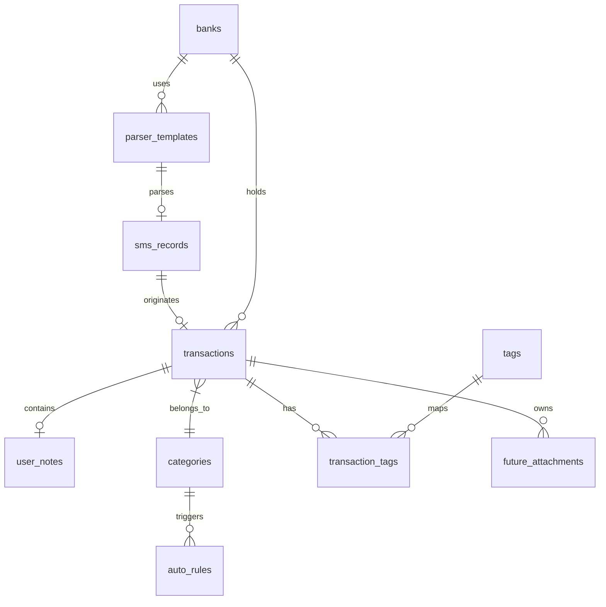
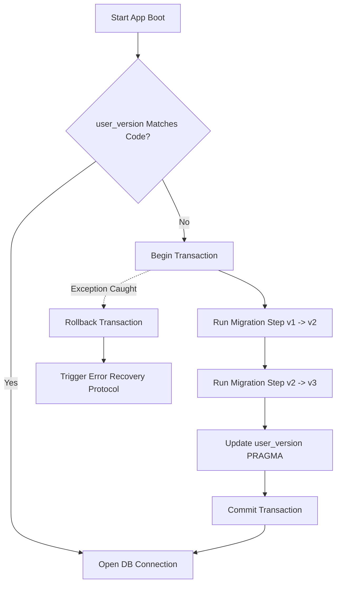
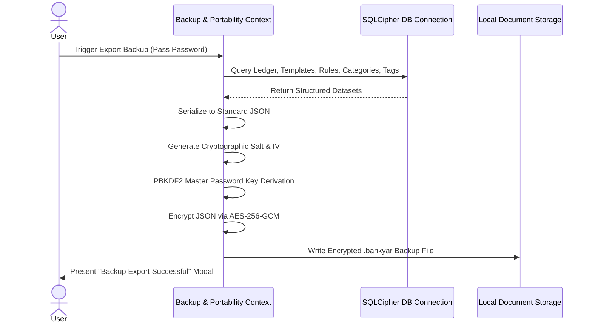
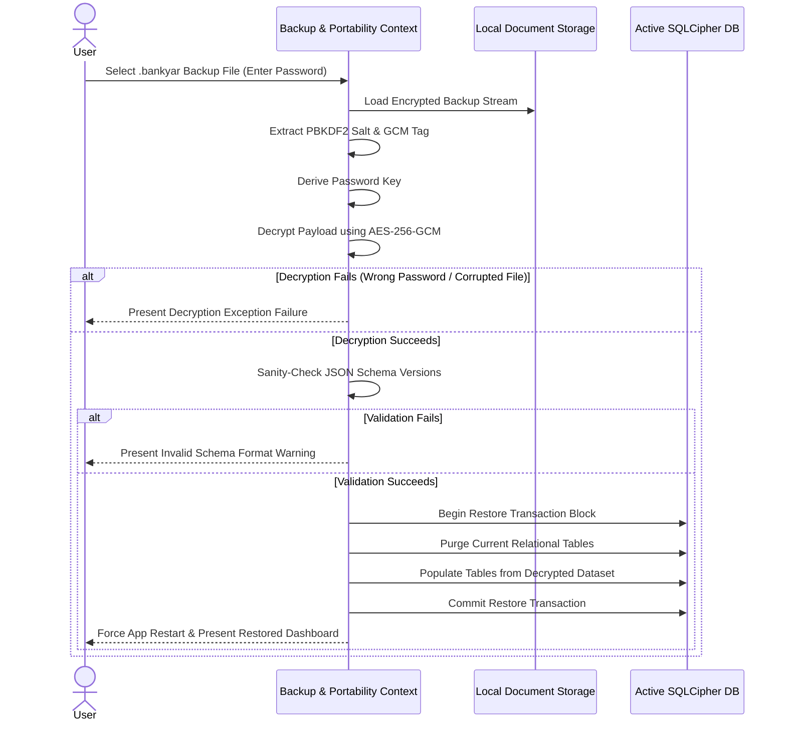

# BankYar Local Database Architecture Specification

**Project Name:** BankYar
**Classification:** Enterprise Database Architecture & Technical Specification
**Document Version:** 1.0.0
**Authors:** Principal Database Architect, Mobile Data Engineer & Enterprise Software Architect
**Status:** Approved / Storage Blueprint

---

## Executive Summary

BankYar is an offline-first, highly secure personal finance management mobile application that operates with an ironclad guarantee of 100% data privacy and zero cloud dependencies. This document defines the comprehensive **Database Architecture and Secure Storage Design** for BankYar.

To satisfy the non-functional requirements (NFRs) of extreme security, zero network permission, and high responsiveness (sub-300ms processing of incoming SMS and 60fps+ UI scrolling over 100,000+ historical records), this architecture specifies a relational database model secured by **SQLCipher (AES-256 page-level encryption)** with keys bound to the hardware TEE (Trusted Execution Environment) via the platform KeyStore.

This document remains strictly at the **Database Architecture Level**. It contains zero SQL statements, zero Flutter/Dart code, zero repository code, and zero ORM classes.

---

## Table of Contents
1. [Database Philosophy](#1-database-philosophy)
2. [Storage Strategy](#2-storage-strategy)
3. [Database Technology Selection](#3-database-technology-selection)
4. [Encryption Strategy](#4-encryption-strategy)
5. [Schema Design Principles](#5-schema-design-principles)
6. [Detailed Entity Analysis & Table Mapping](#6-detailed-entity-analysis--table-mapping)
7. [Relationship Strategy](#7-relationship-strategy)
8. [Primary Keys](#8-primary-keys)
9. [Foreign Keys](#9-foreign-keys)
10. [Index Strategy](#10-index-strategy)
11. [Query Optimization Strategy](#11-query-optimization-strategy)
12. [Full-Text Search Strategy](#12-full-text-search-strategy)
13. [Pagination Strategy](#13-pagination-strategy)
14. [Caching Strategy](#14-caching-strategy)
15. [Database Versioning](#15-database-versioning)
16. [Migration Strategy](#16-migration-strategy)
17. [Backup Strategy](#17-backup-strategy)
18. [Restore Strategy](#18-restore-strategy)
19. [Import / Export Strategy](#19-import--export-strategy)
20. [Data Integrity Rules](#20-data-integrity-rules)
21. [Deduplication Strategy](#21-deduplication-strategy)
22. [Transaction Strategy](#22-transaction-strategy)
23. [Error Recovery Strategy](#23-error-recovery-strategy)
24. [Future Cloud Mapping](#24-future-cloud-mapping)
25. [Database Maintenance Strategy](#25-database-maintenance-strategy)
26. [Data Retention Strategy](#26-data-retention-strategy)
27. [Database Performance Guidelines](#27-database-performance-guidelines)
28. [Testing Strategy](#28-testing-strategy)
29. [Monitoring Strategy](#29-monitoring-strategy)
30. [Database Risks](#30-database-risks)
31. [Architectural Decision Records (ADR)](#31-architectural-decision-records-adr)
32. [Trade-off Analysis](#32-trade-off-analysis)

---

## 1. Database Philosophy

BankYar's database philosophy is established on three foundational axioms:
* **Absolute User Ownership:** The user's device is the single and sovereign source of truth. Under no circumstances should data leak, be cached in insecure temporary system directories, or be accessible by other applications.
* **Resilient Offline Autonomy:** The storage layer must operate deterministically without ever requiring a remote connection. Schema verification, migrations, and indexing must be self-contained and self-repairing on-device.
* **Future-Proof Scalability:** Never optimize for Version 1 at the expense of future extensibility. The schema must seamlessly adapt to multi-device syncing, multi-currency assets, machine learning categorization, and collaborative budgets without requiring destructive structural redesigns.

---

## 2. Storage Strategy

The storage strategy uses a multi-tiered architecture to isolate data types by security profile and read/write characteristics:

```
+-----------------------------------------------------------------------------------+
|                                BANKYAR STORAGE SYSTEM                             |
+-----------------------------------------------------------------------------------+
|                                                                                   |
|  +----------------------------------+       +----------------------------------+  |
|  |       ENCRYPTED RELATIONAL       |       |       ENCRYPTED KEY-VALUE        |  |
|  |            (SQLCipher)           |       |      (Platform SecurePrefs)      |  |
|  |                                  |       |                                  |  |
|  | - Ledger (Transactions)          |       | - Security Lock Status           |  |
|  | - SMS (Raw & Metadata)           |       | - Dark Theme Preference          |  |
|  | - Parser Templates & Auto-rules  |       | - Active Language Selection      |  |
|  | - Categories, Notes, Tags        |       | - Boot Diagnostics Metrics       |  |
|  | - Local Diagnostic Logs          |       |                                  |  |
|  +----------------+-----------------+       +----------------+-----------------+  |
|                   |                                          |                    |
|                   v                                          v                    |
|  +----------------+------------------------------------------+-----------------+  |
|  |                      HARDWARE SECURITY MODULE (TEE)                            |  |
|  |                                                                                |  |
|  | - Holds Android Keystore Alias / iOS Secure Enclave Master Key                 |  |
|  | - Decrypts SQLCipher Passphrase in Volatile RAM only                           |  |
|  +--------------------------------------------------------------------------------+  |
+-----------------------------------------------------------------------------------+
```

### Storage Tiers:
1. **Secure Relational Storage (SQLCipher Database):** Captures structured transactional, parsing, and tagging data models. This database is locked by default and unlocked only when the user passes biometric/PIN verification.
2. **Platform Secure Preferences:** Stores system state configurations (e.g., whether the app lock is enabled, or the system language) that must be readable prior to database decryption.
3. **Hardware Storage (Keystore/Enclave):** Houses the cryptographic master keys. These keys are non-exportable and bound to hardware security boundaries.

---

## 3. Database Technology Selection

### Technology Selected: **SQLCipher (Encrypted Relational SQLite)**

### Rationale:
* **ACID Compliance:** Ensures zero data corruption during unexpected background task terminations or device power losses.
* **Page-Level Cryptography:** SQLCipher encrypts the database file in fixed pages (typically 4096 bytes). Each page is encrypted with a unique initialization vector (IV) via AES-256-CBC, preventing structural patterns from being exposed.
* **Low Memory and Storage Overhead:** SQLite databases run in-process, requiring minimal background CPU and memory resources, leaving a small footprint on older devices.
* **Cross-Platform Compatibility:** The physical database structure is identical on Android and iOS, allowing standard binary migrations and cross-platform backup restores.

---

## 4. Encryption Strategy

The local encryption architecture is designed to prevent plaintext leaks even if the device is rooted, or the filesystem is copied directly off disk.

```
[ Biometric Match / PIN Passed ]
               │
               ▼
   OS Hardware Key Store (TEE)
               │
               ▼ Decrypts
   Secure Preferences DB Key Bytes
               │
               ▼ Injected into
   Volatile Memory (RAM) ──► Decrypts ──► SQLCipher Database
               │
               ▼ Exceeds 5 Mins Inactive
     [ RAM Cleared / Evicted ]
```

### 1. Master Key Strategy
* Upon first installation, a cryptographically secure 256-bit master key is generated on-device using a secure random number generator.
* This key is stored in the **Android Keystore System** under an alias using hardware-backed storage (`TEE` or `StrongBox` microcontrollers, if available).
* The key is configured with user authentication requirements, meaning it cannot be read from the Keystore unless the user completes biometric authentication.

### 2. PIN Protection & Derivation
* If biometrics are unavailable or disabled, the user registers a 6-digit numeric PIN.
* The PIN is not stored directly on disk. Instead, the application utilizes **PBKDF2 (Password-Based Key Derivation Function 2)** with `HMAC-SHA256` and a random salt, running 100,000 iterations to derive an intermediate key.
* This derived key is used to decrypt the master database key stored inside the application sandbox.

### 3. Volatile RAM Key Eviction (NFR-1.2)
* The decrypted database key resides solely in the application's volatile process memory (RAM) as a byte array.
* If the application transition to the background exceeds 5 minutes, an inactivity timer fires.
* This trigger flushes all cached active SQLite connection pools, closes database files, and explicitly overrides the memory address of the key with zeros (Zeroization), forcing hard re-authentication upon next launch.

### 4. Field-Level Classification (PII Separation)

| Classification | Sensitivity | Storage Target | Encryption Method |
| :--- | :--- | :--- | :--- |
| **Raw SMS Body** | Highly Sensitive | SQLCipher Page | Page-level AES-256-CBC |
| **Transaction Amount** | Highly Sensitive | SQLCipher Page | Page-level AES-256-CBC |
| **Merchant Name** | Highly Sensitive | SQLCipher Page | Page-level AES-256-CBC |
| **Card / Account Identifiers**| Highly Sensitive | SQLCipher Page | Page-level AES-256-CBC |
| **User Notes & Tags** | Highly Sensitive | SQLCipher Page | Page-level AES-256-CBC |
| **System Theme Preference** | Non-Sensitive | SharedPreferences | Unencrypted Plaintext JSON |
| **Active Locale Preference** | Non-Sensitive | SharedPreferences | Unencrypted Plaintext JSON |
| **Failed PIN Lockout Timer** | Non-Sensitive | SecurePreferences | KeyStore-backed AES-GCM |

---

## 5. Schema Design Principles

The relational tables conform to strict clean database rules to ensure high query performance:
1. **Third Normal Form (3NF) Compliance:** Eliminate redundancy across financial records. Categories, tags, transactions, and SMS files exist as isolated tables linked via foreign key references.
2. **Explicit Nullability Constraints:** Every column is explicitly declared as either nullable or non-nullable. Financial quantities (amounts) are non-nullable and default to zero to avoid three-valued logic errors during mathematical aggregations.
3. **No Dynamic String-Key Relational Joins:** Relationships utilize invariant UUID v4 fields to prevent cascading updates when text values (e.g., Category Name or Tag Label) are modified.
4. **Independent Audit Fields:** Critical tables include transaction recording audit fields (`created_at`, `updated_at`, `version`) to track the exact timeline of local data updates.

---

## 6. Detailed Entity Analysis & Table Mapping

For each core data element, this section defines its schema layout alongside the 13 required architectural dimensions: **Table Purpose, Relationships, Ownership, Indexes, Constraints, Validation Rules, Unique Constraints, Deletion Policy, Update Policy, Audit Requirements, Search Requirements, Encryption Requirements, and Future Extensions**.

---

### 1. Raw & Metadata SMS Table (`sms_records`)

| Attribute | Specification |
| :--- | :--- |
| **Table Purpose** | Persists raw incoming cellular SMS text and metadata to support auditing, parsing fallback, and verification. |
| **Relationships** | Associated with `parser_templates` (0..1 : 1) for match routing, and `transactions` (1 : 0..1) for structured metadata extraction. |
| **Ownership** | Owned solely by `SMSAggregate`. Remains immutable post-insertion. |
| **Indexes** | `idx_sms_dedup` (Unique, B-Tree) on `deduplication_hash`; `idx_sms_received` (Non-unique, B-Tree) on `received_at`. |
| **Constraints** | `id` PRIMARY KEY, `raw_text` NOT NULL, `received_at` NOT NULL, `deduplication_hash` NOT NULL. |
| **Validation Rules** | `deduplication_hash` must be exactly 64 characters (hex SHA-256 digest). `received_at` must represent a historical Unix epoch. |
| **Unique Constraints** | Unique index on `deduplication_hash`. |
| **Deletion Policy** | Restricted: SMS raw payloads can be pruned on retention policies but are never deleted when associated transactions are deleted. |
| **Update Policy** | Read-Only. Only the `ingestion_status` column can be updated (e.g., from `RAW` to `PARSED`). |
| **Audit Requirements** | Traces exact sender ID, reception epoch, and ingestion lifecycle states. |
| **Search Requirements** | Standard indexing of timestamps. No requirement for FTS search matches on raw bodies to maximize privacy. |
| **Encryption Requirements** | Highly Sensitive. SQLCipher AES-256 page-level encryption. |
| **Future Extensions** | Expansion to support platform notification channels (for NeoBanks that send push notifications instead of SMS). |

#### Schema Mapping:
| Column Name | Logical Data Type | Constraints | Description |
| :--- | :--- | :--- | :--- |
| `id` | VARCHAR(36) | PRIMARY KEY, NOT NULL | Unique UUID v4 identifier. |
| `raw_text` | TEXT | NOT NULL | The unedited text body of the SMS message. |
| `sender_id` | VARCHAR(50) | NOT NULL, Case-Insensitive | The address/Sender ID of the sender (e.g., "CHASE"). |
| `received_at` | BIGINT | NOT NULL | Chronological Unix epoch timestamp. |
| `deduplication_hash`| VARCHAR(64) | UNIQUE, NOT NULL | SHA-256 of `sender_id + raw_text + received_at`. |
| `ingestion_status` | VARCHAR(20) | NOT NULL | Enum: `RAW`, `PARSED`, `UNPARSED`, `IGNORED`. |

---

### 2. Parser Rules & Templates Table (`parser_templates`)

| Attribute | Specification |
| :--- | :--- |
| **Table Purpose** | Stores Regex layout rules and capture group configuration to guide deterministic parsing of specific sender IDs. |
| **Relationships** | Maps to `sms_records` (1 : Many) as rule matcher, and `banks` (Many : 1) for institution mapping. |
| **Ownership** | Owned by `ParserTemplateAggregate`. |
| **Indexes** | Unique index on `sender_id` to speed up mapping. |
| **Constraints** | `id` PRIMARY KEY, `sender_id` NOT NULL, `matching_regex` NOT NULL. All capture indices must be valid. |
| **Validation Rules** | `matching_regex` must compile cleanly under standard regex engines. Numeric group indices must be between -1 and 9. |
| **Unique Constraints** | Unique index on `sender_id` to prevent rule collisions. |
| **Deletion Policy** | ON DELETE CASCADE for custom templates; system-defined templates are immutable. |
| **Update Policy** | Allowed for regex updates and capture index revisions. Triggers dynamic rebuilds of FTS search index targets. |
| **Audit Requirements** | Tracks rule modification date and custom template tags. |
| **Search Requirements** | Indexed lookup on `sender_id`. |
| **Encryption Requirements** | Standard SQLCipher page-level encryption. |
| **Future Extensions** | Cryptographic signature validation for community templates scanned via offline QR codes. |

#### Schema Mapping:
| Column Name | Logical Data Type | Constraints | Description |
| :--- | :--- | :--- | :--- |
| `id` | VARCHAR(36) | PRIMARY KEY, NOT NULL | Unique UUID v4 identifier. |
| `sender_id` | VARCHAR(50) | NOT NULL, Case-Insensitive | Target sender ID (e.g., "BANK_OF_AMERICA"). |
| `matching_regex` | TEXT | NOT NULL | Compiled regular expression pattern. |
| `amount_group_index`| INTEGER | NOT NULL, DEFAULT -1 | Regex capture group index for the transaction amount. |
| `currency_group_index`| INTEGER | NOT NULL, DEFAULT -1 | Regex capture group index for the currency. |
| `merchant_group_index`| INTEGER | NOT NULL, DEFAULT -1 | Regex capture group index for the merchant. |
| `card_group_index` | INTEGER | NOT NULL, DEFAULT -1 | Regex capture group index for the account/card index. |
| `type_group_index` | INTEGER | NOT NULL, DEFAULT -1 | Regex capture group index for the debit/credit keyword. |
| `is_custom_rule` | BOOLEAN | NOT NULL, DEFAULT FALSE | Specifies if the template is user-defined or pre-built. |
| `created_at` | BIGINT | NOT NULL | Unix epoch timestamp of creation. |
| `updated_at` | BIGINT | NOT NULL | Unix epoch timestamp of last modification. |

---

### 3. Transactions Table (`transactions`)

| Attribute | Specification |
| :--- | :--- |
| **Table Purpose** | Persists structured financial records of debit and credit events parsed from SMS or manually created. |
| **Relationships** | `categories` (* : 1), `sms_records` (0..1 : 1), `user_notes` (1 : 0..1), `tags` (Many-to-Many via `transaction_tags`). |
| **Ownership** | Owned by `TransactionAggregate`. Primary aggregate root of the financial domain. |
| **Indexes** | `idx_tx_chrono` on `timestamp` (DESC); `idx_tx_cat_time` composite index on `category_id` and `timestamp`. |
| **Constraints** | `id` PRIMARY KEY, `amount` > 0.00, `currency` NOT NULL, `transaction_type` NOT NULL. |
| **Validation Rules** | `amount` must have high precision (decimal format). `currency` must be represented as a valid 3-character uppercase ISO code. |
| **Unique Constraints** | None (different transactions can share amounts/timestamps, deduplication is handled at the SMS layer). |
| **Deletion Policy** | Permanent delete: cascades to `user_notes` and `transaction_tags` link mappings. |
| **Update Policy** | Mutable: categories, notes, manual corrections are fully updatable. Updates trigger triggers to update search indexing virtual tables. |
| **Audit Requirements** | Logs the date of creation, parsing methodology, and system confidence score. |
| **Search Requirements** | Linked to FTS5 search table, matching against raw and normalized merchant names. |
| **Encryption Requirements** | Highly Sensitive. SQLCipher AES-256 page-level encryption. |
| **Future Extensions** | Support for dynamic multi-currency calculations and multi-account ledger separation. |

#### Schema Mapping:
| Column Name | Logical Data Type | Constraints | Description |
| :--- | :--- | :--- | :--- |
| `id` | VARCHAR(36) | PRIMARY KEY, NOT NULL | Unique UUID v4 identifier. |
| `amount` | DECIMAL(18,4) | NOT NULL | Precise transaction decimal value. |
| `currency` | VARCHAR(3) | NOT NULL | Standard ISO 4217 Currency Code. |
| `transaction_type` | VARCHAR(10) | NOT NULL | Enum: `DEBIT`, `CREDIT`. |
| `raw_merchant` | VARCHAR(100) | NOT NULL | Raw merchant string extracted from text. |
| `normalized_merchant`| VARCHAR(100) | NOT NULL | Normalized, user-facing merchant name. |
| `card_identifier` | VARCHAR(20) | NULLABLE | Masked card reference (e.g., "Ending in 4321"). |
| `timestamp` | BIGINT | NOT NULL | Logical transaction date/time. |
| `category_id` | VARCHAR(36) | FOREIGN KEY, NULLABLE | Reference to the associated category. |
| `source_sms_id` | VARCHAR(36) | FOREIGN KEY, NULLABLE | Reference to the originating SMS record. |
| `confidence_score` | DOUBLE | NOT NULL | Parsing certainty metric (0.0 to 1.0). |
| `parsing_method` | VARCHAR(20) | NOT NULL | Enum: `DETERMINISTIC`, `HEURISTIC`, `MANUAL`. |
| `created_at` | BIGINT | NOT NULL | Unix epoch database write timestamp. |

---

### 4. Categories Table (`categories`)

| Attribute | Specification |
| :--- | :--- |
| **Table Purpose** | Represents structural categories used to group expense and income events. |
| **Relationships** | Transactions belong to categories (* : 1). Auto-rules trigger category assignments (1 : Many). |
| **Ownership** | Independent `CategoryAggregate`. |
| **Indexes** | Unique index on `name`. |
| **Constraints** | `id` PRIMARY KEY, `name` UNIQUE NOT NULL, `color_hex` NOT NULL. |
| **Validation Rules** | `color_hex` must match standard hexadecimal strings (`^#[0-9A-F]{6}$`). `name` is capped at 30 characters. |
| **Unique Constraints** | Unique constraint on case-insensitive category `name`. |
| **Deletion Policy** | Nullify/Default: Deleting a category updates related transaction references to "Uncategorized" and purges related auto-rules. |
| **Update Policy** | Fully mutable for custom categories. System-defined categories (e.g. "Uncategorized") are protected and immutable. |
| **Audit Requirements** | System categories flag `is_system_defined`. |
| **Search Requirements** | Read-only selection list representation. |
| **Encryption Requirements** | Standard SQLCipher page-level encryption. |
| **Future Extensions** | Multi-level subcategories (hierarchical grouping, e.g. "Food" -> "Restaurants"). |

#### Schema Mapping:
| Column Name | Logical Data Type | Constraints | Description |
| :--- | :--- | :--- | :--- |
| `id` | VARCHAR(36) | PRIMARY KEY, NOT NULL | Unique UUID v4 identifier. |
| `name` | VARCHAR(50) | UNIQUE, NOT NULL | Unique category name (case-insensitive). |
| `color_hex` | VARCHAR(7) | NOT NULL | 6-character hex color (e.g., "#FF5733"). |
| `is_system_defined`| BOOLEAN | NOT NULL, DEFAULT FALSE | Flags if the category is a system default. |

---

### 5. User Notes Table (`user_notes`)

| Attribute | Specification |
| :--- | :--- |
| **Table Purpose** | Stores custom user-written descriptions and notes linked to transactions. |
| **Relationships** | Owned by `transactions` in a tight (1 : 1) relationship. |
| **Ownership** | Fully owned by the parent `Transaction` aggregate root. |
| **Indexes** | Unique index `idx_notes_tx` on `transaction_id`. |
| **Constraints** | `id` PRIMARY KEY, `transaction_id` UNIQUE FOREIGN KEY NOT NULL, `note_text` NOT NULL. |
| **Validation Rules** | `note_text` is size-restricted to a maximum of 1,000 characters to prevent memory leaks and database bloating. |
| **Unique Constraints** | Enforces a strict one-to-one relationship with the transaction. |
| **Deletion Policy** | Cascade: Deleting the parent transaction automatically deletes its associated notes. |
| **Update Policy** | Fully mutable. Updates trigger search indexing rebuilds. |
| **Audit Requirements** | Tracks the date of last revision via `edited_at` epoch. |
| **Search Requirements** | Full-text indexed via the FTS5 shadow table. |
| **Encryption Requirements** | Highly Sensitive. SQLCipher AES-256 page-level encryption. |
| **Future Extensions** | Automatic hashtag extraction from text notes. |

#### Schema Mapping:
| Column Name | Logical Data Type | Constraints | Description |
| :--- | :--- | :--- | :--- |
| `id` | VARCHAR(36) | PRIMARY KEY, NOT NULL | Unique UUID v4 identifier. |
| `transaction_id` | VARCHAR(36) | UNIQUE, FOREIGN KEY, NOT NULL | Reference to the parent transaction record. |
| `note_text` | TEXT | NOT NULL | Detailed text note (capped at 1000 chars). |
| `edited_at` | BIGINT | NOT NULL | Unix epoch timestamp of last edit. |

---

### 6. Tags Table (`tags`)

| Attribute | Specification |
| :--- | :--- |
| **Table Purpose** | Holds custom hashtags to support flexible searching and filtering across categories. |
| **Relationships** | Managed in a Many-to-Many relation with `transactions` through `transaction_tags`. |
| **Ownership** | Independent `TagAggregate`. |
| **Indexes** | Unique index on `label_text`. |
| **Constraints** | `id` PRIMARY KEY, `label_text` UNIQUE NOT NULL. |
| **Validation Rules** | `label_text` must match alphanumeric format `^[a-z0-9_-]+$` (no spaces, special characters, or uppercase letters). |
| **Unique Constraints** | Unique constraint on the `label_text` column. |
| **Deletion Policy** | Cascade delete on join table mappings; preserves transaction entities. |
| **Update Policy** | Read-Only. Changing a tag label is not supported; instead, delete the old tag and create a new one to prevent side-effects. |
| **Audit Requirements** | Creation timestamp `created_at`. |
| **Search Requirements** | Tag dictionary autocomplete list support. |
| **Encryption Requirements** | Standard SQLCipher page-level encryption. |
| **Future Extensions** | Hierarchical tag groups or campaigns. |

#### Schema Mapping:
| Column Name | Logical Data Type | Constraints | Description |
| :--- | :--- | :--- | :--- |
| `id` | VARCHAR(36) | PRIMARY KEY, NOT NULL | Unique UUID v4 identifier. |
| `label_text` | VARCHAR(30) | UNIQUE, NOT NULL | Clean alphanumeric tag label (e.g., "vacation"). |
| `created_at` | BIGINT | NOT NULL | Unix epoch creation timestamp. |

---

### 7. Transaction-to-Tag Mapping Table (`transaction_tags`)

| Attribute | Specification |
| :--- | :--- |
| **Table Purpose** | Resolves the Many-to-Many relationship between transactions and tags. |
| **Relationships** | Links `transactions` and `tags` tables. |
| **Ownership** | Joint ownership: entries are managed when relationships are updated. |
| **Indexes** | Composite unique index on `transaction_id` and `tag_id`. |
| **Constraints** | Both columns NOT NULL FOREIGN KEYS. |
| **Validation Rules** | Both references must point to active records. |
| **Unique Constraints** | Enforces that a tag is mapped only once per transaction. |
| **Deletion Policy** | Cascade: Deleting a transaction or a tag automatically purges its matching join records. |
| **Update Policy** | Read-Only. Changes are handled by deleting and inserting new mapping entries. |
| **Audit Requirements** | None. |
| **Search Requirements** | Direct index queries for tag-based transaction filters. |
| **Encryption Requirements** | Standard SQLCipher page-level encryption. |
| **Future Extensions** | None. |

#### Schema Mapping:
| Column Name | Logical Data Type | Constraints | Description |
| :--- | :--- | :--- | :--- |
| `transaction_id` | VARCHAR(36) | FOREIGN KEY, NOT NULL | Link to the associated transaction. |
| `tag_id` | VARCHAR(36) | FOREIGN KEY, NOT NULL | Link to the associated tag. |

---

### 8. Auto-Categorization Rules Table (`auto_rules`)

| Attribute | Specification |
| :--- | :--- |
| **Table Purpose** | Automatically matches text keywords to assign categories to incoming transactions. |
| **Relationships** | Many-to-One relationship with `categories`. |
| **Ownership** | Owned by `CategoryAggregate`. |
| **Indexes** | `idx_rules_active` on `is_active`. |
| **Constraints** | `id` PRIMARY KEY, `category_id` FOREIGN KEY NOT NULL, `matching_keyword` NOT NULL. |
| **Validation Rules** | `matching_keyword` is case-insensitive and cannot be empty. |
| **Unique Constraints** | None. |
| **Deletion Policy** | Cascade: Deleting the target category deletes its auto-categorization rules. |
| **Update Policy** | Fully mutable to toggle rules on/off or change keywords. |
| **Audit Requirements** | Track active rule counts. |
| **Search Requirements** | Keyword-matching logic. |
| **Encryption Requirements** | Standard SQLCipher page-level encryption. |
| **Future Extensions** | Support for wildcards or regular expression rules. |

#### Schema Mapping:
| Column Name | Logical Data Type | Constraints | Description |
| :--- | :--- | :--- | :--- |
| `id` | VARCHAR(36) | PRIMARY KEY, NOT NULL | Unique UUID v4 identifier. |
| `category_id` | VARCHAR(36) | FOREIGN KEY, NOT NULL | Reference to target category. |
| `matching_keyword` | VARCHAR(100) | NOT NULL, Case-Insensitive | Keyword matched against merchant/SMS text. |
| `is_active` | BOOLEAN | NOT NULL, DEFAULT TRUE | Status flag for the active evaluation state. |

---

### 9. Diagnostic Logs Table (`diagnostic_logs`)

| Attribute | Specification |
| :--- | :--- |
| **Table Purpose** | Stores local software exception messages, errors, and system warnings to support offline troubleshooting. |
| **Relationships** | Independent utility table. No relations. |
| **Ownership** | Owned by the system logging sub-module. |
| **Indexes** | Non-unique B-Tree index on `timestamp`. |
| **Constraints** | `id` PRIMARY KEY, `log_level` NOT NULL, `timestamp` NOT NULL, `message` NOT NULL. |
| **Validation Rules** | Enforces a maximum file size limit. Stack traces must run PII scrubbing before saving to disk. |
| **Unique Constraints** | None. |
| **Deletion Policy** | Capped retention: FIFO (First In, First Out) pruning logic keeps a maximum of 10,000 logs. |
| **Update Policy** | Read-Only. Log records are immutable. |
| **Audit Requirements** | Tracks exact timestamps and error traces. |
| **Search Requirements** | Filter logs in-app by severity levels. |
| **Encryption Requirements** | Standard SQLCipher page-level encryption. |
| **Future Extensions** | Diagnostic reporting wizard to output logs safely for developer debugging. |

#### Schema Mapping:
| Column Name | Logical Data Type | Constraints | Description |
| :--- | :--- | :--- | :--- |
| `id` | VARCHAR(36) | PRIMARY KEY, NOT NULL | Unique UUID v4 identifier. |
| `log_level` | VARCHAR(10) | NOT NULL | Enum: `INFO`, `WARNING`, `ERROR`, `CRITICAL`. |
| `timestamp` | BIGINT | NOT NULL | Unix epoch execution timestamp. |
| `message` | TEXT | NOT NULL | PII-scrubbed diagnostic message string. |
| `stack_trace` | TEXT | NULLABLE | Anonymized stack traces. |

---

### 10. Statistics Cache Table (`statistics_cache`)

| Attribute | Specification |
| :--- | :--- |
| **Table Purpose** | Caches heavy pre-computed financial analytical reports to accelerate app startup and dashboards. |
| **Relationships** | Independent cache. Holds no hard keys. |
| **Ownership** | Owned by the Analytics sub-module. |
| **Indexes** | Lookup index on `cache_key`. |
| **Constraints** | `cache_key` PRIMARY KEY, `cache_value` NOT NULL, `computed_at` NOT NULL, `expires_at` NOT NULL. |
| **Validation Rules** | Expired caches are automatically deleted. |
| **Unique Constraints** | Primary key constraint on `cache_key`. |
| **Deletion Policy** | Expired caches are deleted automatically during transactional writes. |
| **Update Policy** | Fully mutable. Writes use a write-through strategy. |
| **Audit Requirements** | Tracks computation times. |
| **Search Requirements** | Rapid key-value queries. |
| **Encryption Requirements** | Standard SQLCipher page-level encryption. |
| **Future Extensions** | Progressive background pre-calculations based on active usage trends. |

#### Schema Mapping:
| Column Name | Logical Data Type | Constraints | Description |
| :--- | :--- | :--- | :--- |
| `cache_key` | VARCHAR(50) | PRIMARY KEY, NOT NULL | Reference string (e.g., "CASH_FLOW_OCT_2023"). |
| `cache_value` | TEXT | NOT NULL | Serialized JSON representation of pre-calculated calculations. |
| `computed_at` | BIGINT | NOT NULL | Unix epoch of computation. |
| `expires_at` | BIGINT | NOT NULL | Unix epoch representing cache expiration bounds. |

---

### 11. Banks & Institutions Registry Table (`banks`)

| Attribute | Specification |
| :--- | :--- |
| **Table Purpose** | Standardizes financial institutions, linking SMS sender IDs to clean bank metadata. |
| **Relationships** | One-to-Many association with `transactions` and `parser_templates`. |
| **Ownership** | Owned by `BankRegistryAggregate`. |
| **Indexes** | Unique index on `name`. |
| **Constraints** | `id` PRIMARY KEY, `name` UNIQUE NOT NULL, `sender_prefix` NOT NULL. |
| **Validation Rules** | `name` cannot be empty. `sender_prefix` matches standard alphanumeric rules. |
| **Unique Constraints** | Unique constraint on the `name` column. |
| **Deletion Policy** | Restricted: Core system institutions cannot be deleted. Custom records are deleted ON DELETE RESTRICT. |
| **Update Policy** | Allowed for bank details or logo assets. |
| **Audit Requirements** | None. |
| **Search Requirements** | Standard filter options. |
| **Encryption Requirements** | Standard SQLCipher page-level encryption. |
| **Future Extensions** | Integration of API connection attributes for future Open Banking iterations. |

#### Schema Mapping:
| Column Name | Logical Data Type | Constraints | Description |
| :--- | :--- | :--- | :--- |
| `id` | VARCHAR(36) | PRIMARY KEY, NOT NULL | Unique UUID v4 identifier. |
| `name` | VARCHAR(50) | UNIQUE, NOT NULL | Unified Bank name (e.g., "Chase Bank"). |
| `sender_prefix` | VARCHAR(30) | NOT NULL, Case-Insensitive | Associated carrier ID pattern (e.g., "CHASE"). |
| `logo_token` | VARCHAR(50) | NULLABLE | Resource string token for in-app display. |

---

### 12. App Permissions Table (`app_permissions`)

| Attribute | Specification |
| :--- | :--- |
| **Table Purpose** | Tracks OS-level authorizations and user permissions locally to manage onboarding guides and diagnostic statuses. |
| **Relationships** | Independent. No references. |
| **Ownership** | Owned by the system permissions module. |
| **Indexes** | Lookup index on `permission_type`. |
| **Constraints** | `permission_type` PRIMARY KEY, `is_granted` NOT NULL. |
| **Validation Rules** | `is_granted` must be a valid boolean. |
| **Unique Constraints** | Primary key constraint on `permission_type`. |
| **Deletion Policy** | Read-Only structure. Row deletion is not allowed. |
| **Update Policy** | Permissions status can be updated when modified in system settings. |
| **Audit Requirements** | None. |
| **Search Requirements** | None. |
| **Encryption Requirements** | SecurePreferences wrapper using hardware-backed GCM encryption. |
| **Future Extensions** | Track device background authorization statuses. |

#### Schema Mapping:
| Column Name | Logical Data Type | Constraints | Description |
| :--- | :--- | :--- | :--- |
| `permission_type` | VARCHAR(50) | PRIMARY KEY, NOT NULL | Permission type identifier (e.g. "SMS_CAPTURE"). |
| `is_granted` | BOOLEAN | NOT NULL, DEFAULT FALSE | Grant status flag. |
| `last_checked_at` | BIGINT | NOT NULL | Unix epoch timestamp of last check. |

---

### 13. Future Attachments Metadata Table (`future_attachments`)

| Attribute | Specification |
| :--- | :--- |
| **Table Purpose** | Prepares the database for future attachment storage, managing filesystem paths for receipts or invoices linked to transactions. |
| **Relationships** | Many-to-One relationship with `transactions`. |
| **Ownership** | Owned by `TransactionAggregate`. |
| **Indexes** | `idx_attachment_tx` on `transaction_id`. |
| **Constraints** | `id` PRIMARY KEY, `transaction_id` FOREIGN KEY NOT NULL, `local_file_path` NOT NULL. |
| **Validation Rules** | File path must point to local app storage directories. Files size is checked before attachment. |
| **Unique Constraints** | None. |
| **Deletion Policy** | Cascade: Deleting a transaction deletes its attachments from both the database and local disk. |
| **Update Policy** | Allowed to rename or modify descriptions. |
| **Audit Requirements** | Creation timestamp and file size indicators. |
| **Search Requirements** | Linked to transaction ledger searches. |
| **Encryption Requirements** | Paths are stored in the SQLCipher database. Target files on disk are encrypted using `AES-GCM-256` before writing. |
| **Future Extensions** | Attachment scanning and OCR extraction using on-device machine learning. |

#### Schema Mapping:
| Column Name | Logical Data Type | Constraints | Description |
| :--- | :--- | :--- | :--- |
| `id` | VARCHAR(36) | PRIMARY KEY, NOT NULL | Unique UUID v4 identifier. |
| `transaction_id` | VARCHAR(36) | FOREIGN KEY, NOT NULL | Reference to the parent transaction. |
| `local_file_path` | TEXT | NOT NULL | Sandboxed file path on the device's storage. |
| `file_size_bytes` | BIGINT | NOT NULL | Size of the attachment file. |
| `mime_type` | VARCHAR(50) | NOT NULL | File type (e.g. "image/jpeg", "application/pdf"). |
| `created_at` | BIGINT | NOT NULL | Creation Unix epoch timestamp. |

---

## 7. Relationship Strategy

BankYar leverages a combination of direct relational tables and intermediate join tables to organize relationships.

### Entity-Relationship Diagram (ERD)



### Join Table Management:
* **`transaction_tags` Join Table:** Resolves the Many-to-Many association between `transactions` and `tags`. By creating a dedicated join table with foreign key indices pointing to both tables, the database avoids storing delimited strings in the transaction record, ensuring index optimization.

---

## 8. Primary Keys

To guarantee absolute data integrity in an offline-first distributed application, BankYar enforces standard guidelines for Primary Keys:
1. **Cryptographically Secure UUID v4:** Every table's primary key (`id`) must utilize a 36-character random UUID representation.
2. **No Monotonic Auto-Incrementing Integers:** Sequential primary keys (such as SQLite's `rowid`) are strictly avoided for core financial records. If two devices generate entries offline and attempt to sync later (e.g., during future multi-device synchronization), sequential integers would collide immediately. UUID v4 ensures zero coordinate collisions across devices.

---

## 9. Foreign Keys

Foreign Keys ensure referential integrity across logical boundaries. The table below specifies the constraints and cascading policies:

| Parent Table | Child Table | Column Reference | Nullability | Cascading Policy | Rationale |
| :--- | :--- | :--- | :--- | :--- | :--- |
| `sms_records` | `transactions` | `source_sms_id` | Nullable | **ON DELETE SET NULL** | Deleting a transaction must never delete the raw SMS audit record. |
| `categories` | `transactions` | `category_id` | Nullable | **ON DELETE SET NULL** | Deleting a category defaults the transaction back to "Uncategorized". |
| `transactions`| `user_notes` | `transaction_id` | Non-Nullable| **ON DELETE CASCADE** | A note has zero business meaning without its parent transaction. |
| `transactions`| `transaction_tags`| `transaction_id` | Non-Nullable| **ON DELETE CASCADE** | Removing a transaction must immediately purge its tag mappings. |
| `tags` | `transaction_tags`| `tag_id` | Non-Nullable| **ON DELETE CASCADE** | Removing a tag dictionary item must clean up its mappings. |
| `categories` | `auto_rules` | `category_id` | Non-Nullable| **ON DELETE CASCADE** | Rules cannot evaluate if their target category is removed. |
| `transactions`| `future_attachments`| `transaction_id`| Non-Nullable| **ON DELETE CASCADE** | Attachment records are deleted when their parent transaction is removed. |

---

## 10. Index Strategy

Indexes are designed to guarantee sub-200ms queries even with 100,000+ records. However, because indexes write duplicate copies of data to disk, BankYar balances search performance against write amplification.

### Composite and Single-Column Indexes

| Target Table | Index Name | Columns Indexed | Index Type | Business / Query Role |
| :--- | :--- | :--- | :--- | :--- |
| `sms_records` | `idx_sms_dedup` | `deduplication_hash` | Unique B-Tree | Ensures immediate deduplication matches on incoming cellular events. |
| `sms_records` | `idx_sms_received`| `received_at` | Non-Unique B-Tree | Speeds up chronological sorting of raw audits. |
| `transactions`| `idx_tx_chrono` | `timestamp` | Non-Unique B-Tree | Powers the core reverse-chronological transaction ledger feed. |
| `transactions`| `idx_tx_cat_time` | `category_id`, `timestamp` | Composite B-Tree | Accelerates analytical queries filtering spending categories over date ranges. |
| `transactions`| `idx_tx_sms` | `source_sms_id` | Non-Unique B-Tree | Speeds up lookups tracing transaction records back to raw carrier text. |
| `user_notes` | `idx_notes_tx` | `transaction_id` | Unique B-Tree | Direct mapping index for transaction annotations. |
| `auto_rules` | `idx_rules_active`| `is_active` | Non-Unique B-Tree | Optimizes the rule matching pipeline, loading only active rules. |

---

## 11. Query Optimization Strategy

To maintain standard rendering performance on low-end mobile hardware, the system enforces strict query rules:
* **No `SELECT *` Queries:** Query definitions must specify exact column names to reduce volatile RAM overhead and avoid pulling unused text (like raw SMS bodies) into layout lists.
* **No Inline Mathematical Manipulations:** Queries must avoid parsing dates or strings on-the-fly during filters. Arithmetic operations must use pre-calculated database column parameters.
* **Correlated Subquery Avoidance:** Large multi-table aggregations must avoid nested subqueries. They should leverage optimized inner joins on indexed foreign keys instead.

---

## 12. Full-Text Search Strategy

### Strategy: SQLCipher FTS5 (Full-Text Search) Extension Module
To deliver instant, offline multi-parameter search over merchant names, annotations, and categories, BankYar implements an FTS5 virtual shadow table layout.

```
       [ Transaction Insert / Update Trigger ]
                         │
                         ▼ Updates
       +───────────────────────────────────────+
       |   FTS5 Virtual Shadow Table           |
       |   (fts_transactions_search)           |
       |                                       |
       |  - transaction_id (Pointer)           |
       |  - merchant_name (Tokenized)          |
       |  - note_text (Tokenized)              |
       |  - tag_labels (Tokenized text array)  |
       +───────────────────────────────────────+
                         │
                         ▼ Standard Query MATCH
       [ Rapid Prefix & Token Matches (< 50ms) ]
```

### Specifications:
1. **FTS5 Virtual Table (`fts_transactions_search`):** Contains references pointing to the transaction UUID and plain text columns for search targets (Merchant Name, Note Text, Tag Labels).
2. **Porter Stemming Algorithm Tokenizer:** Standardizes search words (e.g., "buying", "buys", "bought" stem down to "buy"), enabling flexible prefix matching.
3. **Trigger-Based Synchronization:** System database triggers are defined on the main `transactions` and `user_notes` tables. Whenever a record is inserted, updated, or deleted, the triggers update the FTS5 shadow table, ensuring search indexes are updated with zero application overhead.

---

## 13. Pagination Strategy

To prevent memory leaks when displaying large transaction histories, the chronological transaction ledger uses keyset pagination (also known as the "seek method") instead of offset pagination.

### Why Keyset Pagination is Selected:
* **Constant Time Performance ($O(1)$):** Offset-based pagination (`LIMIT 50 OFFSET 10000`) forces SQLite to read and discard all previous 10,000 pages to return the target 50 rows. Under keyset pagination, the application queries based on the last rendered item's indexed attributes (`timestamp` and `id`).
* **Zero Row Drift:** If new SMS transactions arrive and are inserted in the background while the user is actively scrolling, offset pagination would shift pages down, displaying duplicate records. Keyset pagination remains anchored to the exact last-seen record boundary.

| Pagination Parameters | Logical Type | Description |
| :--- | :--- | :--- |
| `limit_count` | INTEGER | Maximum records to return (default: 50). |
| `anchor_timestamp` | BIGINT | Timestamp value of the last visible transaction on the UI. |
| `anchor_id` | VARCHAR(36) | UUID value of the last visible transaction (acts as tie-breaker for identical timestamps). |

---

## 14. Caching Strategy

Since BankYar runs completely on-device, caching is designed to minimize local disk I/O and optimize system startup speeds:
1. **Pre-Compiled Analytical View Cache:** Computes monthly totals, category expense allocations, and spending trends ahead of time and stores them in the `statistics_cache` table.
2. **Invalidation Policy (Write-Through Caching):**
   * Pre-computed analytics caches are flagged with expiration bounds.
   * If a new transaction is processed and written to the database, the cache invalidation process triggers.
   * The cache is recalculated in the background, updating cached rows without blocking main thread interactions.

---

## 15. Database Versioning

To support schema updates safely, the database file maintains a dedicated version identifier:
* **PRAGMA user_version:** BankYar utilizes SQLite's standard internal integer property `user_version` to track active database schemas.
* **Semantic Code Association:** The source code associates this version with structural migration paths, verifying database alignments upon application launch.

---

## 16. Migration Strategy

BankYar implements sequential, transactional, forward-only migrations. When an update is installed, the system checks `user_version` and applies structural scripts step-by-step.



### Migration Safeguards:
1. **Strict Transaction Boundaries:** Each migration step is executed inside an isolated SQLite transaction. If any column creation, index update, or table update fails, the entire transaction rolls back, preventing partial schema updates.
2. **No Loss of Historical Data:** Migrations utilize incremental scripts (e.g., adding a nullable column) rather than destructive drops, preserving user records.

---

## 17. Backup Strategy

Operating 100% offline means device loss or hardware corruption results in permanent data loss unless a robust backup mechanism exists. BankYar implements a user-controlled, password-encrypted backup system.



### Backup Key Technical Parameters:
* **Export Format:** AES-256-GCM encrypted binary package containing compressed JSON streams.
* **Encryption Key Derivation:** Uses PBKDF2 with HMAC-SHA256, a custom password, a random salt, and 100,000 iterations to generate the encryption key, protecting backups against brute-force attacks.
* **Standard Schemas:** The serialized JSON structure is system-independent, ensuring backups exported from Android can be imported directly into the future iOS/Flutter version.

---

## 18. Restore Strategy

Restoring a backup completely replaces the current database, requiring strict safety validation before execution.



---

## 19. Import / Export Strategy

To support manual fallback imports (for restricted OS environments like iOS), BankYar provides a standard CSV/JSON statement mapping layer.

### CSV Import Architecture:
* **Custom Field Mapping Dictionary:** Maps user-defined CSV statement column configurations (e.g., mapping column index 0 to "Date", index 1 to "Amount") to standard transaction attributes.
* **Isolate-Based Bulk Ingestion:** Parsing, checking, deduplicating, and saving a 5,000-row CSV statement is processed off the main thread using an isolated thread pool, ensuring zero UI lag.

---

## 20. Data Integrity Rules

To protect database integrity, constraints are enforced both in SQLCipher schemas and domain entity boundaries:
1. **Transaction Quantity Non-Negativity:** Transaction decimal values must be greater than zero.
2. **Strict Currency Code ISO Compliance:** Currency strings must match exact three-character ISO 4217 uppercase codes.
3. **Category Color Format:** Custom category colors must compile to a valid 6-character hexadecimal color format.
4. **Unique Active Auto-Rules:** Prevents duplicate text rules by enforcing unique constraints on the active keyword pattern mapping list.

---

## 21. Deduplication Strategy

To prevent duplicate transaction entries from cellular retransmissions, BankYar implements a high-performance hash-based deduplication pipeline.

```
       Incoming SMS Captured (Raw payload details)
                         │
                         ▼
        Compute SHA-256 Deduplication Hash
        Hash = SHA-256(sender_id + raw_text + received_at)
                         │
                         ▼ Query Indexed Table
        Check deduplication_hash in `sms_records`
                         │
               ┌─────────┴─────────┐
         Hash Exists     Hash Does Not Exist
               │                   │
               ▼                   ▼
       Classified: IGNORED   Classified: RAW
       Discard payload       Process through parser
```

### Performance Rationale:
* Checking a B-Tree index on `deduplication_hash` takes logarithmic time ($O(\log N)$).
* For 100,000+ SMS records, matching and rejecting a duplicate payload is resolved in `< 2ms`, protecting system resources from duplicate processing cycles.

---

## 22. Transaction Strategy

BankYar implements strict **ACID transactions** to prevent partial database updates and maintain consistency:
* **Background Parsed SMS Ingestion:** Saving an incoming SMS record, updating its status to `PARSED`, inserting the extracted transaction record, and updating FTS5 shadow index structures are executed within a single SQLCipher database transaction block.
* **Manual Category Purging:** Deleting a category updates all associated transaction records to "Uncategorized" and clears related active auto-rules in a single database transaction, ensuring no orphaned references occur.

---

## 23. Error Recovery Strategy

To handle disk errors or database corruption, BankYar implements a tiered disaster recovery process:

```
                  SQLite / Disk IO Error Occurs
                               │
                               ▼ Catch Exception
                  Run Integrity Verification Checks
                  (Verify database file header validation)
                               │
                     ┌─────────┴─────────┐
               Pass Checks          Fail Checks (Database Corrupt)
                     │                   │
                     ▼                   ▼
          Attempt Page Repair      Initialize Fresh Sandbox DB
                                         │
                                         v
                            Disaster Recovery Interface
                            (Prompt user to restore from latest
                             password-encrypted .bankyar file)
```

---

## 24. Future Cloud Mapping

Although Version 1 runs completely offline with zero internet access, the schema is designed to scale to future cloud sync architectures (e.g., peer-to-peer or secure cloud vaults) without requiring a database redesign.

### Sync-Ready Schema Attributes:
* **`id` UUID v4 keys:** Ensures zero coordinate collisions when writing records across multiple devices.
* **`version` (Revision Counters):** Every table record contains an integer version counter. When modified, this value increments, helping future sync protocols identify and resolve conflicts using standard optimistic concurrency logic.
* **`sync_status` (Enumeration):** Included in core tables as a placeholder, tracking whether a record is `LOCAL_ONLY`, `PENDING_SYNC`, or `SYNCED`.

---

## 25. Database Maintenance Strategy

To maintain high read/write performance over years of use, the system runs silent, scheduled database maintenance:
1. **Periodic Vacuuming:** Running deleting queries on SQLite tables frees pages, but does not shrink the physical database file size, leaving empty spaces. The system schedules a background maintenance task every 30 days to vacuum the database, defragmenting database pages and reducing the storage footprint.
2. **Index Optimization (REINDEX):** Rebuilds indices to recover search speeds over large datasets.

---

## 26. Data Retention Strategy

To prevent the storage footprint from bloating on older devices, users can customize retention policies:
* **SMS Audit Logs Retention:** Users can set policies to automatically delete raw SMS messages older than a specific period (e.g., 1 year or 5 years) while preserving the parsed transactions, notes, and tags in the ledger. This maintains a lean database footprint while retaining the complete historical ledger.

---

## 27. Database Performance Guidelines

The database is configured with optimized pragmas to satisfy demanding non-functional requirements (NFRs):

| Parameter | Configuration Setting | Architectural Rationale |
| :--- | :--- | :--- |
| **Journaling Mode** | `WAL` (Write-Ahead Logging) | Supports concurrent readers while background threads write incoming SMS transactions, ensuring smooth scrolling in the UI. |
| **Synchronous Setting** | `NORMAL` | Balances safety and write performance. WAL mode works reliably with `NORMAL`, reducing disk writes while ensuring zero transactions are lost. |
| **Secure Deletion Mode**| `ON` | Replaces deleted database contents with zeros (Zeroization), preventing deleted financial records from being recovered from the physical storage pages. |
| **Page Size** | `4096` | Aligns database pages with the physical flash block size of modern mobile devices, minimizing write amplification and maximizing I/O performance. |
| **Cache Size** | `2000` pages (~8MB) | Allocates a safe cache footprint in memory to accelerate query performance without bloating RAM usage on low-end devices. |

---

## 28. Testing Strategy

The storage layer is verified using automated test suites running in isolated environments:
* **Unit Tests (In-Memory SQLCipher):** Verifies table structures, constraints, indices, and triggers using an in-memory database to test edge cases with zero disk overhead.
* **Constraint Validation Tests:** Tests the validation rules by attempting to write invalid values (e.g., negative transaction amounts or invalid currency codes) to ensure constraints reject corrupt data.
* **Performance Benchmark Tests:** Runs load tests inserting 100,000+ mock records to verify that search, pagination, and sorting queries resolve in under 200 milliseconds.

---

## 29. Monitoring Strategy

Since the application contains zero network access, diagnostics are kept local to respect user privacy:
1. **Local Telemetry Metrics:** Measures the execution time of transactions and searches. If execution exceed 300ms, the system logs a performance warning in `diagnostic_logs`.
2. **File Size Alerts:** Monitors the physical SQLCipher database file size. If it exceeds 100MB, the system displays a settings warning recommending database maintenance or optimization.

---

## 30. Database Risks

| Risk ID | Risk Scenario | Severity | Likelihood | Architectural Mitigation |
| :--- | :--- | :--- | :--- | :--- |
| **DR-01** | Disk space is exhausted during background SMS ingestion. | High | Low | If write transactions fail due to disk space limits, the ingestion pipeline safely discards the active transaction, keeps the raw SMS, and writes a warning to diagnostic logs. |
| **DR-02** | Rapid battery drain from frequent write operations (write amplification). | Medium | Medium | The background ingestion pipeline batches write operations and schedules indexing tasks to run during device idle times. |
| **DR-03** | Keystore key loss from security modifications. | High | Low | The database includes a password-protected backup utility, allowing users to restore their historical records even if the Keystore resets. |

---

## 31. Architectural Decision Records (ADR)

The storage design of BankYar is governed by three key Architectural Decision Records:

### ADR-001: SQLCipher Page-Level Encryption Selection
* **Status:** Approved
* **Context:** Financial transaction records require strict transactional guarantees (ACID) and robust encryption.
* **Decision:** SQLite encrypted at-rest using SQLCipher.
* **Rationale:** Relational schemas are ideal for search, filtering, and running complex offline aggregations. SQLCipher provides audited, page-level AES-256 encryption, ensuring that database files copied directly off disk are unreadable.

### ADR-002: Keyset Pagination for Ledger Feeds
* **Status:** Approved
* **Context:** The transaction list must scale to 100,000+ items while maintaining smooth scrolling.
* **Decision:** Standardize on keyset pagination using timestamp and UUID anchors.
* **Rationale:** Traditional offset-based pagination degrades in performance as the offset increases ($O(N)$ complexity). Keyset pagination delivers constant-time performance ($O(1)$) and avoids duplicate rows during background data updates.

### ADR-003: Virtual Full-Text Search Tables
* **Status:** Approved
* **Context:** Searching transactions by merchant, category, or note must be fast and responsive.
* **Decision:** Build search workflows around a dedicated FTS5 virtual table synchronized via database triggers.
* **Rationale:** Running standard text searches using wildcards (`LIKE '%search%'`) degrades query speeds. Trigger-synced FTS5 tables provide responsive search queries without adding application maintenance overhead.

---

## 32. Trade-off Analysis

Every architectural decision involves balancing multiple priorities. Below is the justification for the trade-offs made in BankYar's database architecture:

### 1. SQLCipher Encryption vs. Hive NoSQL Storage
* **The Choice:** SQLCipher.
* **Trade-off Analysis:** Key-value storage engines (like Hive or SharedPreferences) are faster for small read/write operations and have a smaller compilation footprint. However, they lack support for ACID transactions and do not provide robust, page-level encryption. For financial tracking, data privacy is our paramount NFR, making SQLCipher the correct choice.

### 2. Keyset Seek Pagination vs. Offset-Limit Pagination
* **The Choice:** Keyset Seek.
* **Trade-off Analysis:** Keyset pagination is slightly more complex to implement because it requires tracking anchors. However, it avoids the linear performance degradation of offset pagination over large datasets, ensuring consistent rendering performance.

### 3. FTS5 Virtual Tables vs. Simple Substrings Search
* **The Choice:** FTS5 Virtual Table.
* **Trade-off Analysis:** FTS5 shadow tables increase the database file size by approximately 15% due to duplicated text indexes. However, this trade-off is necessary to deliver sub-200ms search results over large transaction histories, satisfying our usability requirements.

---
**End of Database Architecture and Secure Storage Design Specification**
