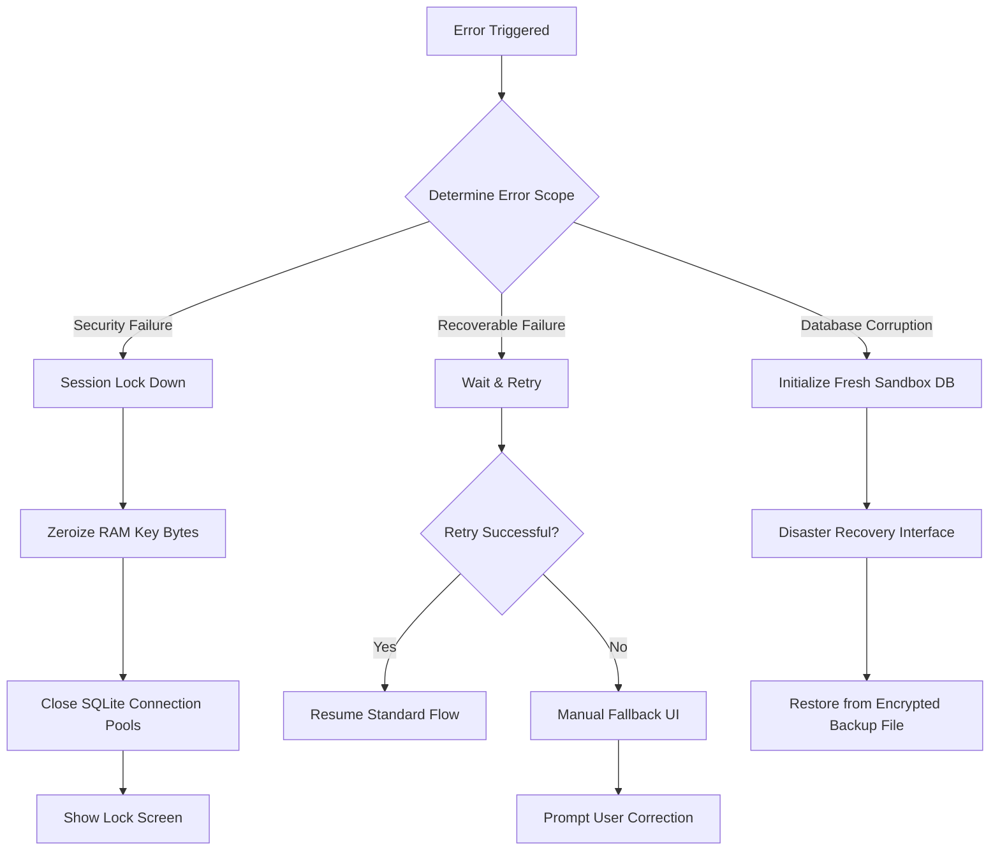

# BankYar Error Handling, Failure Management, and Result Pattern Architecture Specification

**Project Name:** BankYar
**Classification:** Enterprise Error Handling & Failure Management Specification (Restricted)
**Document Version:** 1.0.0
**Authors:** Principal Software Architect, Reliability Engineer & Clean Architecture Specialist
**Status:** Approved / Production-Ready Baseline

---

## Executive Summary

BankYar is an offline-first, highly secure mobile application that automatically parses sensitive financial SMS notifications directly on a user's device. Operating under a strict **zero-network constraint** (no internet permission), the application guarantees 100% data privacy.

To maintain enterprise-level reliability, predictability, and a seamless user experience, BankYar employs a strict, tech-agnostic, and AI-friendly **Error Handling and Failure Management Architecture**. This document defines the application's comprehensive failure classification, result patterns, exception policies, propagation rules, retry/rollback strategies, and recovery flows. It aligns with the PRD, System Architecture, Domain Model, Security, Database, State Management, and Navigation baseline documents, serving as a clean, definitive blueprint for AI-assisted and human-led engineering.

---

## Table of Contents
1. [Error Handling Philosophy](#1-error-handling-philosophy)
2. [Failure Classification](#2-failure-classification)
3. [Error Taxonomy](#3-error-taxonomy)
4. [Result Pattern Design](#4-result-pattern-design)
5. [Exception Policy](#5-exception-policy)
6. [Failure Hierarchy](#6-failure-hierarchy)
7. [Failure Analysis of Specific Failures (Sections 7-22)](#7-failure-analysis-of-specific-failures)
    - [7. Recoverable Errors](#7-recoverable-errors)
    - [8. Non-Recoverable Errors](#8-non-recoverable-errors)
    - [9. User-facing Errors](#9-user-facing-errors)
    - [10. Internal Errors](#10-internal-errors)
    - [11. Infrastructure Errors](#11-infrastructure-errors)
    - [12. Domain Errors](#12-domain-errors)
    - [13. Validation Errors](#13-validation-errors)
    - [14. Security Errors](#14-security-errors)
    - [15. Database Errors](#15-database-errors)
    - [16. Parser Errors](#16-parser-errors)
    - [17. SMS Errors](#17-sms-errors)
    - [18. Permission Errors](#18-permission-errors)
    - [19. Backup Errors](#19-backup-errors)
    - [20. Import Errors](#20-import-errors)
    - [21. Notification Errors](#21-notification-errors)
    - [22. Unknown Errors](#22-unknown-errors)
23. [Error Propagation Rules](#23-error-propagation-rules)
24. [Retry Strategy](#24-retry-strategy)
25. [Rollback Strategy](#25-rollback-strategy)
26. [Transaction Failure Handling](#26-transaction-failure-handling)
27. [Error Recovery Flow](#27-error-recovery-flow)
28. [Offline Error Strategy](#28-offline-error-strategy)
29. [Future Sync Conflict Strategy](#29-future-sync-conflict-strategy)
30. [Logging Integration](#30-logging-integration)
31. [Testing Strategy](#31-testing-strategy)
32. [Monitoring Strategy](#32-monitoring-strategy)
33. [Future Evolution](#33-future-evolution)
34. [Decision Tables & Recovery Flows](#34-decision-tables--recovery-flows)
35. [Architectural Decision Records (ADR)](#35-architectural-decision-records-adr)
36. [Trade-off Analysis](#36-trade-off-analysis)
37. [Best Practices](#37-best-practices)

---

## 1. Error Handling Philosophy

BankYar's error handling philosophy is governed by four core architectural principles:

* **Predictable & Explicit Failures (Type Safety):** Business errors are never thrown as runtime exceptions. Instead, they are represented as explicit types in the domain layer, making them compile-time safe. By leveraging a structured Result pattern, developers and AI agents must handle both success and failure states explicitly.
* **Separation of Exceptions vs. Failures:**
  - **Exceptions** are technical, unexpected events occurring at the data/infrastructure layer (e.g., SQLite file system lock or OS keystore timeout).
  - **Failures** are domain-centric, expected business outcomes (e.g., transaction unparsed or backup password incorrect). Exceptions are caught at the repository boundary and mapped directly into clean domain-specific failures.
* **Fail Safe & Securely (Defense-in-Depth):** In the event of a critical security or persistence failure (e.g., database corruption, continuous PIN failures, or key eviction), the system must immediately secure user data. It forces RAM key-clearing, flushes transaction pools, closes SQLCipher connections, and transitions to a secure lockout state rather than running in an insecure default fallback.
* **Graceful Fallback & Continuity:** If background automated captures fail (e.g., because custom ROM ROM battery managers terminate background tasks), the app must gracefully guide users to manual fallbacks (such as clipboard copy-pasting or statement imports) without visual crashes.

---

## 2. Failure Classification

To organize error behaviors, BankYar classifies failures into three main operational scopes:

```
                  ┌─────────────────────────────────────┐
                  │          FAILURE CLASSIFICATION     │
                  └──────────────────┬──────────────────┘
                                     │
         ┌───────────────────────────┼───────────────────────────┐
         ▼                           ▼                           ▼
┌──────────────────┐        ┌──────────────────┐        ┌──────────────────┐
│ SYSTEM / ENGINE  │        │ SECURITY STATE   │        │ TRANSIENT FLOW   │
│  (Non-Recoverable)        │ (Critical/Strict)│        │   (Recoverable)  │
│ - DB Corruption  │        │ - Auth Lockouts  │        │ - Parser Fallback│
│ - Storage Full   │        │ - Key Lost       │        │ - Format Drifts  │
│ - OS Permission  │        │ - RAM Key Loss   │        │ - CSV Validations│
└──────────────────┘        └──────────────────┘        └──────────────────┘
```

* **Non-Recoverable System/Engine Failures:** Serious failures (e.g., hardware I/O corruptions or total disk full states) that prevent standard database connections. These block standard features and trigger specialized disaster recovery interfaces.
* **Security & Session Lockout Failures:** Security exceptions (such as biometric mismatch, PIN brute-forcing, or key timeout) that immediately terminate the active database connection, zeroize cached RAM key bytes, and lock the application UI.
* **Recoverable Feature/Flow Failures:** Minor exceptions (e.g., unparsed carrier layouts, duplicate SMS captures, or corrupt CSV files) that affect specific features only. The app handles these locally, falling back to manual entry or schema repair flows.

---

## 3. Error Taxonomy

To support consistent logging, automated debugging, and multi-platform alignment, BankYar defines a structured error taxonomy for every failure:

$$\text{Error Code Form: } \text{BY\_[FEATURE]\_[CATEGORY]\_[DETAIL\_CODE]}$$

### Domain Categories:
* `INF`: Infrastructure, Storage, Database, Keystore.
* `SEC`: Authentication, Biometrics, PIN Lockouts.
* `DOM`: Business rules, entities, validations, tags.
* `PAR`: SMS capture, parser templates, heuristics.
* `BCK`: Export backup, import verification, restore.

### Example Taxonomy Codes:
* `BY_INF_DB_CORRUPTED`: The SQLCipher database failed signature validation checks.
* `BY_SEC_PIN_LOCKOUT`: The maximum 3 PIN attempts were exceeded, triggering a temporary lockout.
* `BY_PAR_RE_BACKTRACKING`: Regular expression pattern compilation failed due to catastrophic backtracking risks.

---

## 4. Result Pattern Design

To enforce a unidirectional data flow and ensure compile-time safety, all asynchronous operations and use case executions return a unified, tech-agnostic **Result Model**. The Result Pattern prevents runtime crashes by converting thrown exceptions into declarative data structures.

### Structural Definitions & Properties

```
                            ┌────────────────────────┐
                            │    Result<T, Failure>  │
                            └───────────┬────────────┘
                                        │
                         ┌──────────────┴──────────────┐
                         ▼                             ▼
                ┌────────────────┐            ┌────────────────┐
                │   Success(T)   │            │ Failure(Error) │
                └────────────────┘            └────────────────┘
```

* **Success<T>:** Indicates the operation succeeded and contains the typed return value.
* **Failure:** Indicates the operation failed and contains the specific domain-centric `Failure` object (with taxonomy code, message, and recovery hints).
* **Loading:** A transient UI state.
* **Empty:** A specialized state indicating the operation completed successfully but returned an empty dataset, triggering custom educational layouts rather than blank screens.
* **Partial Success:** A state indicating some batch records succeeded while others failed (e.g., bulk-parsing 1,000 CSV rows where 950 succeeded and 50 failed), returning both success lists and error details.

---

### Detailed Design of Result Variations

| Result Type | Purpose | Properties Included | State Transition Effect |
| :--- | :--- | :--- | :--- |
| **Success<T>** | Delivers successfully processed data to the UI. | `data: T`, `timestamp: DateTime` | Rebuilds widgets, transitions screens to display structured lists. |
| **Failure** | Propagates caught and mapped error details to the UI. | `failure: Failure`, `isUserAlertRequired: Boolean` | Redraws views, displays alert banners, or pops recovery screens. |
| **Loading** | Signals that a heavy background operation is active. | `progress: Double?`, `messageToken: String?` | Renders progress indicators, disables submit buttons. |
| **Empty** | Indicates a successful query returned zero records. | `suggestedActions: List<Action>` | Renders onboarding guides or clipboard paste guides. |
| **Partial Success** | Tracks batch operations with mixed outcomes. | `successfulRecords: List<T>`, `failedRecords: List<Pair<Record, Failure>>` | Displays summary charts with options to manually fix failed rows. |
| **Validation Result** | Validates form fields or configurations. | `isValid: Boolean`, `errors: Map<String, String>` | Displays red warning text below invalid input fields. |
| **Permission Result** | Tracks operating system authorization states. | `status: PermissionStatus` | Renders clipboard manual fallback guides if permission is denied. |
| **Parser Result** | Delivers parsed transaction metadata. | `metadata: TransactionParsedDto`, `confidence: ConfidenceScore` | Automatically saves the transaction or flags it for manual review. |
| **Backup Result** | Confirms backup file generation. | `filePath: String`, `sizeBytes: Long`, `fileHash: String` | Displays a success toast with options to verify backup files. |
| **Import Result** | Confirms backup file decryption and imports. | `schemaMatched: Boolean`, `restoredRecordsCount: Int` | Restores local database tables and forces a secure app reboot. |
| **Export Result** | Confirms ledger statement generation. | `exportPath: String`, `recordCount: Int` | Launches the native OS share sheet to copy files safely. |
| **Database Result** | Monitors SQLCipher database connection lifecycles.| `poolStatus: ConnectionPoolStatus` | If corrupted, transitions immediately to disaster recovery screens. |
| **Search Result** | Delivers full-text search matches. | `matchedTransactions: List<Transaction>`, `matchMetrics: SearchMetrics` | Dynamically updates ledger views under 50ms. |
| **Statistics Result** | Delivers cached cash flow analytics. | `cachedReport: CashFlowReport`, `isStale: Boolean` | Renders dashboard charts instantly. |
| **Future Sync Result**| Tracks future peer-to-peer synchronization status. | `syncStatus: SyncStatus`, `conflictQueue: List<ConflictRecord>`| Renders conflict-resolution cards for manual review. |

---

## 5. Exception Policy

To prevent internal implementation details (such as SQLite errors or Keystore timeouts) from leaking into the UI, BankYar enforces a strict Exception Policy:

* **No Exceptions Pass the Repository Boundary:** The data/infrastructure layer must catch all platform exceptions.
* **Mapping Mechanics:** Catch blocks in repositories must capture exceptions (e.g., `SqliteException`, `SecureStorageException`) and map them to domain-specific failures (e.g., `DatabaseCorruptionFailure`, `KeystoreLostFailure`) using clear mapper utilities.
* **RAM Zeroization on Failure:** Any exception occurring during security operations must immediately zeroize temporary key byte arrays in RAM to protect cryptographic secrets.

---

## 6. Failure Hierarchy

The Failure Hierarchy is modeled as a clean, structured type tree:

```
                                  +──────────────────────────+
                                  │         Failure          │
                                  +─────────────┬────────────+
                                                │
         ┌──────────────────────────────────────┼──────────────────────────────────────┐
         ▼                                      ▼                                      ▼
+──────────────────────────+          +──────────────────────────+          +──────────────────────────+
│    InfrastructureFailure │          │       DomainFailure      │          │     ValidationFailure    │
+────────┬─────────────────+          +────────┬─────────────────+          +────────┬─────────────────+
         │                                     │                                     │
         ├─► DatabaseCorruptionFailure         ├─► TransactionInvariantsFailure      ├─► InvalidMonetaryValue
         ├─► StorageDiskFullFailure            ├─► DeduplicationMatchFailure         ├─► FormatDriftMismatch
         ├─► KeystoreLostFailure               ├─► RuleCollisionsFailure             ├─► InvalidPINHash
         ├─► FileAccessFailure                 └─► CategoryNotFoundFailure           └─► CorruptedCSVFormat
         │
         ▼
+──────────────────────────+
│     SecurityFailure      │
+────────┬─────────────────+
         ├─► BiometricMismatchFailure
         ├─► SessionTimeoutFailure
         └─► UserLockoutFailure
```

---

## 7. Failure Analysis of Specific Failures

This section details the failure analysis for every expected failure class across the 16 core categories required by the system design (Sections 7-22).

### 7. Failure Analysis: Recoverable Errors
* **Purpose:** Handles transient errors (e.g., file lock, format drift, or validation warnings) that can be recovered without crashing the app.
* **Severity:** Low to Medium.
* **Recoverability:** Highly recoverable.
* **User Visibility:** Non-intrusive alert banners, text instructions, or inline notifications.
* **Retry Policy:** Multi-stage exponential backoff with a maximum of 3 attempts.
* **Logging Policy:** Logs warnings with taxonomy codes, scrubbing PII.
* **Security Impact:** Zero.
* **Possible Causes:** Temporary filesystem resource locks, transient system delays, or invalid input formats.
* **Suggested Recovery:** Wait and retry the operation, or fall back to manual user inputs.
* **Future Extensions:** Self-repairing database connection pools that automatically handle transient read/write locks.

---

### 8. Failure Analysis: Non-Recoverable Errors
* **Purpose:** Handles critical engine failures (e.g., SQLite database corruption, hardware encryption failures, or total disk write failures) that prevent the app from operating normally.
* **Severity:** Critical.
* **Recoverability:** Non-recoverable in standard execution threads; requires triggering the disaster recovery protocol.
* **User Visibility:** Full-screen blocking modals.
* **Retry Policy:** Zero retries allowed (running retries on corrupted databases risks destroying remaining data).
* **Logging Policy:** Logs CRITICAL errors; writes details to diagnostic log files.
* **Security Impact:** High (potential database page exposure or master key loss).
* **Possible Causes:** Hardware storage degradation, OS security key erasure, or filesystem corruptions.
* **Suggested Recovery:** Lock standard UI views, open a clean sandbox database, and prompt the user to restore their data from their latest password-encrypted backup file.
* **Future Extensions:** Mirroring database connection logs to support advanced offline database recovery.

---

### 9. Failure Analysis: User-facing Errors
* **Purpose:** Standardizes how user errors (e.g., entering an incorrect PIN, attempting to assign a deleted category, or importing an invalid backup file) are handled.
* **Severity:** Low to Medium.
* **Recoverability:** Fully recoverable by guiding the user to correct their input.
* **User Visibility:** Highly visible (inline warning text, error dialogs, or bottom sheets).
* **Retry Policy:** Unlimited attempts for standard form validation errors; strictly limited to 3 attempts for PIN validation errors.
* **Logging Policy:** Logs errors at INFO level.
* **Security Impact:** Medium for PIN failures; Low for form validations.
* **Possible Causes:** User typo, incorrect password input, or scanning an invalid template QR code.
* **Suggested Recovery:** Render clear instructions explaining the issue and guiding the user on how to correct their input.
* **Future Extensions:** Real-time, interactive input checkers that validate complex schemas (such as regex template configurations) in-app.

---

### 10. Failure Analysis: Internal Errors
* **Purpose:** Captures unexpected application exceptions (e.g., thread state violations or state notifier inconsistencies) that occur within the app container.
* **Severity:** High.
* **Recoverability:** Partially recoverable by resetting state providers or restarting the active feature module.
* **User Visibility:** Soft error banners with options to restart the screen, keeping the app from crashing.
* **Retry Policy:** 1 automated state reset attempt.
* **Logging Policy:** Logs ERROR level with anonymized stack traces.
* **Security Impact:** Low to Medium (depending on whether state issues occur inside secure authentication modules).
* **Possible Causes:** ViewModels attempting to read data from uninitialized providers, or race conditions during background tasks.
* **Suggested Recovery:** Reset active state container states and reload the route view.
* **Future Extensions:** Automated state health checkers that monitor provider dependencies and resolve circular references dynamically.

---

### 11. Failure Analysis: Infrastructure Errors
* **Purpose:** Standardizes failures occurring at the operating system or hardware boundary (e.g., file read/write locks, filesystem access denials, or battery-restriction delays).
* **Severity:** Medium to High.
* **Recoverability:** Recoverable by requesting system permissions or registering background workers with high OS priority.
* **User Visibility:** Standard informational dialogs with system settings shortcuts.
* **Retry Policy:** 3 attempts with a 500ms delay.
* **Logging Policy:** Logs WARNING/ERROR levels with detailed OS codes.
* **Security Impact:** Low to Medium (depending on whether the error occurs inside secure preferences).
* **Possible Causes:** Aggressive operating system power managers, or standard system permission changes.
* **Suggested Recovery:** Guide the user to system settings to grant permissions or disable battery optimizations, or schedule tasks to run during device idle times.
* **Future Extensions:** Native system managers that automatically negotiate background processing window allocations with the OS.

---

### 12. Failure Analysis: Domain Errors
* **Purpose:** Enforces business rules and domain invariants (e.g., negative transaction values, future transaction timestamps, or duplicate transactions).
* **Severity:** Medium.
* **Recoverability:** Highly recoverable by rejecting invalid entities and updating validation states.
* **User Visibility:** Inline form validation errors.
* **Retry Policy:** Zero (domain invariants are absolute and must never be retried with invalid values).
* **Logging Policy:** Logs WARNINGS.
* **Security Impact:** Low.
* **Possible Causes:** Malformed CSV files, typos, or database synchronization errors.
* **Suggested Recovery:** Reject modifications, update validation states, and guide the user to correct the inputs.
* **Future Extensions:** Real-time business rule validation checkers running directly inside domain models.

---

### 13. Failure Analysis: Validation Errors
* **Purpose:** Handles data validation failures (e.g., invalid currency codes, malformed regex patterns, or notes exceeding length limits).
* **Severity:** Low.
* **Recoverability:** Highly recoverable.
* **User Visibility:** Inline input warning texts.
* **Retry Policy:** Unlimited attempts (user-driven corrections).
* **Logging Policy:** Logs INFO level.
* **Security Impact:** Zero.
* **Possible Causes:** User typo, incorrect regex syntax, or pasting long text strings.
* **Suggested Recovery:** Render clear validation warnings below the invalid fields and disable the form submission button until corrected.
* **Future Extensions:** Smart autocomplete utilities that suggest correct currency codes or assist with regex compilation checks.

---

### 14. Failure Analysis: Security Errors
* **Purpose:** Protects the application from unauthorized access (e.g., biometric mismatch, PIN brute-forcing, debugger attachments, or root compromises).
* **Severity:** Critical.
* **Recoverability:** Non-recoverable in the active session. Requires hard lockouts, key evictions, and connection closures.
* **User Visibility:** Full-screen blocking security layouts.
* **Retry Policy:** Strictly limited to 3 consecutive failed PIN attempts before triggering a temporary 1-minute lockout.
* **Logging Policy:** Logs CRITICAL warnings, completely scrubbing passwords, hashes, and PIN values.
* **Security Impact:** High (direct risk of unauthorized data exposure).
* **Possible Causes:** Unauthorized user attempting entry, or a root exploit attempting sandboxed directory reads.
* **Suggested Recovery:** Force close active SQLite connection pools, erase key bytes from memory, block UI inputs, and prompt lockout screens.
* **Future Extensions:** Active secure memory managers that monitor RAM states and automatically wipe sensitive variables if threat indicators are detected.

---

### 15. Failure Analysis: Database Errors
* **Purpose:** Standardizes SQLite/SQLCipher failures (e.g., database file locks, page integrity check failures, or out-of-disk-space errors).
* **Severity:** High to Critical.
* **Recoverability:** Partially recoverable by optimizing connection caches, vacuuming storage, or opening safe connection buffers.
* **User Visibility:** Informative dialogs or disaster recovery pages depending on the error severity.
* **Retry Policy:** 2 attempts for temporary file locks; 0 attempts for corruption errors.
* **Logging Policy:** Logs ERROR with detailed database codes.
* **Security Impact:** High (integrity failures could expose pages).
* **Possible Causes:** Abrupt device power cuts during database writes, or physical flash memory degradation.
* **Suggested Recovery:** Check database integrity; if corrupted, initialize a fresh database and prompt the user to restore from their password-encrypted backup file.
* **Future Extensions:** Real-time page integrity checkers that monitor database safety in the background.

---

### 16. Failure Analysis: Parser Errors
* **Purpose:** Handles failures during carrier SMS parsing (e.g., unrecognized text formats, malformed regex configurations, or regex compilation errors).
* **Severity:** Medium.
* **Recoverability:** Highly recoverable by falling back to heuristic parsing or creating unparsed transaction records.
* **User Visibility:** Non-intrusive alert icons on the ledger, guiding the user to review the unparsed transaction.
* **Retry Policy:** Zero (if parsing rules do not match, repeating the operation will yield the same result).
* **Logging Policy:** Logs WARNINGS, completely scrubbing transaction details.
* **Security Impact:** Low.
* **Possible Causes:** Bank updating its SMS layout, or user entering incorrect capture group indices.
* **Suggested Recovery:** Flag the transaction as "Unparsed", save the raw SMS text, and guide the user to manually enter or correct the parsed fields.
* **Future Extensions:** On-device Naive Bayes tokenizers that learn to parse unrecognized carrier formats automatically.

---

### 17. Failure Analysis: SMS Errors
* **Purpose:** Handles failures during telephony broadcasts or ingestion (e.g., cellular transmission duplicates or corrupt cellular text bytes).
* **Severity:** Low.
* **Recoverability:** Highly recoverable via deduplication hash checks.
* **User Visibility:** Zero (ingestion processes run completely in the background).
* **Retry Policy:** Zero (duplicate messages are dropped immediately).
* **Logging Policy:** Logs INFO level duplicate match notifications.
* **Security Impact:** Low (potential double-counting risks if deduplication fails).
* **Possible Causes:** Cellular network retransmissions, or duplicate broadcast signals from the OS.
* **Suggested Recovery:** Compute deduplication hashes; if the hash matches an existing record in the database index, discard the duplicate payload immediately.
* **Future Extensions:** Advanced SMS body checkers that filter out non-banking keywords before running deduplication checks.

---

### 18. Failure Analysis: Permission Errors
* **Purpose:** Handles OS permission denials (e.g., user denying background SMS capture or storage access permissions).
* **Severity:** Medium.
* **Recoverability:** Highly recoverable by guiding the user to system settings to grant permissions.
* **User Visibility:** Onboarding screens and settings panels displaying interactive fallback tutorials.
* **Retry Policy:** Re-prompt permissions using standard OS dialogs.
* **Logging Policy:** Logs INFO level permission changes.
* **Security Impact:** Low.
* **Possible Causes:** User denying permission prompts, or restrictive operating system sandboxes (such as iOS).
* **Suggested Recovery:** Disable background listeners, update UI permissions states, and display manual fallback options prominently.
* **Future Extensions:** Automated permission checkers that detect authorization changes and adjust UI layouts dynamically.

---

### 19. Failure Analysis: Backup Errors
* **Purpose:** Standardizes failures during password-encrypted backup exports (e.g., incorrect passwords, write failures to target directories, or key derivation timeouts).
* **Severity:** Medium.
* **Recoverability:** Highly recoverable by prompting the user to correct their password or choose a different export directory.
* **User Visibility:** Clean error modals with password instructions.
* **Retry Policy:** Unlimited attempts (user-driven password retries).
* **Logging Policy:** Logs INFO level export results.
* **Security Impact:** High (ensuring exported backup files are securely encrypted).
* **Possible Causes:** User entering weak passwords, or storage access permissions being revoked.
* **Suggested Recovery:** Reject weak passwords, prompt the user to enter a strong password, and ensure the exported file is encrypted using standard AES-GCM.
* **Future Extensions:** Secure backup estimators that calculate backup sizes and estimate key derivation times based on hardware performance.

---

### 20. Failure Analysis: Import Errors
* **Purpose:** Handles failures during backup file imports (e.g., decryption password failures, GCM tag verification failures, or schema mismatch warnings).
* **Severity:** High.
* **Recoverability:** Highly recoverable by verifying files and passwords before writing any data to the database.
* **User Visibility:** Full-screen import screens showing file verification progress.
* **Retry Policy:** Unlimited attempts for password corrections.
* **Logging Policy:** Logs ERROR with file validation details, scrubbing hashes and passwords.
* **Security Impact:** High (protecting against tampered or corrupted backup files).
* **Possible Causes:** User entering an incorrect password, file corruption, or attempting to restore a backup with an incompatible schema.
* **Suggested Recovery:** Run GCM tag checks and schema version validation; if validation fails, abort the restore process, keeping the active database safe from corruption.
* **Future Extensions:** Backward-compatible migration engines that automatically map legacy backup formats to updated tables.

---

### 21. Failure Analysis: Notification Errors
* **Purpose:** Handles failures when scheduling or displaying system tray alerts (e.g., notification channels missing or notifications disabled by the user).
* **Severity:** Low.
* **Recoverability:** Fully recoverable by falling back to in-app alerts and banners.
* **User Visibility:** Low (notifications are non-essential helpers).
* **Retry Policy:** 1 automatic reschedule attempt.
* **Logging Policy:** Logs WARNINGS.
* **Security Impact:** Low (ensuring sensitive financial details are redacted on secure lock screens).
* **Possible Causes:** User disabling notifications in system settings, or OS-specific background notification limits.
* **Suggested Recovery:** redacts transaction details from notifications by default, and falls back to in-app notification logs.
* **Future Extensions:** Dynamic channel managers that automatically adjust notification visibility settings based on OS privacy policies.

---

### 22. Failure Analysis: Unknown Errors
* **Purpose:** Captures and handles unclassified or generic system exceptions.
* **Severity:** Medium to High.
* **Recoverability:** Partially recoverable by resetting state providers or reloading active modules.
* **User Visibility:** Standard error dialogs with options to reload the active view.
* **Retry Policy:** 1 automated reset attempt.
* **Logging Policy:** Logs ERROR level with anonymized details.
* **Security Impact:** Low to Medium.
* **Possible Causes:** Hardware crashes, unclassified OS exceptions, or unexpected state transitions.
* **Suggested Recovery:** Catch the exception, write anonymized details to local logs, reset active state controllers, and reload the UI view.
* **Future Extensions:** Smart error monitors that evaluate unknown errors and suggest potential classifications.

---

## 23. Error Propagation Rules

To prevent chaotic error flows, BankYar enforces strict propagation rules across Clean Architecture layers:

```
[ Infrastructure / Data Sources ] (Throws technical exceptions)
               │
               ▼ Catch & Map via Repository Concrete Classes
[ Repositories ] (Converts exceptions to pure domain Failure types inside Result structures)
               │
               ▼ Return typed Results
[ Use Cases ] (Pure Business Rules - evaluates Failures and applies domain validation rules)
               │
               ▼ Return Result
[ State Providers / ViewModels ] (Evaluates Result states - maps Failures to visual layouts)
               │
               ▼ Emit UI State
[ Presentation UI Widgets ] (Reactively renders success panels, warning banners, or lock views)
```

### Layer Boundary Transition Rules:
1. **Data Sources $\rightarrow$ Repositories:** Raw infrastructure exceptions must be caught inside repositories.
2. **Repositories $\rightarrow$ Use Cases:** Repositories must never throw exceptions or leak raw database models. They must return domain-specific `Failure` types encapsulated inside a `Result` structure.
3. **Use Cases $\rightarrow$ Providers:** Use cases evaluate business rules and return `Result` models.
4. **Providers $\rightarrow$ UI:** State providers parse `Result` states and update UI layouts reactively (e.g., updating validation states or displaying lockout views), keeping the main UI thread unblocked.

---

## 24. Retry Strategy

For recoverable failures, BankYar implements a standardized Retry Strategy:

* **Exponential Backoff:** Retries are spaced using exponential delays with randomized jitter to reduce write contention:
  $$\text{Delay} = \min(\text{BaseDelay} \times 2^{\text{attempt}}, \text{MaxDelay}) + \text{Jitter}$$
* **Maximum Retry Bounds:** Retries are strictly limited to a maximum of 3 attempts.
* **Anti-Patterns / Excluded Scenarios:** Running retries is strictly prohibited during the following security and database integrity operations:
  - Security PIN inputs or Biometric authentication scans.
  - Database writes failing due to unique constraints or page corruption errors.
  - File-level restoration operations.

---

## 25. Rollback Strategy

To maintain standard transactional guarantees (ACID), BankYar employs a strict Rollback Strategy:

* **Single Transaction Scopes:** Critical operations (e.g., parsing an incoming SMS, updating category auto-rules, or running migrations) are wrapped inside explicit database transaction blocks.
* **Exception Handlers:** If an operation fails, the transaction is immediately rolled back, restoring the database to its pre-transaction state and preventing partial database updates.
* **Memory Cleansers:** In addition to database rollbacks, any temporary cryptographic keys or password buffers cached in RAM are zeroized immediately upon rollback execution.

---

## 26. Transaction Failure Handling

If a database write transaction fails, the ingestion pipeline handles the failure securely:

1. **Transaction Rolled Back:** The active SQLCipher transaction block is rolled back, preventing partial data updates.
2. **Raw Text Safeguard:** The raw SMS text is saved to a secure fallback table (`unparsed_sms_records`), ensuring transaction data is not lost.
3. **Diagnostics Warning Written:** An anonymized warning is written to `diagnostic_logs`, alerting the user of parsing failures.
4. **Manual Enrichment Prompted:** The UI displays a warning banner with manual options, letting the user manually correct and save the transaction.

---

## 27. Error Recovery Flow

The diagram below outlines BankYar's Error Recovery Flow, detailing how the app resolves various failure scenarios:



---

## 28. Offline Error Strategy

Since BankYar runs completely offline, error diagnostics must be handled without internet access:

* **Encrypted Diagnostic Logs:** Software errors and unparsed SMS warnings are recorded in an encrypted log file stored in the local SQLCipher database.
* **Strict PII Redaction:** To protect user privacy, log contents must undergo strict regex scrubbing to remove transaction amounts, account numbers, and unparsed message bodies before writing to disk.
* **User-Initiated Manual Export:** Users can view logs in-app and choose to manually export them as plain text JSON files, letting them share logs with developers to diagnose background issues.

---

## 29. Future Sync Conflict Strategy

Prepared for future P2P synchronization over local Wi-Fi, BankYar implements standard guidelines to resolve data conflicts offline:

* **Conflict Resolution Guidelines (Optimistic Concurrency):**
  - **UUID v4 Invariance:** Ensures zero coordinate collisions across devices.
  - **Revision Counters:** Tables include incrementing version counters. When a record is modified, its version increments.
  - **Last-Write-Wins Rule:** If conflict edits occur, the record with the most recent logical timestamp is preserved.
  - **Conflict Resolution Interface:** Conflicting updates (such as concurrent note edits) are written to a temporary conflict table, prompting the user with side-by-side cards to select their preferred version.

---

## 30. Logging Integration

The logging integration is designed to capture system diagnostics while protecting user privacy:

```
[ Exception Occurs ] ──► Map to Failure ──► PII Sanitizer ──► Local Buffer ──► Encrypted SQLite Page
```

* **PII Sanitizer:** Captures stack traces and runs regular expressions to redact numeric sequences (e.g., transaction amounts or account numbers) and replaces them with `[REDACTED_NUM]`.
* **Capped Logs:** Local diagnostic logs are capped at 10,000 records. New logs automatically trigger the deletion of the oldest logs, preventing storage bloat.
* **Encrypted Storage:** Logs are written directly to encrypted SQLCipher database pages, ensuring they are protected by hardware keys.

---

## 31. Testing Strategy

The error handling and failure recovery mechanisms are verified using automated test suites:

* **Unit Testing Failures:** Tests check that repository mappers correctly map raw exceptions to domain failures.
* **Boundary Integration Tests:** Tests verify that use cases catch failures and propagate results without raising runtime crashes.
* **In-Memory Database Tests:** Tests verify transaction rollback integrity by writing invalid data and verifying that previous database states remain intact.
* **Lockout Security Tests:** Tests verify PIN validation limits by simulating failed PIN entries and verifying that inputs are blocked after 3 attempts.

---

## 32. Monitoring Strategy

Since the application operates with zero network permission, system metrics are monitored locally:

* **Local Telemetry Warnings:** The system monitors the execution time of transaction parsing and searches. If execution times exceed 300ms, the system logs a performance warning in `diagnostic_logs`.
* **Storage Footprint Warnings:** Monitors the physical SQLCipher database file size. If it exceeds 100MB, the system displays a settings warning recommending database vacuuming.
* **Background Worker Health Monitors:** Monitors background listener states, providing interactive whitelisting guides to help users resolve issues caused by custom ROM battery restrictions.

---

## 33. Future Evolution

The error handling architecture is designed to support future evolutionary iterations:

* **On-Device Naive Bayes Tokenizer:** Upgrades fallback heuristic parsing to identify transaction attributes in unrecognized formats with higher confidence.
* **Sync Conflict Queue Resolvers:** Integrates automated logical clock checks (e.g., Vector Clocks) to resolve distributed offline modifications across devices.
* **Dynamic Logging Level Controls:** Allows users to adjust diagnostic log levels in settings, optimizing file sizes and performance.

---

## 34. Decision Tables & Recovery Flows

This section defines the system's operational parameters during failure states:

### Decision Matrix: Operational Failure Handling

| Operational Scenario | Target Failure Code | User-Facing Action | Automated Response | Security State |
| :--- | :--- | :--- | :--- | :--- |
| **User enters incorrect PIN.** | `BY_SEC_PIN_INVALID` | Display red warning text below PIN input; show remaining attempts. | Increment failed counter; increment failed lockout metrics. | **LOCKED** |
| **Max 3 PIN attempts exceeded.** | `BY_SEC_PIN_LOCKOUT` | Block PIN inputs; show a lockout timer card. | Start a 1-minute lockout countdown timer. | **LOCKED** |
| **SQLCipher DB corruption detected.**| `BY_INF_DB_CORRUPTED` | Present the Disaster Recovery Screen; guide user to backup restore. | Initialize a fresh sandbox database connection. | **UNINITIALIZED**|
| **Incoming SMS layout unrecognized.** | `BY_PAR_SMS_DRIFT` | Show alert icons on ledger; guide user to manual corrections. | Create an unparsed transaction; save raw SMS text to safe table. | **ACTIVE** |
| **Device storage is full during write.**| `BY_INF_STORAGE_FULL` | Present warning banners recommending clearing space. | Discard write transaction; write warning to diagnostics. | **ACTIVE** |
| **Backup decryption fails (bad password)**| `BY_BCK_PASS_INVALID` | Display error banner prompting user for correct password. | Abort file decryption; zeroize temporary password key in RAM. | **ACTIVE** |

---

## 35. Architectural Decision Records (ADR)

The error handling design of BankYar is governed by three key Architectural Decision Records:

### ADR-001: Error Handling Pattern Selection
* **Status:** Approved
* **Context:** Throwing runtime exceptions causes application crashes and makes code-generation targets unstable for AI engines.
* **Decision:** We commit to standardizing the **Result Pattern** with compile-time checked type signatures for all repository, use case, and ViewModel flows.
* **Rationale:** Translating thrown exceptions into explicit, domain-specific `Failure` types ensures compile-time safety, preventing unhandled runtime crashes and simplifying unit testing.

### ADR-002: Sandbox Database Recovery Selection
* **Status:** Approved
* **Context:** Relational database corruption can block standard operations and make user-facing features unusable.
* **Decision:** If SQLCipher database corruption is detected, initialize a fresh, empty sandbox database and present the user with the Disaster Recovery Screen.
* **Rationale:** This keeps the app functional and guides the user to safely restore their records from their latest password-encrypted backup file.

### ADR-003: RAM Key Eviction on Background Timeout
* **Status:** Approved
* **Context:** Plaintext keys cached in volatile RAM are vulnerable to memory dumps on stolen or compromised devices.
* **Decision:** Evict database master keys from memory and close SQLite connection pools after 5 minutes of background inactivity.
* **Rationale:** This minimizes the window of vulnerability for devices stolen or seized while the application is in the background, prioritizing data security.

---

## 36. Trade-off Analysis

### 1. Unified Result Types vs. Standard Try-Catch Blocks
* **The Choice:** Standardized Result Pattern.
* **Trade-off Analysis:** Writing Try-Catch blocks is faster and requires less setup. However, they lack compile-time safety, making applications vulnerable to runtime crashes if exceptions are not handled correctly. Standardizing on the Result Pattern requires more boilerplate but ensures compile-time checks, prioritizing stability.

### 2. Immediate RAM Key Eviction vs. User Convenience
* **The Choice:** Key Eviction after 5 minutes of background inactivity.
* **Trade-off Analysis:** Purging keys forces users to re-authenticate with biometrics or PINs if they return to the app after 5 minutes, adding minor friction. However, this significantly reduces the risk of memory dumps on stolen devices, prioritizing security over convenience.

### 3. FTS5 Search Shadow Indexes vs. Storage Footprint
* **The Choice:** Trigger-synchronized FTS5 Virtual Tables.
* **Trade-off Analysis:** FTS5 shadow tables duplicate text parameters, increasing the database file size by approximately 15%. However, this is necessary to deliver sub-200ms prefix and token searches, prioritizing performance.

---

## 37. Best Practices

* **No Print Logs in Production:** Use the PII-scrubbed diagnostic logging wrapper to write errors to disk. Standard debug print statements (`print()`) are strictly prohibited in production builds.
* **Explicit Failure Code Mappings:** When adding mappers inside repositories, ensure that every catch block is mapped to a distinct taxonomy code, keeping tracking simple.
* **Write Unit Tests for Mappers:** Ensure that every mapper class is covered by automated unit tests, verifying that raw database exceptions map correctly to domain failures.

---
**End of Error Handling, Failure Management, and Result Pattern Architecture Specification**
