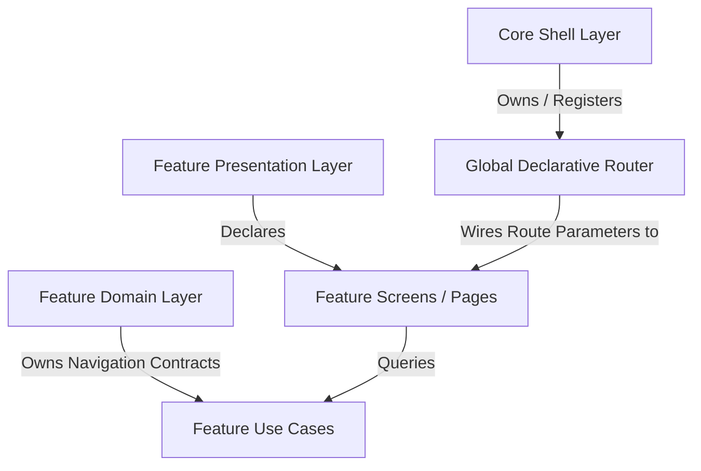
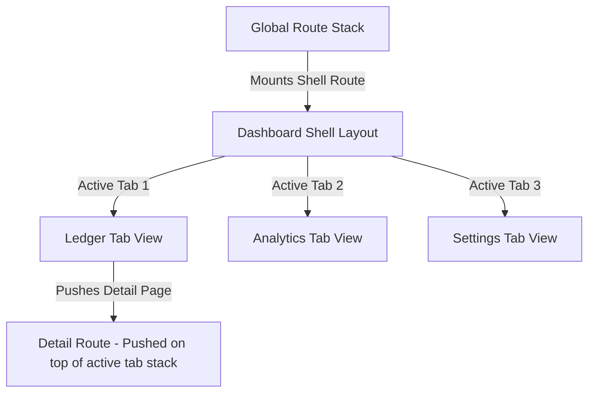
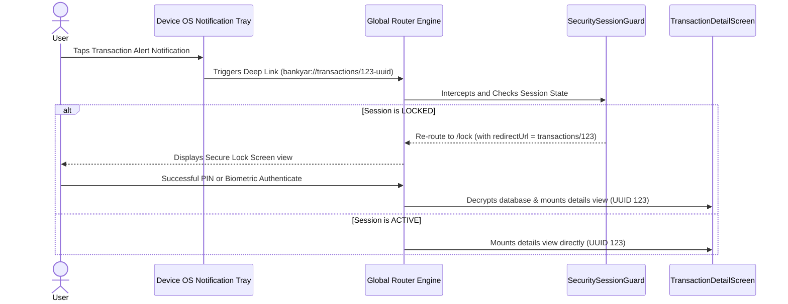
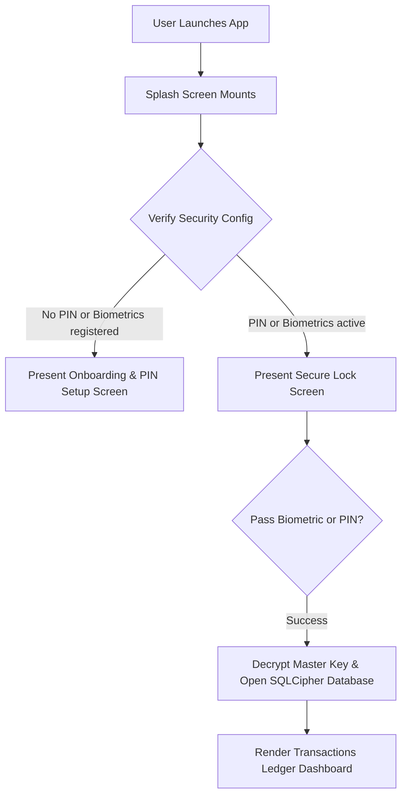
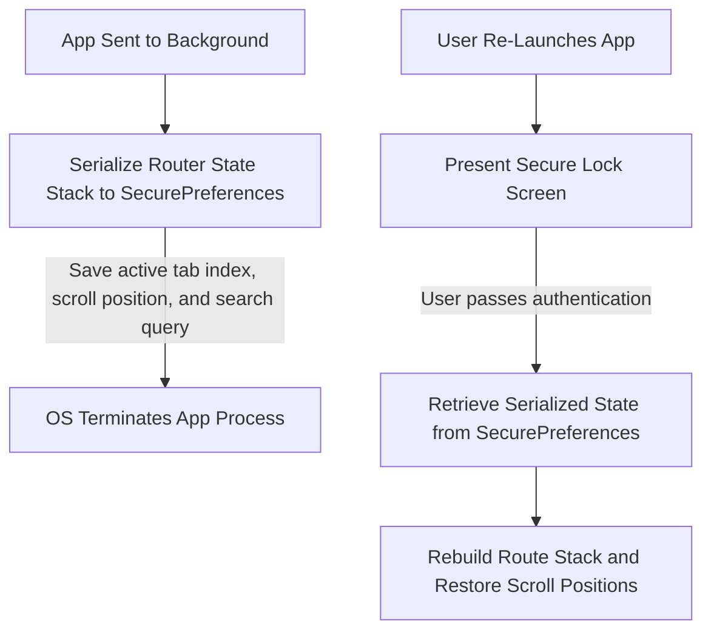

# BankYar Navigation System Architecture Specification

**Project Name:** BankYar
**Classification:** Enterprise Navigation & Routing Architecture Specification
**Document Version:** 1.0.0
**Authors:** Principal Flutter Architect, Mobile UX Architect & Navigation System Expert
**Status:** Approved / Routing Blueprint

---

## Executive Summary

BankYar is an offline-first, highly secure mobile application for intelligent banking SMS capture, cryptographic storage, and offline finance analytics. Operating with a strict **zero-network constraint** (no internet permission declared), BankYar relies entirely on local, on-device computations.

This document establishes the complete, enterprise-grade **Navigation System Architecture** for BankYar. Designed to support Clean Architecture and Feature-First modularity, the navigation system enforces strict module boundaries, supports state restoration, manages multi-layered route guards, and scales to accommodate future cloud synchronization and third-party plugin extensions.

This navigation system utilizes a declarative, compile-time safe routing paradigm. To ensure strict adherence to our architectural division of concerns, this document remains at the **Specification Level**. It contains exactly **zero lines of Flutter routing code** (no GoRouter configurations, no Navigator setups, and no Widget templates), serving as a definitive, platform-agnostic blueprint for human-led and AI-assisted development.

---

## Table of Contents
1. [Navigation Philosophy](#1-navigation-philosophy)
2. [Route Hierarchy](#2-route-hierarchy)
3. [Navigation Ownership](#3-navigation-ownership)
4. [Navigation Layers](#4-navigation-layers)
5. [Feature Routes](#5-feature-routes)
6. [Shared Routes](#6-shared-routes)
7. [Global Routes](#7-global-routes)
8. [Nested Navigation](#8-nested-navigation)
9. [Route Guards](#9-route-guards)
10. [Permission Guards](#10-permission-guards)
11. [Security Guards](#11-security-guards)
12. [Future Authentication Guards](#12-future-authentication-guards)
13. [Deep Link Strategy](#13-deep-link-strategy)
14. [Notification Routing](#14-notification-routing)
15. [App Launch Flow](#15-app-launch-flow)
16. [Splash Flow](#16-splash-flow)
17. [Startup Initialization Flow](#17-startup-initialization-flow)
18. [Error Navigation](#18-error-navigation)
19. [Empty State Navigation](#19-empty-state-navigation)
20. [Dialog Strategy](#20-dialog-strategy)
21. [Bottom Sheet Strategy](#21-bottom-sheet-strategy)
22. [Modal Strategy](#22-modal-strategy)
23. [Navigation Restoration](#23-navigation-restoration)
24. [Back Navigation Policy](#24-back-navigation-policy)
25. [Navigation Analytics (Future)](#25-navigation-analytics-future)
26. [Route Naming Strategy](#26-route-naming-strategy)
27. [Navigation Testing Strategy](#27-navigation-testing-strategy)
28. [Future Expansion Strategy](#28-future-expansion-strategy)
29. [Risks & Trade-offs](#29-risks--trade-offs)
30. [Architectural Decision Records (ADR)](#30-architectural-decision-records-adr)

---

## 1. Navigation Philosophy

The navigation philosophy of BankYar is founded on five core principles:
* **Declarative Router as State:** Navigation is not a series of imperative side-effects (such as manually pushing or popping widgets from a context stack). The active screen path, history, and modal stack exist as a deterministic read-only representation of the application's global state, synchronized with Riverpod providers.
* **Feature Isolation (Strict Module Boundaries):** Features must operate in complete isolation. Code inside the analytics module must never directly import visual pages or screens of the transactions module to navigate. Instead, all cross-feature navigation is orchestrated via generic routing contracts managed at the core shell level.
* **Security-Enforced Routing (Dynamic Interceptors):** Routes represent trust levels. Transitioning to secure feature paths requires passing through a multi-layered barrier of permission, authentication, and cryptographic session guards, preventing visual leaks of financial data.
* **Seamless State Restoration:** If the operating system terminates the application background process, the router must possess the state serialization data necessary to restore the exact visual stack (nested tabs, scroll anchors, and search parameters) upon user-reauthentication.
* **AI-First Maintainability:** Route naming, parameter validation, and hierarchy boundaries follow a predictable, highly standardized syntax, enabling automated LLMs to easily generate new features and refactor pages without circular dependency regressions.

---

## 2. Route Hierarchy

The application's route structure is modeled as a unified, logical tree, categorizing paths by their trust levels and feature modules.

```
/ (Root)
├── /splash (Unauthenticated, System-Level Boot)
├── /lock (Secure Session Unlock - PIN / Biometrics)
├── /error (Fatal System Error & Disaster Recovery)
└── /home (Authenticated Dashboard Shell - Multi-Tab Wrapper)
    ├── /home/ledger (Nested Tab: Transaction List Feed)
    │   ├── /home/ledger/search (Search Screen / Overlay)
    │   ├── /home/ledger/manual (Manual Transaction Creation)
    │   └── /home/ledger/detail/:id (Transaction Detail Inspector)
    │       └── /home/ledger/detail/:id/edit (Note & Category Annotation Editor)
    ├── /home/analytics (Nested Tab: Spending Charts & Reports)
    └── /home/settings (Nested Tab: App Config & System Maintenance)
        ├── /home/settings/parser (Custom Regex Template Builder)
        ├── /home/settings/backup (Local Encrypted Backup/Restore Controls)
        └── /home/settings/diagnostics (Background Service Health Checks)
```

---

## 3. Navigation Ownership

Route registration, state transitions, and parameter processing follow a strict ownership matrix based on Clean Architecture layers:



### Ownership Rules:
1. **Core Router Module:** Owns the global declarative configuration, mapping path templates (e.g., `/transactions/:id`) to screen builders. It acts as the horizontal bridge across features.
2. **Feature Presentation Module:** Owns its internal page routes and associated state controllers (Notifiers). For instance, the transactions feature owns the code building the details page, but does not own the global navigator connecting it to settings.
3. **Domain Use Cases:** Own navigation permissions and arguments contracts, ensuring that parameter checks (e.g., verifying a transaction UUID v4 structure) run at the pure Dart business boundary before rendering the visual screen.

---

## 4. Navigation Layers

BankYar maps its routing pipeline into four sequential processing layers, ensuring complete security and separation of concerns:

```
[ Navigation Trigger Event ]
             │
             ▼ Layer 1
┌──────────────────────────────────────────┐
│  Validation & Sanitization Layer         │
│  - Verifies parameters (UUID formats)    │
│  - Scrubs and sanitizes input arguments  │
└────────────┬─────────────────────────────┘
             │
             ▼ Layer 2
┌──────────────────────────────────────────┐
│  Route Guard & Interceptor Layer         │
│  - Evaluates system lock state           │
│  - Verifies permissions (SMS, storage)   │
└────────────┬─────────────────────────────┘
             │
             ▼ Layer 3
┌──────────────────────────────────────────┐
│  Declarative Routing Engine              │
│  - Resolves path patterns                │
│  - Matches nested shell navigation tabs  │
└────────────┬─────────────────────────────┘
             │
             ▼ Layer 4
┌──────────────────────────────────────────┐
│  Declarative UI Layout Layer             │
│  - Mounts feature screens and widgets    │
│  - Restores scroll position states       │
└──────────────────────────────────────────┘
```

---

## 5. Feature Routes

Feature-specific routes are managed inside self-contained modules, requiring direct constructor mapping to prevent compile-time leaks.

### Detailed Route Profiles

#### Route Profile 1: Transactions Ledger (`/home/ledger`)
* **Purpose:** Serves as the main transaction list viewer, showing reverse-chronological logs.
* **Owner:** `features/transactions` Presentation Team.
* **Entry Points:** `/splash` (on autologin), `/lock` (upon passing authentication).
* **Exit Points:** `/home/ledger/search`, `/home/ledger/manual`, `/home/ledger/detail/:id`, `/home/analytics`, `/home/settings`.
* **Required Data:** None.
* **Optional Data:** `categoryId` (Filter parameter), `bankName` (Filter parameter).
* **Dependencies:** `ledgerStateNotifierProvider` (watches active transaction streams).
* **Navigation Guards:** `SecuritySessionGuard` (verifies active unlocked session).
* **State Restoration:** Saves vertical scroll position, active filters, and seek-pagination anchors.
* **Deep Link Support:** `bankyar://ledger` — launches the ledger view directly.
* **Notification Support:** Rebuilds view reactively when background transaction generation commits.
* **Testing Strategy:** UI unit-test verifies that empty transaction lists display onboarding guides.
* **Future Extensions:** Support for multi-select swipe-to-delete bulk updates.

---

#### Route Profile 2: Transaction Detail (`/home/ledger/detail/:id`)
* **Purpose:** Inspects metadata fields and original raw SMS texts of a transaction.
* **Owner:** `features/transactions` Presentation Team.
* **Entry Points:** `/home/ledger` (tapping item on ledger list), `/search` (clicking search results).
* **Exit Points:** `/home/ledger` (popping back), `/home/ledger/detail/:id/edit` (tapping annotate).
* **Required Data:** `id` (36-character UUID v4 string representing transaction identity).
* **Optional Data:** None.
* **Dependencies:** `TransactionRepository` (queries details by UUID).
* **Navigation Guards:** `SecuritySessionGuard`, `ArgumentValidationGuard` (verifies UUID format).
* **State Restoration:** Restores active detail view tabs (Structured metadata vs Raw Carrier Text tab).
* **Deep Link Support:** `bankyar://transactions/:id` — opens transaction inspector directly.
* **Notification Support:** Tapping on a success notification launches this route with the associated transaction id.
* **Testing Strategy:** Integration test asserts that non-existent UUID parameters gracefully fallback to the `/error` route.
* **Future Extensions:** Display original cellular carrier operator receipts or custom PDF invoices.

---

#### Route Profile 3: Annotations Editor (`/home/ledger/detail/:id/edit`)
* **Purpose:** Updates category allocations, custom text notes, and search tags.
* **Owner:** `features/transactions` Presentation Team.
* **Entry Points:** `/home/ledger/detail/:id`.
* **Exit Points:** `/home/ledger/detail/:id` (on successful commit or cancel).
* **Required Data:** `id` (UUID v4 of target transaction).
* **Optional Data:** None.
* **Dependencies:** `TransactionRepository` (to save modifications).
* **Navigation Guards:** `SecuritySessionGuard`, `ArgumentValidationGuard`.
* **State Restoration:** Saves text notes field values and currently selected category markers.
* **Deep Link Support:** None (Restricted to inside session navigation for privacy).
* **Notification Support:** None.
* **Testing Strategy:** Form-level validation checks verifying notes size limits (1,000 characters).
* **Future Extensions:** Automatic hashtag suggestions parsed from Note content.

---

#### Route Profile 4: Manual Transaction Creator (`/home/ledger/manual`)
* **Purpose:** Allows manual transaction logging or clipboard fallback parsing.
* **Owner:** `features/transactions` Presentation Team.
* **Entry Points:** `/home/ledger`, App Resume (on detecting banking SMS pattern in clipboard).
* **Exit Points:** `/home/ledger` (on save or cancel).
* **Required Data:** None.
* **Optional Data:** `pastedSmsText` (pasted text to parse and pre-fill).
* **Dependencies:** `SaveTransactionUseCase`.
* **Navigation Guards:** `SecuritySessionGuard`.
* **State Restoration:** Saves partially filled form text parameters.
* **Deep Link Support:** None.
* **Notification Support:** None.
* **Testing Strategy:** Assert form rejects negative amounts or invalid currency code inputs.
* **Future Extensions:** Voice-activated offline spending logging.

---

#### Route Profile 5: Spend Search (`/home/ledger/search`)
* **Purpose:** Instant local query engine matching merchants, notes, and tags.
* **Owner:** `features/transactions` Presentation Team.
* **Entry Points:** `/home/ledger` search button.
* **Exit Points:** `/home/ledger` (pop back), `/home/ledger/detail/:id`.
* **Required Data:** None.
* **Optional Data:** `initialQuery` (string).
* **Dependencies:** `LocalSearchService` (interacts with FTS5 search index).
* **Navigation Guards:** `SecuritySessionGuard`.
* **State Restoration:** Restores active search results list and input query string.
* **Deep Link Support:** `bankyar://search?q=:query` — executes search on open.
* **Notification Support:** None.
* **Testing Strategy:** Assert search query utilizes 300ms debounce to prevent layout freezes.
* **Future Extensions:** Advanced multi-select boolean operators (`AND`, `OR`).

---

#### Route Profile 6: Spend Analytics (`/home/analytics`)
* **Purpose:** Interactive offline spending charts and monthly trend analytics.
* **Owner:** `features/analytics` Presentation Team.
* **Entry Points:** `/home/ledger` tab switcher.
* **Exit Points:** `/home/ledger`, `/home/settings`, `/home/ledger/detail/:id` (clicking chart segments).
* **Required Data:** None.
* **Optional Data:** `selectedMonth` (DateTime format).
* **Dependencies:** `GenerateCashFlowReportUseCase`.
* **Navigation Guards:** `SecuritySessionGuard`.
* **State Restoration:** Restores selected month, chart zoom levels, and active tab selections.
* **Deep Link Support:** `bankyar://analytics` — launches charts directly.
* **Notification Support:** None.
* **Testing Strategy:** Verify chart rendering does not drop frames below 60fps over 100,000 records.
* **Future Extensions:** Local, privacy-safe budgeting forecast charts using simple linear regression.

---

#### Route Profile 7: Custom Parser Builder (`/home/settings/parser`)
* **Purpose:** Allows creation and compilation of custom regular expressions for unsupported banks.
* **Owner:** `features/sms_detection` Presentation Team.
* **Entry Points:** `/home/settings` parser button.
* **Exit Points:** `/home/settings` (pop back).
* **Required Data:** None.
* **Optional Data:** `importTemplateJson` (for QR code imports).
* **Dependencies:** `ParserTemplateRepository`, `CompileRegexPatternUseCase`.
* **Navigation Guards:** `SecuritySessionGuard`.
* **State Restoration:** Restores raw regex input fields and test texts.
* **Deep Link Support:** `bankyar://import_template?config=:json` — prompts custom rule import.
* **Notification Support:** None.
* **Testing Strategy:** Validates that regular expressions compile cleanly under standard engines.
* **Future Extensions:** Non-regex, token-based builder using dynamic keyword selection.

---

#### Route Profile 8: Backup Management (`/home/settings/backup`)
* **Purpose:** Encrypted local data exports and disaster restores.
* **Owner:** `features/backup_restore` Presentation Team.
* **Entry Points:** `/home/settings` backup button.
* **Exit Points:** `/home/settings` (pop back).
* **Required Data:** None.
* **Optional Data:** None.
* **Dependencies:** `ExportEncryptedBackupUseCase`, `ImportEncryptedBackupUseCase`.
* **Navigation Guards:** `SecuritySessionGuard`.
* **State Restoration:** Restores active progress states (Exporting vs Restoring progress dialogs).
* **Deep Link Support:** `bankyar://restore?file=:path` — triggers restore prompt.
* **Notification Support:** None.
* **Testing Strategy:** Verify recovery fails if GCM authentication integrity check fails.
* **Future Extensions:** Secure, password-encrypted P2P transfers over local Wi-Fi.

---

#### Route Profile 9: System Diagnostics (`/home/settings/diagnostics`)
* **Purpose:** Heartbeat monitor verifying SMS background services.
* **Owner:** Core Logging & Database Team.
* **Entry Points:** `/home/settings` diagnostics button.
* **Exit Points:** `/home/settings` (pop back).
* **Required Data:** None.
* **Optional Data:** None.
* **Dependencies:** `SystemHealthService`.
* **Navigation Guards:** `SecuritySessionGuard`.
* **State Restoration:** None.
* **Deep Link Support:** None.
* **Notification Support:** None.
* **Testing Strategy:** Verify log files scrub PII (all amounts replaced with `[REDACTED_NUM]`).
* **Future Extensions:** Automated system environment health diagnostic generator.

---

## 6. Shared Routes

Shared routes represent interactive panels or modals that cross feature boundaries without hard navigation stack updates:

* **Category Selection Sheet (`/shared/categories`):**
  - **Purpose:** Floating bottom sheet presenting custom categories for transaction allocation.
  - **Invoked By:** `/home/ledger/detail/:id/edit`, `/home/ledger/manual`.
  - **Output Action:** Returns a valid `CategoryId` UUID v4 back to the calling screen.
* **Custom Tags Dialog (`/shared/tags`):**
  - **Purpose:** Pop-up modal allowing tagging, adding custom hashtag text.
  - **Invoked By:** `/home/ledger/detail/:id/edit`.
  - **Output Action:** Registers custom tag bindings inside the active transaction model.

---

## 7. Global Routes

Global routes represent system-level paths that control application states and handle errors:

* **Splash Screen (`/splash`):**
  - **Purpose:** Application startup sequence. Validates system dependencies and app lock settings.
  - **Required Data:** None.
  - **Navigation Guards:** None (Always accessible).
* **Secure Auth Lock Screen (`/lock`):**
  - **Purpose:** Password PIN / Biometric secure entry gate.
  - **Required Data:** `redirectUrl` (string representing target destination post-unlock).
  - **Navigation Guards:** None.
* **System Error Route (`/error`):**
  - **Purpose:** Displays fatal errors and guides users through database recovery or clean resets.
  - **Required Data:** `failureCode` (System error identifier), `errorMessage` (User-friendly error).
  - **Navigation Guards:** None.

---

## 8. Nested Navigation

BankYar maps its core feature dashboard shell inside a nested navigation layout (e.g., using Flutter's `StatefulShellRoute`). This architecture guarantees that independent visual hierarchies (Ledger, Analytics, and Settings) are retained in memory simultaneously.



### Key Performance Benefits:
1. **Preserved Visual State:** Switching tabs (e.g., from Analytics to Settings) does not destroy Tab 1's visual layout, keeping scroll states, tab zoom levels, and active query inputs cached.
2. **Tab-Specific Sub-Stacks:** Pushing nested sub-routes (e.g., loading `/home/ledger/detail/123` from Ledger) maintains the tab view boundaries, letting users use the back button within the active tab stack.

---

## 9. Route Guards

Route Guards act as synchronous gatekeepers, verifying permissions and session states before allowing navigation transitions. If a guard fails, the transition is aborted, redirecting the user to a safe fallback route.

| Guard Name | Target Scope | Failure Trigger | Action Taken |
| :--- | :--- | :--- | :--- |
| **`SecuritySessionGuard`** | All `/home/**` routes | `SessionState.status` equals `LOCKED` | Aborts transition; redirects user to `/lock` with `redirectUrl` payload. |
| **`PermissionGuard`** | `/home/settings/diagnostics` | `PermissionState.SMS` equals `DENIED` | Halts path; loads in-app permissions setup wizard overlay. |
| **`ArgumentValidationGuard`**| Dynamic parameters (e.g., `:id` inside ledger details) | Parameter fails regular expression checks (e.g. invalid UUID format) | Cancels navigation; routes user to `/error` with bad argument parameters. |

---

## 10. Permission Guards

Permission guards verify operating system authorizations before allowing access to hardware-dependent features:

* **SMS Capture Access Guard:**
  - **Target:** In-app diagnostics screen (`/home/settings/diagnostics`).
  - **Mechanism:** Queries `SystemPermissionService`. If background SMS capture permissions are revoked, the guard pauses navigation, loading a graceful fallback tutorial screen that guides the user through Android battery optimization whitelists.

---

## 11. Security Guards

Security guards protect sensitive financial data from unauthorized local exposure:

* **Volatile RAM Key Verification Guard:**
  - **Mechanism:** Evaluates if the database master key is cached in volatile RAM. If the 5-minute background inactivity timer has fired, the key is evicted, and this guard blocks all subsequent feature navigation transitions, forcing a redirection to the lock screen.

---

## 12. Future Authentication Guards

Prepared for future secure cloud synchronization and multi-device support:

* **Authentication Guard (Future):**
  - **Placeholder Contract:** Exposes an interface that intercepts cloud settings views. In future releases, if local credentials or secure synchronization tokens expire, this guard will redirect the user to the secure Cloud Login screen, preserving current ledger data safely during the authentication transition.

---

## 13. Deep Link Strategy

Although BankYar operates with a zero-network constraint, deep links can be resolved locally by processing native OS incoming parameters.

### Supported Deep Link Schema: `bankyar://*`

| URI Template | Feature Destination | Arguments | Security Guard | Business Scenario |
| :--- | :--- | :--- | :--- | :--- |
| `bankyar://ledger` | `/home/ledger` | None | `SecuritySessionGuard` | Launches app directly into chronological transaction ledger feed. |
| `bankyar://transactions/:id` | `/home/ledger/detail/:id` | `id` (UUID v4) | `SecuritySessionGuard`, `ArgumentValidationGuard` | Tapping a success notification opens detail inspector of parsed transaction. |
| `bankyar://search?q=:query` | `/home/ledger/search` | `query` (String) | `SecuritySessionGuard` | Opens search view directly with pre-filled query text. |
| `bankyar://import_template?config=:json` | `/home/settings/parser` | `config` (Signed JSON) | `SecuritySessionGuard` | Scanning a secure template QR code imports custom parsing rules. |

---

## 14. Notification Routing

When the background SMS processing engine successfully parses a transaction, it fires a system tray alert. Tapping this notification triggers a deep link that must be processed safely:



---

## 15. App Launch Flow

The app launch flow is the startup sequence that runs when the application is launched, ensuring the environment is secure and initialized before displaying the dashboard:



---

## 16. Splash Flow

The splash flow manages the initial boot sequence:

1. **Mount Splash Screen:** Displays a non-intrusive logo.
2. **Execute Diagnostic Verifications:** Verifies database file signatures and validates database schemas sequentially.
3. **Check Lock Preferences:** Reads settings from SecurePreferences. If security features are active, redirect to `/lock`; if the app is launching for the first time, redirect to the onboarding setup page.

---

## 17. Startup Initialization Flow

Startup initialization is executed off the main thread during the splash sequence, ensuring standard boot times:

- **Step 1: Settings Initialization:** Loads theme configurations, languages, and app lock parameters from SecurePreferences.
- **Step 2: Database Signature Verification:** Verifies database file header integrity, protecting the database from filesystem tampering.
- **Step 3: Security Validation:** Checks PIN lockout durations. If a lockout is active, blocks input and displays a countdown timer.

---

## 18. Error Navigation

To protect data privacy and maintain stability, technical database exceptions are caught and sanitized, redirecting the user to a secure error screen:

- **Disaster Recovery Interface (`/error`):**
  - **Scenarios:** Triggered by database corruption failures or Keystore key resets.
  - **UX Rules:** Hides technical stack traces to prevent info leakage. Guides the user through initializing a fresh sandbox database and importing their latest encrypted `.bankyar` backup file.

---

## 19. Empty State Navigation

Empty state interfaces provide helpful onboarding instructions, guiding users when no records are returned:

* **Ledger Empty State:**
  - **UX Rule:** If the transaction stream is empty, the ledger view displays a custom template with tips, such as how to import a CSV statement or scan custom rules QR codes.
* **Analytics Empty State:**
  - **UX Rule:** If there is no transaction history, the charts dashboard displays a placeholder layout that guides the user to complete onboarding.

---

## 20. Dialog Strategy

Dialogs represent small, focused pop-up overlays used for secondary actions. To maintain a clean navigation stack, dialogs do not have dedicated route paths:

* **Implementation Guidelines:**
  - Dialogs must be managed locally within the active screen context, preventing back stack inconsistencies.
  - Clicking outside the dialog dismisses it safely.
* **Examples:**
  - *Confirm Purge Dialog:* Prompts the user before executing a self-destruct operation, requiring confirmation.

---

## 21. Bottom Sheet Strategy

Bottom sheets are used for user selection lists and interactive menus:

* **Implementation Guidelines:**
  - Bottom sheets must slide up from the bottom, covering no more than 70% of the screen height to preserve context.
  - Sheets must utilize scrollable lists, handling overflow gracefully on smaller screens.
* **Examples:**
  - *Category Assignment Sheet:* Allows the user to quickly select or create custom spending categories.

---

## 22. Modal Strategy

Modals represent temporary, full-screen overlay paths used for focused tasks:

* **Implementation Guidelines:**
  - Modals slide up vertically, covering 100% of the screen.
  - Closing a modal is handled explicitly via Close or Cancel buttons, ensuring uncommitted form changes are discarded safely.
* **Examples:**
  - *Manual Entry Creator:* Full-screen modal allowing users to log manual transaction details.

---

## 23. Navigation State Restoration

To support seamless background multitasking, BankYar implements a robust state restoration strategy. If the operating system terminates the app process while it is in the background, the application must restore its exact state upon resume:



### Key Security Safeguards:
1. **Zero Database Key Persistence:** To maintain strict security, the database encryption key is never saved on disk. If the app process is terminated, the user must re-authenticate to decrypt the database and restore the ledger view.
2. **Encrypted State Serialization:** Serialized state variables (e.g., active search queries) are encrypted before writing to SecurePreferences, preventing sensitive inputs from leaking in plaintext.

---

## 24. Back Navigation Policy

To prevent navigation inconsistencies and accidental application closures, BankYar enforces strict back navigation rules:

* **Root Back Interception (Double-Tap to Exit):**
  - Tapping the system back button on the primary `/home/ledger` dashboard must not close the application immediately. Instead, it must display a non-intrusive notification ("Press back again to exit"). Tapping back a second time within 2 seconds closes the app.
* **Modal Form Interception (Unsaved Changes Warning):**
  - If a user attempts to navigate back or close a modal form (e.g., Annotations Editor or Custom Template Builder) with unsaved changes, the router intercepts the pop event, displaying a confirmation dialog ("Discard unsaved changes?").

---

## 25. Navigation Analytics (Future)

Since BankYar operates with a strict zero-network constraint, traditional cloud-based analytics (e.g., Firebase Analytics) are prohibited. Navigation metrics are logged completely offline:

* **Local Retention:** Screen transition logs are recorded in the encrypted database, tracking parameters such as screen view durations and tab usage.
* **User Consent Export:** These diagnostic metrics are kept local and are only exported when the user explicitly triggers a "Export Performance Diagnostics" action from the settings panel.

---

## 26. Route Naming Strategy

To simplify development and ensure compatibility with AI code-generation agents, all route paths, name definitions, and arguments follow a strict, standardized syntax:

* **Standardized Path Syntax:** Route paths must be declared using lowercase, snake_case strings:
  - Good: `/home/settings/backup`
  - Bad: `/home/settings/backup_Management`
* **Static Class Parameters:** String paths and route keys must be defined as static constant properties on screen classes, preventing typo errors across the application:
  ```dart
  // Standardized Route Naming Contract:
  class BackupManagementScreen {
    static const String routeName = 'backup_management';
    static const String routePath = '/home/settings/backup';
  }
  ```

---

## 27. Navigation Testing Strategy

The navigation and routing stack is verified using automated test suites running in isolated environments:

* **Declarative Routing Unit Tests:** Tests verify that the router correctly maps path patterns to their corresponding screen builders and handles parameters (such as UUID formats) safely.
* **Route Guard Integration Tests:** Tests simulate various session states to verify that the `SecuritySessionGuard` blocks access and redirects users to `/lock` when the session is locked.
* **Mock State Restoration Tests:** Tests verify that the state restoration engine serializes and restores stack histories and scroll positions correctly without losing consistency.

---

## 28. Future Expansion Strategy

The routing architecture is designed to support evolutionary updates without requiring a redesign of core routing components:

* **Modularity for Multi-Device Sync:** Adding synchronization settings will require only registering a new sub-route path under Settings (e.g., `/home/settings/sync`), keeping the rest of the application unchanged.
* **Seamless iOS Graceful Degradation:** The routing configuration supports dynamic platform adjustments, allowing the iOS build to swap background SMS guides with clipboard-import guides without modifying the central route structure.

---

## 29. Risks & Trade-offs

Every routing and navigation decision involves balancing multiple priorities. Below is the justification for the trade-offs made in BankYar's navigation architecture:

### 1. Declarative Routing vs. Imperative Pops/Pushes
* **The Choice:** Declarative routing (e.g., GoRouter configurations).
* **Trade-off Analysis:** Imperative navigation (`Navigator.push`) is simpler to implement in small projects. However, it makes deep-linking and state restoration complex. Declarative routing treats navigation as a function of application state, ensuring reliability and testability at the cost of minor registration overhead.

### 2. Nesting Navigation Shell vs. Single Flattened Stack
* **The Choice:** Nested Navigation Tab Shell.
* **Trade-off Analysis:** Flat navigation structures consume fewer resources because only one screen is held in memory. However, flat structures destroy visual tab states when switching tabs. Nested navigation shell structures preserve tab views in memory, prioritizing user experience over minor RAM optimizations.

---

## 30. Architectural Decision Records (ADR)

### ADR-001: Declarative Routing Configuration
* **Status:** Approved
* **Context:** The application must support deep links, state restoration, and multi-layered route guards.
* **Decision:** Implement declarative routing using a compile-time safe router configuration.
* **Rationale:** Declarative routing treats navigation as a function of the application's global state, enabling reliable deep-linking, automatic state restoration, and robust security interceptors.

### ADR-002: Enforcing SecuritySessionGuard Interceptors
* **Status:** Approved
* **Context:** Financial transaction details must be protected from unauthorized local exposure.
* **Decision:** All routes under the `/home/**` dashboard path must pass through the `SecuritySessionGuard` interceptor.
* **Rationale:** This ensures that if the user session locks due to inactivity or manual action, any subsequent navigation attempts are blocked, redirecting the user to the secure lock screen.

### ADR-003: Tab Shell Visual Preservation
* **Status:** Approved
* **Context:** Users expect smooth multitasking, and switching tabs must not lose active scroll positions or query inputs.
* **Decision:** Standardize the main dashboard shell using nested tab routes.
* **Rationale:** This retains tab visual states (scroll anchors and input fields) in memory, ensuring responsive transitions across dashboard sections.

---
**End of Navigation System Architecture Specification**
