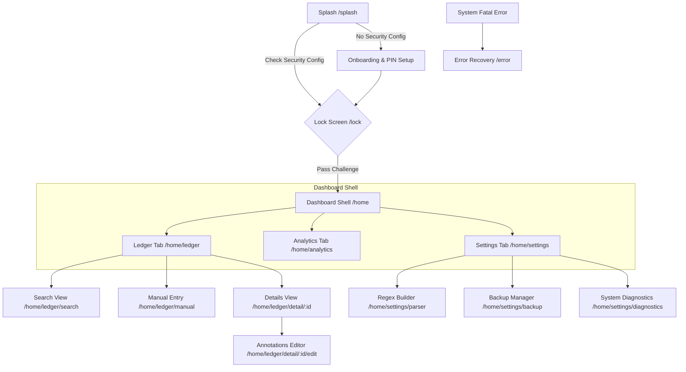

# BankYar Navigation & Information Architecture System Specification

**Project Name:** BankYar
**Classification:** Enterprise Navigation, Routing & Information Architecture Specification
**Document Version:** 2.0.0
**Authors:** Principal UX Architect, Information Architect, Navigation Design Specialist, Flutter Product Architect
**Status:** Approved / Routing Blueprint

---

## Executive Summary

BankYar is an offline-first, secure mobile application for intelligent banking SMS capture, cryptographic storage, and offline finance analytics. Operating under a strict **zero-network constraint** (no internet permission declared at the OS level), BankYar relies entirely on local, on-device computations.

This document establishes the official **Navigation & Information Architecture System** for BankYar. Designed to implement the core product personality (Stoic, Precise, Empowering) and UX principles defined in `DESIGN_PHILOSOPHY.md`, this architecture serves as the absolute single source of truth for how users move through the application, discover facts, complete tasks, and maintain spatial orientation.

This navigation system utilizes a declarative, state-driven routing paradigm. To ensure strict adherence to our architectural separation of concerns, this document remains at the **Specification Level**. It contains exactly **zero lines of implementation code** (no router configurations, no page stacks, and no UI layout templates), serving as a definitive, platform-agnostic blueprint for human-led and AI-assisted development.

---

## Table of Contents
1. [Navigation Philosophy](#1-navigation-philosophy)
2. [Information Architecture Principles](#2-information-architecture-principles)
3. [Content Hierarchy](#3-content-hierarchy)
4. [Application Sitemap](#4-application-sitemap)
5. [User Journey Mapping](#5-user-journey-mapping)
6. [Navigation Hierarchy](#6-navigation-hierarchy)
7. [Primary Navigation](#7-primary-navigation)
8. [Secondary Navigation](#8-secondary-navigation)
9. [Contextual Navigation](#9-contextual-navigation)
10. [Bottom Navigation Strategy](#10-bottom-navigation-strategy)
11. [Top App Bar Navigation](#11-top-app-bar-navigation)
12. [Search-first Navigation](#12-search-first-navigation)
13. [Filter Navigation](#13-filter-navigation)
14. [Statistics Navigation](#14-statistics-navigation)
15. [Settings Navigation](#15-settings-navigation)
16. [Detail Page Navigation](#16-detail-page-navigation)
17. [Dialog Navigation](#17-dialog-navigation)
18. [Bottom Sheet Navigation](#18-bottom-sheet-navigation)
19. [Modal Navigation](#19-modal-navigation)
20. [Deep Link Strategy](#20-deep-link-strategy)
21. [Notification Entry Points](#21-notification-entry-points)
22. [Shortcut Entry Points](#22-shortcut-entry-points)
23. [Widget Entry Points](#23-widget-entry-points)
24. [Back Navigation Rules](#24-back-navigation-rules)
25. [Up Navigation Rules](#25-up-navigation-rules)
26. [Navigation History Rules](#26-navigation-history-rules)
27. [State Restoration](#27-state-restoration)
28. [Multi-window Strategy](#28-multi-window-strategy)
29. [Foldable Navigation](#29-foldable-navigation)
30. [Tablet Navigation](#30-tablet-navigation)
31. [Landscape Navigation](#31-landscape-navigation)
32. [RTL Navigation Rules](#32-rtl-navigation-rules)
33. [Accessibility Navigation](#33-accessibility-navigation)
34. [Focus Navigation](#34-focus-navigation)
35. [Keyboard Navigation](#35-keyboard-navigation)
36. [Empty Navigation States](#36-empty-navigation-states)
37. [Error Navigation Recovery](#37-error-navigation-recovery)
38. [Navigation Analytics Events](#38-navigation-analytics-events)
39. [Navigation Token Mapping](#39-navigation-token-mapping)
40. [Governance Rules](#40-governance-rules)
41. [Validation Checklist](#41-validation-checklist)
42. [Anti-pattern Catalog](#42-anti-pattern-catalog)
43. [Future Evolution Strategy](#43-future-evolution-strategy)

---

## 1. Navigation Philosophy

The navigation philosophy of BankYar is founded on four core principles:

* **Declarative Router as State:** Navigation is not a series of imperative side-effects. The active screen path, history, and modal stack exist as a deterministic representation of the application's global state, synchronized with Riverpod providers.
* **Offline-First UX Consistency:** Since there is zero network latency, transitions must be instantaneous. The navigation system must never block user actions with loading spinners. If background ingestion is active, the active screen transitions are executed locally and updated immediately.
* **Content-as-Interface:** Grouping containers and reading lines are defined by the structure of text and figures. Navigation indicators use minimal visual noise, reserving contrast strictly for active items and primary navigation triggers.
* **Logical Coordinates (RTL-First):** Navigation directions are never defined physically (left or right). Every transition, swipe vector, and structural alignment utilizes logical coordinates (start, end, inline, block) to ensure flawless spatial adaptability.

---

## 2. Information Architecture Principles

The logical structure of BankYar is governed by clear architectural principles:

* **Strict Functional Isolation:** Features operate in complete isolation. For example, code inside the analytics feature never directly imports page structures from the transactions feature. All cross-feature transitions are orchestrated via generic routing contracts managed at the core shell level.
* **Low Cognitive Load via Progressive Disclosure:** High-level dashboards display only the core facts (Amount, Date, and Counterparty). Detailed parameters (such as raw SMS carrier text or custom category rules) are kept behind a single-tap detail inspector.
* **Unified Namespaces and Data Boundaries:** All resources are structured using clear semantic namespaces. Accessing features requires passing through explicit route gates, preserving absolute security and local confidentiality.

---

## 3. Content Hierarchy

Information in BankYar is organized strictly by transactional significance, establishing a consistent vertical scanning line for the user's eyes:

```
+-------------------------------------------------------------+
| 1. THE NUMBER (Amount)                                      |
|    - Highest visual weight, display typography scale        |
+-------------------------------------------------------------+
                              |
                              v
+-------------------------------------------------------------+
| 2. THE COUNTERPARTY (Merchant / Bank Sender)                 |
|    - Regular weight, secondary reading scale                 |
+-------------------------------------------------------------+
                              |
                              v
+-------------------------------------------------------------+
| 3. THE TIMESTAMP (Date & Time)                              |
|    - Monospace mathematical scale, metadata color           |
+-------------------------------------------------------------+
                              |
                              v
+-------------------------------------------------------------+
| 4. THE META-TAGS (Categories / Notes / Hashtags)            |
|    - Smallest scale, styled within flat chip containers     |
+-------------------------------------------------------------+
```

---

## 4. Application Sitemap

The BankYar application structure is mapped as a unified, logical tree, categorizing paths by their trust levels and feature modules.

### ASCII Sitemap

```
[ Root Path: / ]
       |
       +---> [ /splash ] (Unauthenticated - Boot diagnostics & Keystore validation)
       |
       +---> [ /lock ] (Security Gate - PIN / Biometrics challenge)
       |
       +---> [ /error ] (Disaster Recovery - Database signature failures & recovery controls)
       |
       +---> [ /home ] (Authenticated Dashboard Shell - Multi-Tab Wrapper)
                |
                +---> [ /home/ledger ] (Tab 1: Chronological transaction feed)
                |        |
                |        +---> [ /home/ledger/search ] (Local full-text FTS5 query)
                |        +---> [ /home/ledger/manual ] (Manual transaction form)
                |        +---> [ /home/ledger/detail/:id ] (Transaction inspector)
                |                 |
                |                 +---> [ /home/ledger/detail/:id/edit ] (Category & notes annotation)
                |
                +---> [ /home/analytics ] (Tab 2: Spend distributions & monthly cash flows)
                |
                +---> [ /home/settings ] (Tab 3: System management & diagnostics)
                         |
                         +---> [ /home/settings/parser ] (Custom regex rules builder)
                         +---> [ /home/settings/backup ] (Encrypted backup export & import)
                         +---> [ /home/settings/diagnostics ] (SMS service heartbeat logs)
```

### Navigation Flow Diagram (Mermaid)



---

## 5. User Journey Mapping

Every primary user operation is mapped onto a clear, multi-step navigation sequence, ensuring complete reliability under different app states.

### Task Flow Charts

#### 1. First Launch Journey (App Setup)
```
[User Launches App] -> [Splash Screen Checks Config] -> [Redirects to PIN Setup Screen]
 -> [User Configures PIN] -> [User Confirms PIN] -> [Initialize SQLite Schema] -> [Route to Ledger Dashboard]
```

#### 2. Daily Usage (Session Recovery)
```
[User Opens App] -> [Splash Screen Reads Lock Settings] -> [Redirects to Lock Screen]
 -> [User Authenticates via Biometrics or PIN] -> [Retrieve AES Key] -> [Route to Ledger Dashboard]
```

#### 3. Receiving a New SMS (Silent Ingestion)
```
[Incoming Banking SMS] -> [Background BroadcastReceiver Intercepts] -> [Extract Bytes]
 -> [Deduplicate via Hash Check] -> [Deterministic Regex Match] -> [Write Encrypted Record]
  -> [Fire System Tray Notification]
```

#### 4. Opening a Notification (Secure Direct Entry)
```
[User Taps System Tray Notification] -> [Router Intercepts Deep Link bankyar://transactions/:id]
 -> [Trigger SecuritySessionGuard] -> [Display Secure Lock Screen] -> [Successful PIN/Biometric Authentication]
  -> [Route Directly to Transaction Inspector with ID]
```

#### 5. Searching Transactions (Local Full-Text Search)
```
[User Taps Search in Ledger Header] -> [Open Search Overlay] -> [User Enters Query]
 -> [Apply 300ms Input Debounce] -> [Query Local FTS5 SQLite Index] -> [Display Matching Transaction List]
```

#### 6. Adding Notes (Annotation Flow)
```
[User Opens Details Page] -> [Tap Edit Notes Button] -> [Route to Annotation Screen]
 -> [Validate Note Character Limit < 1000] -> [Tap Save Action] -> [Commit to SQLCipher Database]
  -> [Self-dismissing success notice] -> [Return to Details Page]
```

#### 7. Viewing Statistics (Analytical Drill-Down)
```
[User Selects Analytics Tab] -> [Generates Spending Cash Flow Reports] -> [Tap Segment on Spend Donut Chart]
 -> [Retrieve Categories ID] -> [Deep Link Route to Ledger View with Category Filters Applied]
```

#### 8. Changing Settings (Preference Configuration)
```
[User Selects Settings Tab] -> [Display Linear Preference List] -> [Tap Preference Toggle]
 -> [Commit updated settings parameter to SecurePreferences] -> [Apply theme/behavior shifts instantly]
```

#### 9. Creating Backup (Encrypted Export Sequence)
```
[User Opens Backup Settings] -> [Tap Export Backup Action] -> [Verify Master Lock PIN]
 -> [Read SQLCipher database file bytes] -> [Encrypt via AES-256-GCM using derived PBKDF2 key]
  -> [Launch System Share Sheet to save local .bankyar file]
```

#### 10. Restoring Backup (Disaster Recovery Sequence)
```
[User Mounts Error Screen or Settings] -> [Tap Restore Backup Action] -> [Select local .bankyar file]
 -> [Prompt Backup Password Input] -> [Attempt Decryption and GCM Integrity Validation]
  -> [If valid: Overwrite local database file and trigger soft reload] -> [Redirect to Lock Screen]
```

#### 11. Changing Security PIN
```
[User Opens Security Settings] -> [Tap Update Security PIN] -> [Prompt and Validate Current PIN]
 -> [Prompt New PIN] -> [Re-confirm New PIN] -> [Encrypt and save new hash in SecurePreferences]
  -> [Trigger Success Notification]
```

#### 12. Future Feature Expansion (Modular Integration)
```
[Register Future Sub-route in configurations] -> [Map sub-route to features module]
 -> [Implement Domain repository interfaces] -> [Register Riverpod provider mapping]
```

---

## 6. Navigation Hierarchy

BankYar organizes its route registry inside self-contained modules, requiring direct constructor mapping to prevent compile-time leaks.

```
       +-------------------------------------------------------+
       |                  CORE SYSTEM ROUTER                   |
       |  - Manages global stateful shell route                |
       |  - Houses SecuritySessionGuard & ArgumentValidation   |
       +--------------------------+----------------------------+
                                  |
                                  | Mounts
                                  v
       +-------------------------------------------------------+
       |               AUTHENTICATED SYSTEM SHELL              |
       |  - Multi-tab layout tracking:                         |
       |    - Tab 1: /home/ledger                              |
       |    - Tab 2: /home/analytics                           |
       |    - Tab 3: /home/settings                            |
       +--------------------------+----------------------------+
                                  |
                                  | Resolves sub-paths
                                  v
       +-------------------------------------------------------+
       |                  FEATURE ROUTE SCHEMAS                |
       |  - features/secure_auth   => /lock                    |
       |  - features/transactions  => /home/ledger/**          |
       |  - features/analytics     => /home/analytics          |
       |  - features/backup_restore=> /home/settings/backup    |
       +-------------------------------------------------------+
```

---

## 7. Primary Navigation

The primary navigation of BankYar uses a persistent bottom navigation layout on phone viewports. It acts as the gateway to the three primary areas of the application: Ledger, Analytics, and Settings.

* **Persistent Tab Layout:** Switching tabs (e.g., Ledger to Analytics) maintains the active state of each tab in memory, preserving scroll coordinates and active filters.
* **Unified Selection Targets:** Active tab targets are highlighted using `bankyar.semantic.color.text.accent` to ensure clear focus.

---

## 8. Secondary Navigation

Secondary navigation manages transitions within individual tab stacks, keeping the user's focus organized:

* **Linear Stack Transitions:** Sub-pages (such as transaction details or rule builders) slide horizontally onto the screen, remaining contained within the active tab's stack.
* **Symmetrical Header Actions:** The top App Bar displays a clear back chevron on the logical start edge, providing a consistent exit point.

---

## 9. Contextual Navigation

Contextual navigation provides inline navigation opportunities based on the user's active context:

* **Horizontal Category Chips:** Tapping a category chip on a transaction card automatically redirects the user to a filtered view of the ledger.
* **Inline Error Recoveries:** Inline alert banners include direct action triggers (such as "Retry Diagnostic Check" or "Re-validate PIN") to help users resolve issues quickly.

---

## 10. Bottom Navigation Strategy

The bottom navigation bar coordinates high-level app navigation on compact screen devices, keeping controls within comfortable thumb reach.

```
  Compact Viewport Navigation Layout:
  +-------------------------------------------------------------------------+
  |  [Icon: Ledger]          [Icon: Analytics]           [Icon: Settings]   |
  |     Ledger                   Analytics                   Settings       |
  |  (Active Tab indicator: bankyar.semantic.color.text.accent)             |
  +-------------------------------------------------------------------------+
```

* **No Dynamic Text Hiding:** Both active and inactive navigation labels must remain visible at all times to prevent layout shifts.
* **Strict Touch Zones:** Each navigation target must maintain a minimum physical touch target height of `bankyar.space.xl` to prevent accidental taps.

---

## 11. Top App Bar Navigation

The Top App Bar provides a sticky status header, anchoring the page title and primary utilities.

* **Scroll-Bound Elevation:** The App Bar remains flat and blends with the background canvas. When content scrolls underneath, the bar renders a subtle divider line (`bankyar.semantic.color.border.subtle`) to define structure.
* **Visual Symmetry:** Symmetrical alignments are enforced. The page title is centered horizontally, with back actions positioned at the logical start edge and primary tools (like help or filter toggles) placed at the logical end edge.

---

## 12. Search-first Navigation

To support fast data retrieval, BankYar implements a dedicated local search overlay.

```
  Search Interface Layout:
  +-------------------------------------------------------------------------+
  |  [Back Chevron]  [ Search text input field... ]       [Clear Query Button]|
  |  ---------------------------------------------------------------------  |
  |  [ Filter Chip: Income ]   [ Filter Chip: Expenses ]  [ Filter: Date ]  |
  |  =====================================================================  |
  |  Scrollable Local Search Results Feed (FTS5 query output list)          |
  +-------------------------------------------------------------------------+
```

* **Immediate Access:** Tap the search trigger on the ledger header to immediately launch the full-screen search view.
* **Input Debouncing:** Search executions are debounced by 300 milliseconds, preventing redundant query processing on the background SQLCipher thread during typing.

---

## 13. Filter Navigation

Filter navigation helps users refine long transaction lists using intuitive, scrollable chips.

* **Horizontal Scroll Track:** Filter chips are arranged in a horizontal scrollable row below the search input field, letting users scroll chips horizontally.
* **Visual Activation Feedback:** Active chips use high-contrast styling (`bankyar.semantic.color.text.accent`), while inactive chips remain styled in low-contrast secondary tones.

---

## 14. Statistics Navigation

Statistics navigation allows users to drill down into high-level analytical overviews.

* **Interactive Donut Wedges:** Tapping a specific segment on the spending donut chart (Analytics tab) automatically applies the selected category filter and redirects the user to the ledger feed.
* **Period Navigators:** Segment selectors at the top of the analytics dashboard let users slide horizontally to switch reports between weekly, monthly, and yearly intervals.

---

## 15. Settings Navigation

Settings are organized inside a linear preference list, helping users manage app properties easily.

* **Functional Grouping:** Settings are grouped into distinct, logical cards (Security configuration, Backup tools, System Diagnostics).
* **Chevron Flow Indicators:** Each preference row displays a tiny flow arrow on the logical end edge, indicating that tapping the row will launch a sub-page.

---

## 16. Detail Page Navigation

The Detail Page presents a structured, deep-dive view of a single transaction record.

```
  Transaction Details Inspector View Layout:
  +-------------------------------------------------------------------------+
  | [ App Bar: Detail Inspector ]                               [Close]     |
  |                                                                         |
  |  { High Contrast Amount: +250,000 Rials }                               |
  |  { Merchant: Mellat Bank Transfer }                                      |
  |                                                                         |
  |  =========================[ Inspector Tabs ]==========================  |
  |  |  * TAB A: STRUCTURED DATA  |      |   TAB B: RAW SMS TEXT  |         |
  |  =====================================================================  |
  |                                                                         |
  |  - Timestamp: 1402/10/12 - 14:22:10                                     |
  |  - Target Account: Card ending in 4053                                  |
  |  - Assigned Category: [ Chip: Salary ]                                  |
  |                                                                         |
  |  ---------------------------------------------------------------------  |
  |  [ Edit Annotations Button ] (Primary Action, bottom zone)              |
  +-------------------------------------------------------------------------+
```

* **Interactive Detail Tabs:** Switch between "Structured Data" and "Raw SMS Text" views without reloading the page.
* **One-Handed Action Placement:** Editing tools are positioned inside the bottom interactive zone, ensuring they remain within easy reach.

---

## 17. Dialog Navigation

Dialogs represent small, high-priority overlays used for critical confirmations.

* **No URL Boundaries:** Dialogs do not have dedicated routing paths. They are managed as local, context-bound overlay states.
* **Predictable Actions:** Confirm actions are aligned with the logical start edge of the bottom button row, with cancel actions placed at the logical end edge.

---

## 18. Bottom Sheet Navigation

Bottom sheets slide up from the bottom of the screen, providing quick access to selection menus and settings.

* **Context Retention:** Bottom sheets cover no more than 70% of the viewport height, letting the parent screen remain partially visible behind a dim translucent scrim.
* **Gesture Dismissal:** Sheets must include a top-centered drag handle, indicating that they can be dismissed with a natural downward swipe.

---

## 19. Modal Navigation

Modals are full-screen overlays used to complete focused tasks (such as manual transaction entry).

* **Explicit Exit Triggers:** Modals require explicit user confirmation to close. If there are uncommitted text edits, closing the modal triggers a confirmation prompt to prevent data loss.
* **Vertical Page Slide:** Modals slide up vertically, covering 100% of the viewport to keep the user's attention focused on the task.

---

## 20. Deep Link Strategy

Although BankYar is offline-first, deep links are resolved locally by processing native OS intent parameters.

* **Secure Interception Pipeline:** Tapping a deep link (e.g., `bankyar://transactions/123`) executes the deep link parser locally. The route transitions are processed through the `SecuritySessionGuard`. If the app session is locked, the transaction details are blocked, redirecting the user to `/lock`.
* **Deep Link Schema Mapping:**
  - `bankyar://ledger` => Maps to `/home/ledger`
  - `bankyar://transactions/:id` => Maps to `/home/ledger/detail/:id`
  - `bankyar://search?q=:query` => Maps to `/home/ledger/search`

---

## 21. Notification Entry Points

Tapping a system tray notification triggers a direct deep link transition:

1. **Verify Session Lock Status:** The security guard checks if the database master key is cached in RAM.
2. **If Locked:** The router redirects the user to the secure PIN screen, saving the target transaction ID in the redirection payload.
3. **Upon Unlock:** The database is decrypted, and the router immediately opens the details page of the matching transaction.

---

## 22. Shortcut Entry Points

OS App Icon shortcuts provide quick, one-click access to primary features directly from the device home screen:

* **"Search Transactions":** Opens `/home/ledger/search` directly, prompting immediate biometric authentication if locked.
* **"Manual Entry":** Launches the `/home/ledger/manual` modal screen, allowing users to log a transaction or paste text from the clipboard in seconds.

---

## 23. Widget Entry Points

To support future platform features, BankYar defines a clear integration structure for OS home screen widgets:

* **"Balance Overview Widget":** Displays high-level balance metrics on the device home screen.
* **Secure Transition Rule:** Tapping the widget launches the app and triggers the standard biometric lock gate. Financial screens are blocked until authentication completes successfully.

---

## 24. Back Navigation Rules

To prevent accidental app exits and ensure navigation predictability, BankYar enforces strict back navigation rules:

* **Double-Tap to Exit (Root Interception):** Tapping the system back button on the primary dashboard screen `/home/ledger` must not close the application immediately. Instead, it must display a non-intrusive banner ("Press back again to exit"). Tapping back a second time within 2 seconds closes the app.
* **Unsaved Changes Interception:** Attempting to navigate back from active forms (such as notes annotation or rule builder) with unsaved changes triggers a confirmation dialog ("Discard unsaved changes?").

---

## 25. Up Navigation Rules

Up navigation provides visual indicators that guide users back through the page hierarchy:

* **Explicit Visual Indicators:** Back arrows are displayed on the logical start edge of top App Bars on all sub-routes.
* **Hierarchical Escapes:** Navigating up always returns the user to the immediate parent route (e.g., `/home/ledger/detail/:id` always pops back to `/home/ledger`).

---

## 26. Navigation History Rules

The routing engine manages screen history stacks using clean lifecycle rules to maintain efficiency and prevent memory leaks:

* **No Nested Stack Accumulation:** Navigating between bottom navigation tabs must clear sub-pages within inactive tabs, keeping navigation memory clear.
* **Tab-Specific Stack Separation:** Each tab maintains its own sub-route history stack, ensuring the back button operates predictably within the active tab context.

---

## 27. State Restoration

To support multitasking, BankYar implements a robust, secure state restoration strategy:

1. **Serialize Active Coordinates:** When sent to the background, the router encrypts and serializes active tab indexes, scroll positions, and search inputs to `SecurePreferences`.
2. **Re-authentication Requirement:** Because database decryption keys are never persisted on disk, resuming the app always prompts the secure authentication screen.
3. **Restore Viewport:** Once authenticated, the router decrypts the serialized coordinates, restoring the exact viewport layout.

---

## 28. Multi-window Strategy

Multi-window and split-screen modes allow users to run BankYar alongside other applications (such as banking apps or calculators):

* **Responsive Viewport Wrapping:** When the screen width is compressed below the compact threshold, the layout adapts instantly, scaling the active columns down to 4.
* **Scale Constraints:** High-level charts scale down proportionally, and inline action buttons wrap vertically to remain readable.

---

## 29. Foldable Navigation

Foldable device strategies adjust layouts dynamically depending on the active physical fold state:

* **Dual-Pane Master-Detail View:** When unfolded, the viewport transitions to a balanced double-column configuration. The transaction ledger feed is pinned to the logical start pane, and the transaction details inspector is displayed on the logical end pane.
* **Hinge Protection:** Page dividers and interactive buttons must never overlap the physical hinge area, ensuring a comfortable reading and typing experience.

---

## 30. Tablet Navigation

Tablet navigation leverages large screen dimensions to display detailed financial overviews on a single screen:

```
  Tablet Dual-Pane Navigation Grid Layout:
  +-----------------------------------------------------------------------------------+
  | L | [ Header: Search Ledger ]                   | [ Detail Page App Bar ]         |
  | A |                                             |                                 |
  | T |  - Search Textfield ...                     |  Amount: +120,000 Rials         |
  | E |                                             |  Merchant: SNAPP Taxi           |
  | R |  - Horizontal Scrolling Category Chips...   |                                 |
  | A |  ========================================== |  -----------------------------  |
  | L |  Scrollable Chronological Ledger List Feed  |  - Timestamp: 1402/10/12        |
  |   |  - Item 1: Snapp Petrol (Selected)          |  - Target: Card 4053            |
  | R |  - Item 2: Mellat Transfer                  |  - Notes: Fuel for trip         |
  | A |  - Item 3: Hyperstar Groceries              |                                 |
  | I |                                             |  [ Edit Annotations Button ]    |
  | L |                                             |                                 |
  +-----------------------------------------------------------------------------------+
```

* **Persistent Lateral Rail:** The bottom navigation bar transitions to a lateral navigation rail anchored to the logical start edge of the tablet viewport.
* **Width-Constrained Forms:** Forms and input containers are constrained to standard maximum widths, preventing layouts from looking stretched.

---

## 31. Landscape Navigation

Landscape navigation rearranges layout dimensions to maximize horizontal space:

* **Horizontal Splitting:** Single-column lists split into balanced side-by-side viewports, displaying spending charts and recent transactions simultaneously.
* **Compacted Headers:** Vertical App Bar heights are compacted horizontally, maximizing the visible area for scrollable content feeds.

---

## 32. RTL Navigation Rules

To support Persian reading and scrolling habits natively, BankYar is designed RTL-first:

```
  RTL Flow Orientation:
  [ Margin Start (Right Edge) ]  ==================================>  [ Margin End (Left Edge) ]
```

* **Mirrored Screen Transitions:** Sub-pages slide onto the screen from left-to-right (originating from the logical start edge), mirroring the natural reading direction.
* **Mirrored Asset Directions:** Navigation back arrows, scroll progress bars, slider indicators, and form field icons are mirrored dynamically based on the RTL locale.

---

## 33. Accessibility Navigation

Accessibility navigation ensures BankYar remains readable and usable for all users:

* **Semantic Screen Reader Focus:** Accessible screens are labeled with clear semantic descriptions. When a new overlay opens, screen readers are directed to focus on the overlay's primary header first.
* **High-Contrast Text Scaling:** Layouts must support up to 200% system-level text magnification without overlapping or clipping text lines.

---

## 34. Focus Navigation

Focus navigation ensures consistent focus indicators for all interactive elements, supporting screen readers and external keyboards:

* **Structured Tab Cycles:** Tapping the Tab key cycles focus through interactive elements sequentially (App Bar -> Search -> Filters -> Ledger Cards -> Bottom Bar).
* **High-Contrast Focus Outlines:** Focused elements render a clear, high-contrast outline indicator using the focused border token.

---

## 35. Keyboard Navigation

Keyboard navigation maps external hardware keys to core app controls, supporting tablets, foldables, and accessibility switches:

* **Directional Arrow Navigation:** Use Arrow keys to scroll through chronological transaction lists.
* **Action Shortcuts:**
  - `Enter` => Opens the transaction details page.
  - `Escape` => Closes open modals, dialogs, or search overlays.
  - `Tab` => Cycles focus through interactive targets.

---

## 36. Empty Navigation States

Empty screens display helpful, reassuring guidance instead of blank voids:

* **Ledger Empty State:** Displays a warm onboarding guide with tips, such as how to import a CSV statement or scan custom rules QR codes.
* **Analytics Empty State:** Displays a fallback empty feed template that guides the user to complete onboarding and log transactions.

---

## 37. Error Navigation Recovery

Technical database exceptions are caught and sanitized, redirecting the user to a secure error screen:

```
  Disaster Recovery /error Screen Layout:
  +-------------------------------------------------------------------------+
  | [ Large Alert Shield Graphic ]                                          |
  |                                                                         |
  | { System Initialization Failed }                                        |
  | Secure database key verification has failed. This can happen if the     |
  | system keystore was reset by security updates.                          |
  |                                                                         |
  | [ Action 1: Create Fresh Secure Database ]                              |
  | [ Action 2: Import Encrypted Backup file (.bankyar) ]                   |
  +-------------------------------------------------------------------------+
```

* **PII Redaction:** Technical error traces are redacted from visual screens, protecting sensitive information from exposure.
* **Disaster Recovery Interface:** Guides the user through initializing a fresh local database and importing their latest encrypted `.bankyar` backup file.

---

## 38. Navigation Analytics Events

To protect user privacy, navigation metrics are logged completely offline:

* **Local Retention:** Screen transitions and viewport durations are saved in the encrypted local database.
* **Diagnostic Exports:** These metrics are kept local and are only exported when the user explicitly triggers a "Export Diagnostics" action from the settings panel.

---

## 39. Navigation Token Mapping

This matrix maps navigation visual styles directly to BankYar semantic tokens:

| Navigation Element | Visual Property | Mapping Token Key |
| :--- | :--- | :--- |
| Bottom Navigation Bar | Background Fill | `bankyar.semantic.color.surface.flat` |
| Active Tab Indicator | Label and Icon Color | `bankyar.semantic.color.text.accent` |
| Inactive Tab Indicator| Label and Icon Color | `bankyar.semantic.color.text.secondary` |
| Navigation Chevron | Icon Sizing | `bankyar.icon.size.md` |
| Floating Action Trigger| Background Fill | `bankyar.semantic.color.interactive.default` |
| System Focus Ring | Border Thickness | `bankyar.border.width.thick` |

---

## 40. Governance Rules

Navigation governance rules protect the system's structural integrity:

1. **No Direct Feature Imports:** Features must never import other features' page structures directly. Cross-feature transitions are managed at the core shell level.
2. **Mandatory Token Compliance:** Visual properties must reference design tokens. Raw values are strictly prohibited.
3. **Double-Tap Exit Protection:** The primary ledger screen must intercept single-tap back events, preventing accidental app exits.
4. **Predictable Linear Exits:** Navigation sub-pages must reside exactly one layer deep, returning users immediately to the parent context.

---

## 41. Validation Checklist

All routing contributions must pass this checklist before merge:

- [ ] Does the new route pass through `SecuritySessionGuard`?
- [ ] Are left/right alignments excluded, using logical start/end properties instead?
- [ ] Does the screen support up to 200% text magnification without overlapping text lines?
- [ ] Are all path names declared in lowercase snake_case?
- [ ] Does the page follow our standard three-zone layout model (Header, Feed, Control)?
- [ ] Are all interactive elements located within comfortable thumb-reach?

---

## 42. Anti-pattern Catalog

The following navigation and visual anti-patterns are strictly prohibited:

* **Imperative Pops/Pushes:** Direct use of imperative routing commands (such as standard route pushes and pops) bypasses route guards and is prohibited.
* **Unprotected Paths:** Placing sensitive financial pages outside the `SecuritySessionGuard` is prohibited.
* **Arbitrary Sizing Steps:** Defining layout dimensions using raw, non-standard margins that do not align with spacing tokens is prohibited.
* **Hidden Actions:** Placing primary actions inside complex, non-standard gestures (like long-pressing or double-tapping) is prohibited.

---

## 43. Future Evolution Strategy

As BankYar expands, its routing architecture is built to scale:

* **Platform-Independent Parser Schemas:** The core text parsing engine is written in pure Dart, allowing the future iOS build to reuse the exact same matching schemas and regular expressions.
* **Multi-Account Navigation Rail:** Adding support for multiple bank sub-accounts will require only registering a lateral switcher rail under the Ledger tab, keeping the core page structure unchanged.

---
**End of Navigation & Information Architecture System Specification**
