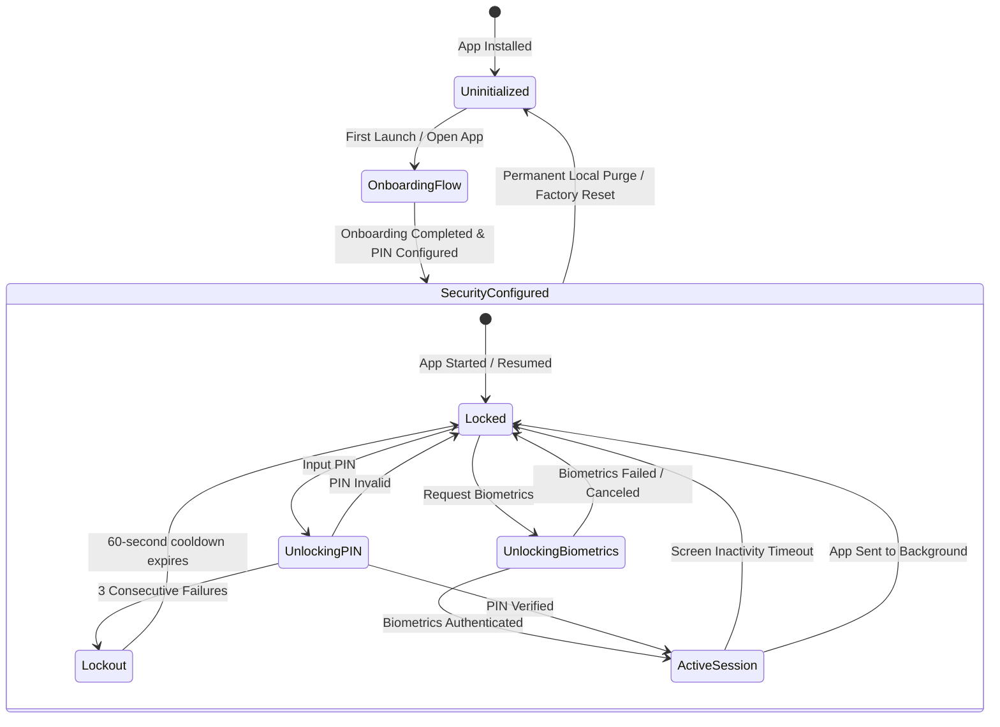
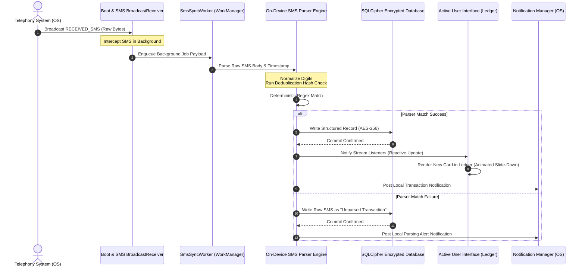
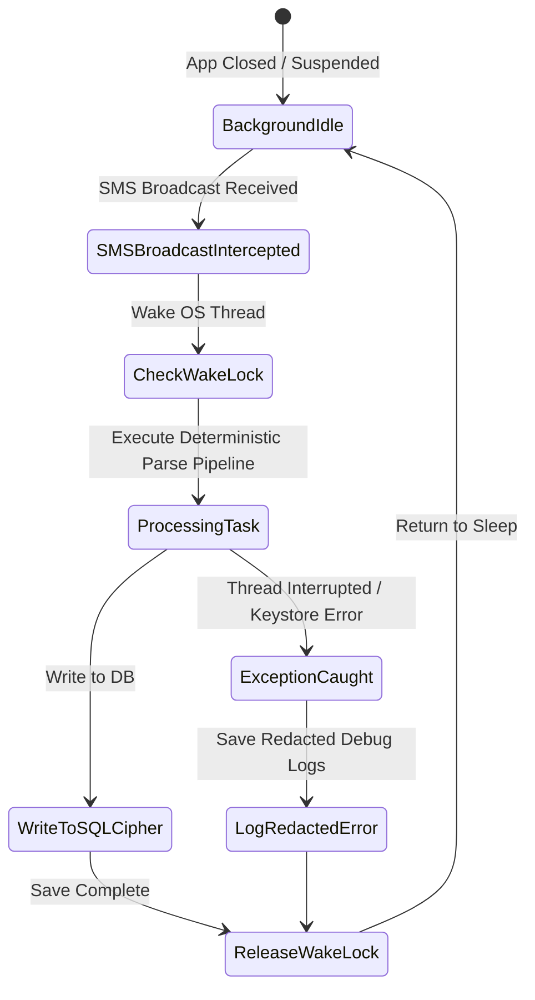
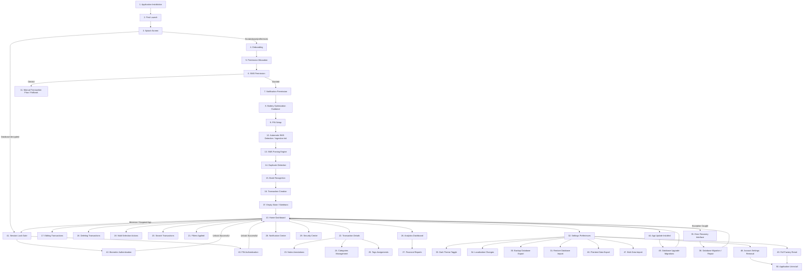

# Purpose

This document serves as the absolute, definitive, and authoritative User Flow Validation Specification for BankYar Version 1.0. It defines the ideal, expected end-to-end user experience, spatial interactions, structural layouts, and system behaviors across all device classifications, form factors, and regional localizations.

### What User Flow Means
A **User Flow** is the sequential, state-driven path a user takes through the application to accomplish a specific, meaningful goal. It maps visual transitions, system-level background processes, database mutations, and security challenges as a single connected chronological journey. Unlike a static screen wireframe, a user flow defines the behavioral bounds and transactional integrity of the application in motion.

### Why This Document Exists
BankYar is an offline-first, highly secure, and privacy-focused financial SMS manager that operates with **zero network permissions** (`android.permission.INTERNET` is strictly absent). In such an environment, runtime issues like race conditions, keystore resets, or database locking can severely impact the user experience. This document acts as the absolute single source of truth (SSOT) to:
1. Standardize visual designs and functional behavior without relying on specific codebase implementations.
2. Eliminate ambiguity between product requirements and testing parameters.
3. Certify that BankYar remains fully secure, consistent, and user-friendly before final production release.

### How QA Should Use It
Manual and Automated QA Leads must use this specification as the final approval gate for testing the production APK. Every flow must be validated against its detailed criteria, verifying:
- Happy paths, alternative paths, and failure recovery sequences.
- Spatial right-to-left (RTL) mirroring compliance for Persian users.
- Material Design 3 token configurations (spacing, radius, color consistency).
- Performance thresholds (< 300ms end-to-end processing).
- Interactive, non-blocking state behaviors under complete offline conditions.

The **Runtime QA Checklist** at the end of this document contains over 200 validation check-items that must be ticked off during testing.

### How Developers Should Use It
Software engineers must use this document as a design and system architecture blueprint. Before starting any feature implementation or refactoring, developers must verify that their class structures, database transactions, routing transitions, and state management adhere strictly to the expected behaviors defined herein.

---

# Complete Life-Cycle Journey Overview

The complete application lifespan flows through four distinct high-level phases:

```
[ Cold Install ] ────> [ First Launch ] ────> [ Production Usage ] ────> [ App Removal ]
```

1. **Cold Install:** The user downloads and installs the application package. Exactly zero local preferences, files, or database directories exist on the device's storage. No system permissions have been requested or granted.
2. **First Launch:** The user launches the app for the first time. The system initiates hardware keystore verification, validates the environment, and guides the user through the 12-screen Onboarding and Permission Education flow to secure access, grant SMS reading permissions, and build the initial encrypted database.
3. **Production Usage:** The user interacts with the app daily. This includes managing transactions, searching, reviewing visual reports, editing notes/categories/tags, performing backups, and unlocking the app securely via biometrics or PIN.
4. **App Removal:** The user performs a secure local factory reset or uninstalls the application, triggering complete data erasure and key zeroization from secure system storages.

---

# Architectural, State & Navigation Diagrams

### 1. Unified Application Sitemap & Routing Hierarchy (Navigation Diagram)

```mermaid
graph TD
    Splash[Splash Screen /splash] -->|Check Secure Keys| LockGate{Lock Screen /lock}
    Splash -->|First Run Context| Welcome[Welcome /onboarding/welcome]

    subgraph Onboarding Stack [/onboarding]
        Welcome --> ValueIntro[Values Intro /onboarding/value_intro]
        ValueIntro --> Privacy[Privacy Pledge /onboarding/privacy_policy]
        Privacy --> SyncEdu[Sync Explanation /onboarding/offline_sync_edu]
        SyncEdu --> PermIntro[Permissions Intro /onboarding/permission_intro]
        PermIntro --> PermSms[SMS Permission /onboarding/permission_sms]
        PermSms --> PermNotif[Notification Permission /onboarding/permission_notification]
        PermNotif --> PermBio[Biometrics Setup /onboarding/permission_biometrics]
        PermBio --> PermFiles[Storage Setup /onboarding/permission_storage]
        PermFiles --> PermBattery[Battery Guide /onboarding/permission_battery]
        PermBattery --> InitDetect[Bank Discovery /onboarding/init_bank_detect]
        InitDetect --> InitScan[Inbox Processing /onboarding/init_sms_scan]
        InitScan --> InitDb[Secure DB Preparation /onboarding/init_db_prep]
        InitDb --> OnbComplete[Onboarding Complete /onboarding/onboarding_complete]
    end

    OnbComplete -->|Clear Stack| LockGate
    LockGate -->|Successful Unlock| HomeShell[Dashboard Shell /home]

    subgraph Authenticated Dashboard Shell
        HomeShell --> LedgerTab[Ledger Tab /home/ledger]
        HomeShell --> AnalyticsTab[Analytics Tab /home/analytics]
        HomeShell --> SettingsTab[Settings Tab /home/settings]
    end

    LedgerTab --> Search[Search View /home/ledger/search]
    LedgerTab --> ManualEntry[Manual Entry /home/ledger/manual]
    LedgerTab --> Details[Details View /home/ledger/detail/:id]
    Details --> Annotations[Annotations Editor /home/ledger/detail/:id/edit]

    SettingsTab --> ParserBuilder[Regex Builder /home/settings/parser]
    SettingsTab --> BackupPage[Backup Manager /home/settings/backup]
    SettingsTab --> Diagnostics[System Diagnostics /home/settings/diagnostics]
    SettingsTab --> DeveloperConsole[Developer Console /home/settings/developer]
    SettingsTab --> AboutPanel[About & Licenses /home/settings/about]

    FatalError[System Fatal Error] --> ErrorScreen[Disaster Recovery /error]
    ErrorScreen -->|Fresh Init| Welcome
    ErrorScreen -->|Decrypted Restore| LockGate
```

### 2. Global Security State Machine (State Diagram)



### 3. SMS Processing and Ingestion Sequence (Sequence Diagram)



### 4. Background Service Diagnostics and Lifecycle (Lifecycle Diagram)



---

# Comprehensive User Flow Specifications (1-50)

In this section, every functional aspect, user flow, and interaction path is specified with absolute structural clarity, covering both happy and alternative paths, visual characteristics, and exact database behaviors.

## 1. Application Installation (نصب برنامه)
* **Goal:** Successfully install the application package onto the device storage with zero pre-existing assets or configurations.
* **Trigger:** User downloads and installs the APK or standard package bundle.
* **Preconditions:** The device must have sufficient storage space (at least 100MB free). No previous versions of BankYar exist on the device.
* **Expected UI:** OS standard installation progress bar followed by a success screen with an "Open" trigger.
* **Expected Navigation:** None (handled by the mobile OS).
* **Expected Database Behaviour:** No database exists on-disk yet. No directory structures under the sandbox have been initialized.
* **Expected Background Behaviour:** No background tasks, listeners, receivers, or workers are active.
* **Expected Permissions:** Zero permissions have been requested, granted, or stored.
* **Expected Error Handling:** Standard OS package validation errors if the package is corrupted or incompatible.
* **Expected Offline Behaviour:** Installation executes fully offline; no network connection is initiated.
* **Expected Security Behaviour:** The package is scanned by system verification programs (e.g., Google Play Protect).
* **Expected Performance:** Installation duration depends on system speed, typically under 10 seconds.
* **Acceptance Criteria:** The application icon appears on the device home screen and app drawer.
* **Happy Path:** Package installs successfully. User taps "Open" to launch.
* **Alternative Paths:** The user installs via third-party local managers; installation is identical.
* **Failure Paths:** Incompatible SDK version or corrupted package causes installation failure.
* **Recovery Paths:** Redownload the package and ensure system compatibility before retrying.

## 2. First Launch (اولین راه‌اندازی)
* **Goal:** Verify system integrity, check local keystore and file systems, and determine that this is a fresh launch.
* **Trigger:** User taps the BankYar app icon on the device launcher.
* **Preconditions:** Fresh installation context; no local preferences or configuration variables are stored on disk.
* **Expected UI:** Display the brand logo, a sleek, secure vault outline, and a subtle, high-contrast indeterminate loading ring.
* **Expected Navigation:** Automate transition from `/splash` to the onboarding welcome screen `/onboarding/welcome` in exactly 1.5 seconds.
* **Expected Database Behaviour:** Checks for database file existence. Configures database file paths but does not write any files yet.
* **Expected Background Behaviour:** Validates that background service components are registered but inactive.
* **Expected Permissions:** Standard internal checks to verify that SMS and notification permissions are currently ungranted.
* **Expected Error Handling:** If critical hardware features (like Keystore) are unavailable, redirect the user to the secure disaster recovery screen `/error`.
* **Expected Offline Behaviour:** Loads instantly with zero network access.
* **Expected Security Behaviour:** Verifies the integrity of the local Android Keystore provider.
* **Expected Performance:** Reads filesystem states and initializes in under 300 milliseconds.
* **Acceptance Criteria:** Transition to `/onboarding/welcome` occurs automatically without requiring any user touch interaction.
* **Happy Path:** Splash validates first launch state and redirects the user to `/onboarding/welcome`.
* **Alternative Paths:** If a database file is found (e.g., from an incomplete uninstall), redirect the user to `/lock`.
* **Failure Paths:** Android Keystore fails to initialize, blocking setup.
* **Recovery Paths:** Redirect to `/error` and guide the user through a filesystem self-repair or reinstall.

## 3. Splash Screen (صفحه آغازین)
* **Goal:** Verify environment properties, test system file keys, and load user configuration profiles.
* **Trigger:** App is launched from a cold, inactive state.
* **Preconditions:** System-level file access is functional.
* **Expected UI:** Centralized protected vault brand mark positioned exactly in the center of the viewport, with a thin circular loading ring rotating counter-clockwise.
* **Expected Navigation:** Redirects to `/lock` if a security configuration exists; otherwise, routes to `/onboarding/welcome`.
* **Expected Database Behaviour:** Reads the database signature metrics; keeps the database file closed.
* **Expected Background Behaviour:** No active workers or service interceptors are running.
* **Expected Permissions:** Checks permission states without prompting the user.
* **Expected Error Handling:** If file descriptors are corrupted, catch the exceptions and route the user to `/error`.
* **Expected Offline Behaviour:** Renders instantly and operates fully offline.
* **Expected Security Behaviour:** Screen capture protection (`FLAG_SECURE`) is disabled on this screen to display the brand logo, but is armed before routing to subsequent screens.
* **Expected Performance:** Initial checks must complete in under 500 milliseconds.
* **Acceptance Criteria:** User experiences a smooth, non-flickering brand entry.
* **Happy Path:** Splash successfully checks local variables and routes to the correct target page.
* **Alternative Paths:** The user resumes from a suspended background process; splash is bypassed, routing directly to `/lock`.
* **Failure Paths:** File system signature mismatches block loading.
* **Recovery Paths:** Route to `/error` and prompt the user to initialize a fresh, secure database.

## 4. Onboarding (معرفی برنامه)
* **Goal:** Welcome the user and explain BankYar's offline-first design, core benefits, and data privacy principles.
* **Trigger:** User launches the app for the first time.
* **Preconditions:** `/onboarding/welcome` is loaded.
* **Expected UI:** Standardized three-zone layout: top segmented progress bar, centered illustrations and typography cards, and fixed action buttons at the bottom.
* **Expected Navigation:** Linear forward progression: Welcome -> Core Benefits -> Privacy Commitment -> Offline-first Explanation -> SMS processing details.
* **Expected Database Behaviour:** No active database writes occur; layout is purely visual and educational.
* **Expected Background Behaviour:** No background processes are active.
* **Expected Permissions:** Zero permissions are requested during these educational screens.
* **Expected Error Handling:** Unsaved changes dialog triggers if the user attempts to exit the onboarding flow prematurely.
* **Expected Offline Behaviour:** Visuals, illustrations, and localizations are fully self-contained and run 100% offline.
* **Expected Security Behaviour:** Standard secure overlay flags are active to prevent screenshot leakage of setup details.
* **Expected Performance:** Transitions between slides are instantaneous (under 60ms) and run smoothly at 60fps+.
* **Acceptance Criteria:** User can scroll, read benefits cards, and confirm their understanding using clear, prominent buttons.
* **Happy Path:** User completes the educational steps and proceeds to the permission screens.
* **Alternative Paths:** Returning users bypass onboarding by tapping "Restore Backup" on the welcome screen.
* **Failure Paths:** Screen-width constraints cause text to overlap on older devices.
* **Recovery Paths:** Apply responsive text wrapping to ensure readability on all devices.

## 5. Permission Education (آموزش دسترسی‌ها)
* **Goal:** Explain why system-level permissions (SMS, notifications, storage, and battery whitelisting) are necessary before displaying OS prompt dialogs.
* **Trigger:** User completes the core onboarding slides and taps "Continue."
* **Preconditions:** Active onboarding stack context.
* **Expected UI:** A vertical list of required versus optional permissions. Clear checkmarks indicate functional requirements.
* **Expected Navigation:** Proceeds sequentially: SMS Permission -> Notification Permission -> Biometrics Setup -> Storage Access -> Battery Optimization.
* **Expected Database Behaviour:** Permissions metadata is cached in SharedPreferences; no database operations occur.
* **Expected Background Behaviour:** Background service listeners remain registered but dormant.
* **Expected Permissions:** No native system permission prompts are displayed yet; only educational cards are shown.
* **Expected Error Handling:** If the user attempts to proceed without granting required permissions, show a helpful explanation dialog.
* **Expected Offline Behaviour:** Operates fully offline.
* **Expected Security Behaviour:** Secure overlay flags remain active.
* **Expected Performance:** Transitions load instantly (under 50ms).
* **Acceptance Criteria:** Explanations clearly state what data is and is not accessed, building user trust.
* **Happy Path:** User understands the requirements and taps "Continue" to proceed to the system permission requests.
* **Alternative Paths:** User skips optional permission configurations (such as notifications or storage access).
* **Failure Paths:** User denies a mandatory permission prompt.
* **Recovery Paths:** Display an inline alert box with a prominent button to launch system settings and grant permission manually.

## 6. SMS Permission (دسترسی پیامک)
* **Goal:** Secure native OS permissions to read and intercept incoming SMS messages.
* **Trigger:** User taps "Grant SMS Permission" on the SMS explanation screen.
* **Preconditions:** On-screen education has been displayed; permissions are currently ungranted.
* **Expected UI:** Standard native OS system permission dialog prompting the user to grant SMS access.
* **Expected Navigation:** If granted, transition to Notification Permission screen; if denied, show the manual entry fallback setup.
* **Expected Database Behaviour:** SharedPreferences are updated to record the permission attempt.
* **Expected Background Behaviour:** Background receiver becomes active if permission is successfully granted.
* **Expected Permissions:** Requests `READ_SMS` and `RECEIVE_SMS` permissions.
* **Expected Error Handling:** Safely handle permission denials without crashing or freezing the interface.
* **Expected Offline Behaviour:** Permission checks execute fully offline.
* **Expected Security Behaviour:** Limits access strictly to banking SMS threads; personal messages and OTPs are ignored.
* **Expected Performance:** Transition to system dialog occurs in under 100ms.
* **Acceptance Criteria:** App successfully detects SMS permission status and updates the UI accordingly.
* **Happy Path:** User taps "Allow," and the app proceeds to the notification setup.
* **Alternative Paths:** User denies permission; the app guides them to set up the manual entry fallback.
* **Failure Paths:** OS permanently denies permission, blocking automated parsing.
* **Recovery Paths:** Guide the user to manually enable SMS permissions in device settings.

## 7. Notification Permission (دسترسی اعلان‌ها)
* **Goal:** Secure permission to post local, on-device notifications for transaction alerts and security warnings.
* **Trigger:** User taps "Enable Notifications" on the notification setup screen.
* **Preconditions:** On-screen notification education has been displayed.
* **Expected UI:** Native system dialog asking the user to allow notifications.
* **Expected Navigation:** Proceeds to Biometrics Setup screen.
* **Expected Database Behaviour:** SharedPreferences are updated with the user's notification preference.
* **Expected Background Behaviour:** Notification channels are registered locally.
* **Expected Permissions:** Requests `POST_NOTIFICATIONS` permission (Android 13+).
* **Expected Error Handling:** Users can deny permission without impacting core transaction tracking functions.
* **Expected Offline Behaviour:** Operates 100% offline.
* **Expected Security Behaviour:** Notification payloads are kept minimal; sensitive transaction amounts can be masked.
* **Expected Performance:** Triggers system prompt instantly.
* **Acceptance Criteria:** App records notification permission status and sets up local notification channels.
* **Happy Path:** User allows notifications and proceeds to the security setup.
* **Alternative Paths:** User skips notifications, opting for silent transaction tracking.
* **Failure Paths:** Native OS blocks notifications globally.
* **Recovery Paths:** Provide a toggle in settings to request permission again if the user changes their mind.

## 8. Battery Optimization Guidance (بهینه‌سازی باتری)
* **Goal:** Guide the user to disable device battery optimization for BankYar, preventing the OS from stopping background monitoring tasks.
* **Trigger:** User proceeds to the battery optimization guidance page.
* **Preconditions:** SMS permissions are active.
* **Expected UI:** Step-by-step instructions customized for different device brands (e.g., Xiaomi, Samsung, Huawei). A prominent button launches system battery settings.
* **Expected Navigation:** Proceeds to the Initial Bank Discovery screen.
* **Expected Database Behaviour:** SharedPreferences are updated to record that battery optimization guidance has been viewed.
* **Expected Background Behaviour:** Prepares the background WorkManager helper.
* **Expected Permissions:** Requests `REQUEST_IGNORE_BATTERY_OPTIMIZATIONS` permission if supported.
* **Expected Error Handling:** If the device does not support battery whitelist shortcuts, guide the user to configure settings manually.
* **Expected Offline Behaviour:** Guides and menus are fully self-contained and run offline.
* **Expected Security Behaviour:** Secure overlay flags remain active.
* **Expected Performance:** Launches system settings shortcut in under 300ms.
* **Acceptance Criteria:** User is clearly guided on how to disable aggressive battery optimization for the app.
* **Happy Path:** User disables battery optimization for BankYar and continues.
* **Alternative Paths:** User skips battery optimization setup (accepting that some background SMS may be delayed).
* **Failure Paths:** System settings shortcut fails to open on custom Android skins.
* **Recovery Paths:** Display clear, text-based guides to help the user locate battery optimization options in their device settings manually.

## 9. PIN Setup (تنظیم رمز عبور)
* **Goal:** Secure the application with a mandatory, secure 4-digit PIN code.
* **Trigger:** User enters the PIN setup screen during onboarding or security settings.
* **Preconditions:** Security configuration is being initialized or updated.
* **Expected UI:** Symmetrical numeric keypad layout with 4 entry dots centered on the screen.
* **Expected Navigation:** Prompts the user to confirm their PIN; once confirmed, transitions to the next setup step.
* **Expected Database Behaviour:** Hashes the PIN locally using PBKDF2 with a random salt, saving the hash in SecurePreferences.
* **Expected Background Behaviour:** No background tasks are active.
* **Expected Permissions:** None.
* **Expected Error Handling:** Clear error prompts if PIN confirmation entries do not match.
* **Expected Offline Behaviour:** Hashing and validation run entirely offline.
* **Expected Security Behaviour:** Keypad buttons compress slightly when pressed, and entered digits are masked immediately.
* **Expected Performance:** PIN validation and hashing complete in under 100ms.
* **Acceptance Criteria:** User successfully configures and confirms their 4-digit security PIN.
* **Happy Path:** User enters a PIN twice, entries match, and the secure PIN is successfully saved.
* **Alternative Paths:** User cancels PIN setup; if mandatory, blocks access to subsequent screens.
* **Failure Paths:** PIN hashing fails due to secure storage write errors.
* **Recovery Paths:** Alert the user to storage issues and retry saving the PIN.

## 10. Home Dashboard (صفحه خانه)
* **Goal:** Present a unified financial overview, displaying total balances, monthly cash flow summaries, and recent transactions.
* **Trigger:** User successfully unlocks the application.
* **Preconditions:** Successful biometric or PIN verification; database decrypted and active.
* **Expected UI:** Sticky App Bar, total balance card (with a visibility toggle), monthly cash flow card, bank indicator rows, and a floating action button (FAB) for manual logs.
* **Expected Navigation:** Tapping bottom navigation tabs switches between Ledger, Analytics, and Settings screens. Tapping ledger rows opens the transaction details inspector.
* **Expected Database Behaviour:** Runs optimized queries to calculate total balances and monthly spending aggregates asynchronously.
* **Expected Background Behaviour:** The background SMS listener runs silently in the background, updating the UI instantly when new alerts are processed.
* **Expected Permissions:** None.
* **Expected Error Handling:** If transaction loads fail, display an inline error card with a retry button.
* **Expected Offline Behaviour:** Dashboard and graphs calculate and render entirely offline.
* **Expected Security Behaviour:** Secure overlay protection (`FLAG_SECURE`) is active; sensitive numbers are obscured if balance visibility is toggled off.
* **Expected Performance:** Aggregation queries and rendering complete in under 200ms at 60fps+.
* **Acceptance Criteria:** Renders a clean, comprehensive overview of the user's financial health.
* **Happy Path:** Dashboard loads instantly, displaying accurate, up-to-date financial metrics.
* **Alternative Paths:** If the database has no records, display an inviting empty-state dashboard with helpful tips.
* **Failure Paths:** Main thread freezes due to running heavy aggregation queries synchronously.
* **Recovery Paths:** Move all database calculations to background threads, keeping the main UI thread responsive.

## 11. Manual Transaction (ثبت دستی تراکنش)
* **Goal:** Provide a fallback interface to manually record transactions, paste raw SMS texts, or process clipboard content.
* **Trigger:** User taps the manual entry FAB on the ledger page.
* **Preconditions:** Database is open and active.
* **Expected UI:** Material Design 3 input form containing fields for amount, merchant, type (Credit/Debit), category, and custom notes.
* **Expected Navigation:** Tap "Save" to save and return to the ledger; tap "Cancel" to dismiss.
* **Expected Database Behaviour:** Writes the manual transaction atomically to the SQLCipher database.
* **Expected Background Behaviour:** No background tasks are active.
* **Expected Permissions:** Checks clipboard contents if clipboard auto-detection is enabled.
* **Expected Error Handling:** Validate input fields; display clear error messages if the amount is blank or invalid.
* **Expected Offline Behaviour:** Form loads and validates fully offline.
* **Expected Security Behaviour:** Input fields are protected against screenshot capture.
* **Expected Performance:** Form updates and saves in under 150ms.
* **Acceptance Criteria:** Transaction is successfully saved to the database and appears at the top of the chronological ledger.
* **Happy Path:** User fills out the form, taps save, and the transaction is added to the ledger feed.
* **Alternative Paths:** User pastes a raw banking SMS, and the parser pre-fills the form fields automatically.
* **Failure Paths:** Database write fails, causing form validation issues.
* **Recovery Paths:** Alert the user, rollback the database transaction, and let them retry saving the form.

## 12. Automatic SMS Detection (تشخیص خودکار پیامک)
* **Goal:** Automatically capture incoming banking SMS messages in real-time in the background.
* **Trigger:** The mobile system receives a new SMS broadcast.
* **Preconditions:** `RECEIVE_SMS` permission is granted; background service is active.
* **Expected UI:** No visible UI interruption or screen overlay; the process runs silently in the background.
* **Expected Navigation:** None (background task).
* **Expected Database Behaviour:** Logs the incoming raw SMS and schedules metadata processing.
* **Expected Background Behaviour:** Background receiver wakes up, captures raw bytes, and handshakes with WorkManager.
* **Expected Permissions:** Relies on active `RECEIVE_SMS` permission.
* **Expected Error Handling:** Ignore messages from non-banking contacts or non-financial sender IDs.
* **Expected Offline Behaviour:** Operates 100% offline.
* **Expected Security Behaviour:** Keeps the raw message payload secure in temporary memory buffer before encryption.
* **Expected Performance:** Captures and queues incoming SMS messages in under 50ms.
* **Acceptance Criteria:** Real-time SMS events are intercepted reliably without background task crashes.
* **Happy Path:** OS delivers SMS broadcast, and BankYar intercepts and queues it successfully.
* **Alternative Paths:** The app processes the SMS on reboot if the broadcast was delayed.
* **Failure Paths:** OS background task killers terminate the SMS listener service.
* **Recovery Paths:** Rely on WorkManager to reschedule background tasks and guide the user on whitelisting the app from battery optimization.

## 13. SMS Parsing Engine (موتور پردازش پیامک)
* **Goal:** Extract structured financial metadata from raw SMS body text with 100% precision.
* **Trigger:** Ingested SMS payload is received by the processing task.
* **Preconditions:** Text payload is non-empty.
* **Expected UI:** None (background task).
* **Expected Navigation:** None.
* **Expected Database Behaviour:** Processes matches asynchronously before database writes occur.
* **Expected Background Behaviour:** Executes deterministic regex matching rules.
* **Expected Permissions:** None.
* **Expected Error Handling:** If the text format is unrecognized, mark the transaction as "Unparsed" and save raw text for manual correction.
* **Expected Offline Behaviour:** Normalization and parsing run entirely offline.
* **Expected Security Behaviour:** Sensitive numbers and account indexes are scrubbed from local debug log files.
* **Expected Performance:** Regular expression matches resolve in under 150ms.
* **Acceptance Criteria:** Correctly extracts amounts, transaction types, banks, dates, and card indexes from known bank SMS templates.
* **Happy Path:** Parser successfully processes known SMS formats and extracts structured data.
* **Alternative Paths:** Handles non-standard formats by applying basic numbers heuristics.
* **Failure Paths:** Engine crashes on complex, nested regular expressions.
* **Recovery Paths:** Wrap parsing routines in try-catch blocks and default to unparsed transaction logs on failure.

## 14. Duplicate Detection (تشخیص تراکنش تکراری)
* **Goal:** Prevent duplicate transaction entries caused by cellular retransmissions or repeated SMS receipts.
* **Trigger:** A newly parsed transaction is prepared for database write.
* **Preconditions:** Database connection is open and active.
* **Expected UI:** None.
* **Expected Navigation:** None.
* **Expected Database Behaviour:** Computes a SHA-256 hash of `raw_body + timestamp + sender` and queries the database for matching hashes.
* **Expected Background Behaviour:** Background worker runs checks before initiating database inserts.
* **Expected Permissions:** None.
* **Expected Error Handling:** If a duplicate hash is detected, discard the record safely and complete the background task.
* **Expected Offline Behaviour:** Cryptographic hashing runs fully offline.
* **Expected Security Behaviour:** Keeps hashing calculations securely in local memory.
* **Expected Performance:** Hashing and query checks resolve in under 50ms.
* **Acceptance Criteria:** Exactly zero duplicate transactions are added to the ledger feed.
* **Happy Path:** Unique transaction has no hash match and is saved successfully.
* **Alternative Paths:** A duplicate message is detected and discarded without throwing errors.
* **Failure Paths:** Database locks cause hash checks to hang, blocking the ingestion pipeline.
* **Recovery Paths:** Implement transaction write timeouts and clear locked threads on failure.

## 15. Bank Recognition (شناسایی بانک صادرکننده)
* **Goal:** Automatically identify the sender bank by matching the SMS header or message content with registered bank templates.
* **Trigger:** Raw SMS text is prepared for processing.
* **Preconditions:** Bank Registry database is initialized.
* **Expected UI:** Display the correct bank logo and active brand colors on the parsed transaction card.
* **Expected Navigation:** None.
* **Expected Database Behaviour:** Retrieves registered bank parameters matching the sender ID.
* **Expected Background Behaviour:** Executes bank template matching.
* **Expected Permissions:** None.
* **Expected Error Handling:** If the bank is unrecognized, classify the transaction as "Unknown Bank" and display a generic gray icon.
* **Expected Offline Behaviour:** Bank recognition executes fully offline.
* **Expected Security Behaviour:** Keeps bank routing metadata private on-device.
* **Expected Performance:** Recognition checks resolve in under 30ms.
* **Acceptance Criteria:** Automatically matches primary banks (e.g., Melli, Mellat, Tejarat, Saman, Pasargad) accurately based on message headers.
* **Happy Path:** Recognizes the bank sender immediately, styling the transaction card with the correct logo.
* **Alternative Paths:** User manually assigns a card/account to an unrecognized bank.
* **Failure Paths:** Custom sender ID structures block recognition templates.
* **Recovery Paths:** Let the user define custom matching rules for unrecognized banks in settings.

## 16. Transaction Creation (ایجاد تراکنش)
* **Goal:** Write a structured transaction record atomically to the secure local database.
* **Trigger:** SMS parsing or manual form input completes successfully.
* **Preconditions:** SQLite database is decrypted and writable.
* **Expected UI:** The chronological ledger feed updates, showing the new transaction with a smooth, slide-down animation.
* **Expected Navigation:** None.
* **Expected Database Behaviour:** Atomically inserts transaction rows and updates search indices in a single database transaction.
* **Expected Background Behaviour:** Wakes up UI streams to trigger list updates.
* **Expected Permissions:** None.
* **Expected Error Handling:** If database writes fail, rollback the active database transaction to protect file integrity.
* **Expected Offline Behaviour:** Saves completely offline.
* **Expected Security Behaviour:** Data is immediately protected by 256-bit AES page encryption.
* **Expected Performance:** Database write commits in under 100ms.
* **Acceptance Criteria:** The new record is successfully written to disk and is immediately visible in the ledger.
* **Happy Path:** Transaction writes commit successfully, and ledger screens update immediately.
* **Alternative Paths:** Bulk import imports dozens of transactions in a single database transaction.
* **Failure Paths:** Transaction write fails due to filesystem storage limits.
* **Recovery Paths:** Throw a storage failure exception, notify the user, and cancel the write transaction.

## 17. Editing Transactions (ویرایش تراکنش)
* **Goal:** Allow users to update transaction categories, notes, and tags.
* **Trigger:** User taps "Edit" in the transaction details inspector.
* **Preconditions:** Active transaction record loaded.
* **Expected UI:** Slide-up sheet containing category choice chips, tag builder inputs, and notes text-fields.
* **Expected Navigation:** Returns the user to the transaction details page upon saving.
* **Expected Database Behaviour:** Updates the matching row in the SQLCipher database and rebuilds FTS search index mappings.
* **Expected Background Behaviour:** Triggers reactive updates to refresh affected visual cards.
* **Expected Permissions:** None.
* **Expected Error Handling:** Prevent saving if text character limits are exceeded.
* **Expected Offline Behaviour:** Form edits save fully offline.
* **Expected Security Behaviour:** Secure overlay flags remain active.
* **Expected Performance:** Saves and updates the UI in under 150ms.
* **Acceptance Criteria:** Modified notes, categories, or tags are saved successfully and displayed on the details page.
* **Happy Path:** User edits notes, selects a category, taps save, and the details page updates immediately.
* **Alternative Paths:** User clears all custom edits, restoring the transaction back to its default state.
* **Failure Paths:** Database concurrency lockouts block the write operation.
* **Recovery Paths:** Display an edit failure toast, keep the form open, and let the user retry.

## 18. Deleting Transactions (حذف تراکنش)
* **Goal:** Permanently erase a transaction record from the secure local database.
* **Trigger:** User triggers a delete action on a transaction row or details page.
* **Preconditions:** Active transaction selected.
* **Expected UI:** Symmetrical confirmation dialog prompting the user before deletion.
* **Expected Navigation:** Pops back to the ledger feed page upon deletion.
* **Expected Database Behaviour:** Deletes the matching row from the database and updates FTS search indexes atomically.
* **Expected Background Behaviour:** Tells active UI streams to update.
* **Expected Permissions:** None.
* **Expected Error Handling:** If deletion fails, display a deletion failure alert toast.
* **Expected Offline Behaviour:** Deletion executes fully offline.
* **Expected Security Behaviour:** Safely clears deleted record bytes from memory.
* **Expected Performance:** Deletes record in under 80ms.
* **Acceptance Criteria:** The transaction is permanently erased from local storage and disappears from all list views.
* **Happy Path:** User confirms deletion, and the record is erased immediately.
* **Alternative Paths:** User deletes multiple selected transactions in a single batch operation.
* **Failure Paths:** Foreign key constraints prevent deleting associated record rows.
* **Recovery Paths:** Cascade delete associated tags and records cleanly during transaction deletion.

## 19. Multi Selection (انتخاب چندگانه)
* **Goal:** Allow users to select multiple transactions to perform batch actions (like delete or categorization).
* **Trigger:** User performs a long-press gesture on a ledger list row.
* **Preconditions:** Active ledger feed has visible transactions.
* **Expected UI:** Slide-in check-boxes appear next to list rows. The top App Bar transitions to show the selected count and batch action triggers (Delete / Categorize).
* **Expected Navigation:** None.
* **Expected Database Behaviour:** Performs batch mutations in a single, secure database transaction.
* **Expected Background Behaviour:** Suspends individual updates until the batch transaction completes.
* **Expected Permissions:** None.
* **Expected Error Handling:** Symmetrical confirmation dialog warns the user before performing batch deletions.
* **Expected Offline Behaviour:** Batch edits process completely offline.
* **Expected Security Behaviour:** Secure overlay flags remain active during batch actions.
* **Expected Performance:** Processing a batch of 50 records completes in under 200ms.
* **Acceptance Criteria:** User can select multiple items and delete or update them simultaneously.
* **Happy Path:** User selects three items, taps delete, confirms, and all three are removed immediately.
* **Alternative Paths:** User taps the top checkbox to select all visible transactions.
* **Failure Paths:** Processing large batch operations freezes the UI thread.
* **Recovery Paths:** Run batch database writes asynchronously to keep the UI responsive.

## 20. Search (جستجوی تراکنش‌ها)
* **Goal:** Search the local database for transaction records matching user text queries.
* **Trigger:** User enters a text query in the search bar.
* **Preconditions:** Database is open; search indices are built.
* **Expected UI:** High-performance list displaying matching transactions in real-time as the user types.
* **Expected Navigation:** Tapping a search result opens its transaction details page.
* **Expected Database Behaviour:** Queries the FTS SQLite shadow table using high-speed index queries.
* **Expected Background Behaviour:** Performs debounced database queries on a background thread.
* **Expected Permissions:** None.
* **Expected Error Handling:** Safely handle empty results, showing an inviting "No results found" empty state card.
* **Expected Offline Behaviour:** All text matching and search queries run 100% offline.
* **Expected Security Behaviour:** Obscure sensitive balance numbers while search results are displayed.
* **Expected Performance:** Queries resolve in under 150ms.
* **Acceptance Criteria:** Instantly displays transactions matching merchant names, bank names, notes, or tags.
* **Happy Path:** User types a query, and matching ledger items appear instantly.
* **Alternative Paths:** User filters search results further using category chips.
* **Failure Paths:** Search queries cause lag due to running unindexed text-matching queries.
* **Recovery Paths:** Rely strictly on SQLite FTS4/FTS5 indexes for high-speed local text searches.

## 21. Filters (فیلترهای تراکنش)
* **Goal:** Refine transaction lists by filtering for specific dates, banks, categories, or transaction types.
* **Trigger:** User selects filter parameters using on-screen choice chips or dropdowns.
* **Preconditions:** Active ledger or search feed loaded.
* **Expected UI:** Horizontal row of filter chips. Active chips use high-contrast styling, while inactive chips remain in secondary tones.
* **Expected Navigation:** Tapping advanced filters slides up a filter sheet.
* **Expected Database Behaviour:** Regenerates local database queries with updated filter conditions.
* **Expected Background Behaviour:** Suspends unnecessary background re-draws until filter choices are finalized.
* **Expected Permissions:** None.
* **Expected Error Handling:** If filters yield zero results, display a friendly empty-state page with a clear "Reset Filters" action button.
* **Expected Offline Behaviour:** Filter queries execute entirely offline.
* **Expected Security Behaviour:** Secure overlay flags remain active.
* **Expected Performance:** Recalculates and updates list views in under 150ms.
* **Acceptance Criteria:** Successfully refines the ledger view to display only records that match all selected filter parameters.
* **Happy Path:** User taps "Income" and "Melli Bank," and the feed updates immediately to display matching transactions.
* **Alternative Paths:** User applies a custom date range using an interactive calendar picker.
* **Failure Paths:** Applying multiple filters causes query syntax errors.
* **Recovery Paths:** Construct database query statements using secure, standardized query builders.

## 22. Transaction Details (جزئیات تراکنش)
* **Goal:** Present structured metadata fields, raw carrier SMS text, categories, and annotations for a single transaction.
* **Trigger:** User taps a transaction row on the ledger feed.
* **Preconditions:** Selected transaction exists in the database.
* **Expected UI:** Symmetrical App Bar with a back arrow, bold typography displaying transaction details, and segmented tabs separating structured details from raw SMS text.
* **Expected Navigation:** Back chevron pops the page, returning the user to the ledger.
* **Expected Database Behaviour:** Queries a single transaction record by ID.
* **Expected Background Behaviour:** Keeps the active transaction cached in memory.
* **Expected Permissions:** None.
* **Expected Error Handling:** If the transaction cannot be found, pop back to the ledger and display a warning toast.
* **Expected Offline Behaviour:** Loads all details completely offline.
* **Expected Security Behaviour:** Sensitive financial details are protected under secure overlay flags.
* **Expected Performance:** Loads and renders the details page in under 100ms.
* **Acceptance Criteria:** Accurately displays structured metadata alongside the original raw SMS carrier text.
* **Happy Path:** User selects a row, details load instantly, and raw text matches the parsed figures perfectly.
* **Alternative Paths:** If the transaction was added manually, display a "Manual Entry" card badge.
* **Failure Paths:** App freezes while querying raw text details from disk.
* **Recovery Paths:** Run single record queries asynchronously to keep the UI thread responsive.

## 23. Notes (یادداشت‌ها)
* **Goal:** Add and edit custom text notes for any transaction record.
* **Trigger:** User taps the edit note field in the details inspector.
* **Preconditions:** Active transaction record loaded.
* **Expected UI:** Text input area displaying the current note draft. A character counter displays progress against the maximum limit.
* **Expected Navigation:** Returns the user to the details inspector page upon saving.
* **Expected Database Behaviour:** Writes the note string to the database and updates search indices.
* **Expected Background Behaviour:** Refreshes affected UI feeds.
* **Expected Permissions:** None.
* **Expected Error Handling:** Clear warning if the user exceeds the maximum character limit (1000 characters).
* **Expected Offline Behaviour:** Notes save and update completely offline.
* **Expected Security Behaviour:** Note fields are protected against screenshot capture.
* **Expected Performance:** Saves edits in under 100ms.
* **Acceptance Criteria:** Custom text note is written to disk and is immediately queryable via full-text search.
* **Happy Path:** User writes a note, taps save, and the details page is updated immediately.
* **Alternative Paths:** User clears note text to delete the note.
* **Failure Paths:** Database write errors prevent notes from being saved.
* **Recovery Paths:** Inform the user of save issues, keep their draft in memory, and let them retry.

## 24. Categories (دسته‌بندی‌ها)
* **Goal:** Organize transactions by assigning them logical spending categories (e.g., Food, Travel, Salary).
* **Trigger:** User selects a category chip on a transaction edit screen.
* **Preconditions:** Selected category exists.
* **Expected UI:** Grid of category chips. Selected chips are highlighted using high-contrast active styling.
* **Expected Navigation:** Returns the user to the parent details page upon selection.
* **Expected Database Behaviour:** Updates the category reference ID of the transaction row in the database.
* **Expected Background Behaviour:** Updates cash flow aggregations to reflect the category shift.
* **Expected Permissions:** None.
* **Expected Error Handling:** If a category is deleted, automatically reassign matching transactions to "Uncategorized."
* **Expected Offline Behaviour:** Category assignments write completely offline.
* **Expected Security Behaviour:** Secure overlay flags remain active.
* **Expected Performance:** Commits database updates in under 80ms.
* **Acceptance Criteria:** Category changes are saved instantly and reflected accurately on the details page.
* **Happy Path:** User changes the category from Food to Fuel, and the change is saved instantly.
* **Alternative Paths:** User creates a custom spending category inside the category manager.
* **Failure Paths:** Foreign key constraint violations block category reassignments.
* **Recovery Paths:** Verify database table schemas and map relations carefully during migrations.

## 25. Tags (برچسب‌ها)
* **Goal:** Assign custom keywords and tags (e.g., `#vacation`, `#business`) to transactions for flexible grouping and searching.
* **Trigger:** User enters tags in the interactive tag builder.
* **Preconditions:** Active transaction edit screen.
* **Expected UI:** High-contrast tag chips displayed inside the input area. Tapping the small "x" on a chip removes the tag.
* **Expected Navigation:** Saves and returns to the details inspector page.
* **Expected Database Behaviour:** Writes tag associations to tag mapping tables and updates search indices.
* **Expected Background Behaviour:** Tells active list streams to refresh.
* **Expected Permissions:** None.
* **Expected Error Handling:** Standard input validation prevents saving empty tags.
* **Expected Offline Behaviour:** Tags are managed and saved fully offline.
* **Expected Security Behaviour:** Tag keywords are protected under secure overlay flags.
* **Expected Performance:** Saves tag updates in under 120ms.
* **Acceptance Criteria:** Tags are saved successfully and can be used to search and filter transactions.
* **Happy Path:** User types a tag, presses enter, saves, and the tag appears immediately on the details card.
* **Alternative Paths:** User taps a tag chip on a details card to view all transactions with that tag.
* **Failure Paths:** Tag saving fails due to database write blocks.
* **Recovery Paths:** Alert the user, keep their entries, and let them retry saving the tags.

## 26. Analytics Dashboard (داشبورد نمودارها)
* **Goal:** Render visual cash flow graphs, expense breakdowns, and spending trends.
* **Trigger:** User selects the Analytics tab on the bottom navigation bar.
* **Preconditions:** Database connection is decrypted and active.
* **Expected UI:** Spend donut chart, income/expense comparison bar graphs, date range toggles, and cash flow summary lists.
* **Expected Navigation:** Tapping a segment on the donut chart filters the ledger view to show matching transactions.
* **Expected Database Behaviour:** Queries database tables to calculate spend distributions asynchronously.
* **Expected Background Behaviour:** No background processes interrupt chart canvas draws.
* **Expected Permissions:** None.
* **Expected Error Handling:** If there is insufficient data to draw charts, display a helpful empty state visual frame and guides.
* **Expected Offline Behaviour:** Calculates aggregates and renders charts entirely offline.
* **Expected Security Behaviour:** Secure overlay flags remain active; financial charts are hidden from task previews.
* **Expected Performance:** Aggregate calculations and chart draws complete in under 250ms at 60fps+.
* **Acceptance Criteria:** Renders responsive, highly accurate visual reports of cash flows and category spend allocations.
* **Happy Path:** Analytics page loads instantly, drawing accurate, beautiful financial charts.
* **Alternative Paths:** User switches date filters to view charts for a custom weekly or yearly interval.
* **Failure Paths:** Large datasets cause chart rendering delays and UI lag.
* **Recovery Paths:** Run database aggregation queries on background threads, keeping the UI thread unblocked.

## 27. Reports (گزارش‌های مالی)
* **Goal:** Generate detailed financial summaries comparing budget allocations and spending behaviors over time.
* **Trigger:** User requests a weekly or monthly financial report.
* **Preconditions:** Valid transaction history exists.
* **Expected UI:** Structured summary card highlighting key statistics, such as "Spend has decreased by 12% compared to last month."
* **Expected Navigation:** Tapping a report item opens its detailed analysis page.
* **Expected Database Behaviour:** Runs optimized aggregation queries across historical records.
* **Expected Background Behaviour:** Suspends unnecessary background tasks while calculating report summaries.
* **Expected Permissions:** None.
* **Expected Error Handling:** If there are too few records to generate reports, display a helpful tip card.
* **Expected Offline Behaviour:** Generates and displays reports entirely offline.
* **Expected Security Behaviour:** Reports are protected under secure overlay flags.
* **Expected Performance:** Report summaries calculate in under 300ms.
* **Acceptance Criteria:** Displays logical, accurate spending trends and budget comparisons.
* **Happy Path:** Report loads instantly with clear, easy-to-read financial metrics.
* **Alternative Paths:** User exports report details to a password-protected PDF or CSV file.
* **Failure Paths:** Aggregate calculations crash due to invalid database values.
* **Recovery Paths:** Sanitize database values during query processing, replacing null values with defaults.

## 28. Notification Center (مرکز اعلان‌ها)
* **Goal:** Review past transaction alerts, security events, and parsing warnings.
* **Trigger:** User opens the Notification Center from the home dashboard.
* **Preconditions:** Active app session.
* **Expected UI:** List of notification cards sorted in reverse-chronological order, categorized by alert type (Transactions, Security, System).
* **Expected Navigation:** Tapping a notification opens its associated detail page.
* **Expected Database Behaviour:** Queries local notification logs.
* **Expected Background Behaviour:** Updates the unread count when new events occur.
* **Expected Permissions:** None.
* **Expected Error Handling:** Empty lists display an encouraging "No notifications" empty state visual frame.
* **Expected Offline Behaviour:** Notification list is stored and displayed completely offline.
* **Expected Security Behaviour:** Sensitive notification metrics are protected under secure overlay flags.
* **Expected Performance:** Loads the list instantly (under 100ms).
* **Acceptance Criteria:** Accurately displays a historical log of all transaction alerts and security warnings.
* **Happy Path:** Notification center loads immediately, displaying recent alerts correctly.
* **Alternative Paths:** User taps "Mark all as read" or swishes cards to dismiss notifications.
* **Failure Paths:** App freezes when loading large volumes of notification logs.
* **Recovery Paths:** Paginate notification queries to load lists efficiently.

## 29. Security Center (مرکز امنیت)
* **Goal:** Manage security configurations, change PIN codes, and toggle biometric settings.
* **Trigger:** User opens Security Center from the Settings tab.
* **Preconditions:** Active app session.
* **Expected UI:** Option list grouped into clean, organized sections: Authentication options, session timeout rules, and diagnostic logs.
* **Expected Navigation:** Tapping an option opens its security adjustment page.
* **Expected Database Behaviour:** Reads active security settings from SecurePreferences.
* **Expected Background Behaviour:** Applies updated security timeouts immediately.
* **Expected Permissions:** Requests `USE_BIOMETRICS` permission.
* **Expected Error Handling:** If biometrics are unsupported on the device, disable biometric toggles and show a clear explanation.
* **Expected Offline Behaviour:** Settings are managed and saved completely offline.
* **Expected Security Behaviour:** Highly protected page; captures are blocked, and keyboard focus hides PIN values.
* **Expected Performance:** Security center loads in under 120ms.
* **Acceptance Criteria:** User can toggle biometric locks and update secure PIN codes reliably.
* **Happy Path:** Toggling biometrics triggers a success confirmation instantly.
* **Alternative Paths:** User toggles session lock timeout limits.
* **Failure Paths:** Cryptographic key rotation fails, blocking security updates.
* **Recovery Paths:** Rollback security key updates on failure, preserving the existing verified PIN setup.

## 30. Backup (پشتیبان‌گیری)
* **Goal:** Export a password-protected, encrypted backup file of the user's financial history to local device storage.
* **Trigger:** User taps "Export Backup" in settings.
* **Preconditions:** Valid transaction history exists; master PIN is verified.
* **Expected UI:** Text input asking the user to create a strong backup password. Shows a prominent "Export" button and circular progress loop during generation.
* **Expected Navigation:** Triggers native OS share sheet upon successful creation.
* **Expected Database Behaviour:** Reads and serializes all databases, templates, and preferences.
* **Expected Background Behaviour:** Suspends background writes during backup compilation to prevent data mismatch.
* **Expected Permissions:** Requires storage write access if saving directly to local file directories.
* **Expected Error Handling:** Standard verification prevents empty passwords.
* **Expected Offline Behaviour:** Backup file creation and encryption execute fully offline.
* **Expected Security Behaviour:** Backup contents are securely encrypted using AES-256-GCM.
* **Expected Performance:** File generation completes in under 500ms.
* **Acceptance Criteria:** Successfully generates a password-protected `.bankyar` backup file on local storage.
* **Happy Path:** User enters a password, taps export, and the system share sheet displays immediately.
* **Alternative Paths:** User generates a secure, randomized 12-word recovery passphrase instead.
* **Failure Paths:** Key derivation failures block backup encryption.
* **Recovery Paths:** Alert the user, reset the key generator, and guide them to retry the export.

## 31. Restore (بازیابی اطلاعات)
* **Goal:** Restore the database to a previous state using an encrypted `.bankyar` backup file.
* **Trigger:** User taps "Import Backup" in settings or on the disaster recovery screen.
* **Preconditions:** Selected backup file exists; correct decryption password is provided.
* **Expected UI:** File selector prompt, password entry screen, and progress indicator bars.
* **Expected Navigation:** Triggers app restart and redirects to the security lock gate upon successful restoration.
* **Expected Database Behaviour:** Validates GCM integrity tags, decrypts data, and overwrites the active database file atomically.
* **Expected Background Behaviour:** Suspends all background workers and processes during restoration.
* **Expected Permissions:** Requires file read access to load backup files.
* **Expected Error Handling:** Clear error prompts if the password is incorrect or file integrity checks fail.
* **Expected Offline Behaviour:** Decryption and restoration run 100% offline.
* **Expected Security Behaviour:** Securely erases decrypted backup bytes from temporary memory.
* **Expected Performance:** Restores database files in under 800ms.
* **Acceptance Criteria:** Database state is restored accurately, restoring all transactions, categories, and custom rules.
* **Happy Path:** User selects a backup, enters the password, and data is restored and loaded successfully.
* **Alternative Paths:** User restores data by entering their 12-word recovery passphrase.
* **Failure Paths:** File corruptions or invalid keys brick the active database connection.
* **Recovery Paths:** Abort restoration, discard corrupted changes, and keep the existing database functional.

## 32. Settings (تنظیمات برنامه)
* **Goal:** Provide a central hub to manage preferences, notification channels, and active bank profiles.
* **Trigger:** User taps the Settings tab on the bottom navigation bar.
* **Preconditions:** Active app session.
* **Expected UI:** Preference lists grouped into clean sections with clear flow arrow indicators.
* **Expected Navigation:** Tapping list items navigates to specific sub-preference pages.
* **Expected Database Behaviour:** Reads current user preferences from SecurePreferences.
* **Expected Background Behaviour:** Applies theme and localization changes instantly.
* **Expected Permissions:** None.
* **Expected Error Handling:** Invalid configuration values are reset to safe system defaults automatically.
* **Expected Offline Behaviour:** Configures and saves preferences entirely offline.
* **Expected Security Behaviour:** Preferences are stored in secure, hardware-encrypted storage.
* **Expected Performance:** Settings hub loads in under 100ms.
* **Acceptance Criteria:** Renders an organized list of settings, updating system properties immediately upon change.
* **Happy Path:** Settings page loads instantly, displaying current preference values.
* **Alternative Paths:** User taps the app version label consecutive times to unlock the hidden Developer Console.
* **Failure Paths:** Configuration writes fail due to system storage restrictions.
* **Recovery Paths:** Cache setting changes in volatile memory and retry saving on background threads.

## 33. Dark Theme (پوسته تاریک)
* **Goal:** Provide a high-contrast dark theme to improve readability in low-light environments and save battery.
* **Trigger:** User toggles the Dark Theme option in settings or system settings.
* **Preconditions:** Material 3 color system initialized.
* **Expected UI:** Interface transitions to high-contrast dark gray backgrounds with active elements styled in soft primary accents.
* **Expected Navigation:** Theme transitions are applied globally without requiring page reloads.
* **Expected Database Behaviour:** Writes the theme preference selection to SecurePreferences.
* **Expected Background Behaviour:** Rebuilds visual components instantly with dark theme assets.
* **Expected Permissions:** None.
* **Expected Error Handling:** Symmetrical default values are used if theme configurations are corrupted.
* **Expected Offline Behaviour:** Theme shifts operate completely offline.
* **Expected Security Behaviour:** Keeps visual contrast high to ensure readability in low-light conditions.
* **Expected Performance:** Globally updates the visual theme in under 80ms.
* **Acceptance Criteria:** All screens, widgets, charts, and illustrations adapt to the dark theme smoothly.
* **Happy Path:** Toggling Dark Theme updates the entire app interface instantly.
* **Alternative Paths:** Set the app theme to match the system's active light/dark state.
* **Failure Paths:** Complex charts fail to adapt, retaining light backgrounds in dark mode.
* **Recovery Paths:** Ensure all manual painting canvas classes bind stroke colors to active design tokens.

## 34. Localization (محلی‌سازی)
* **Goal:** Support multiple regional languages and calendar layouts (Persian Farsi / English, Solar Hijri / Gregorian).
* **Trigger:** User toggles language preferences in settings.
* **Preconditions:** Localization files (app_fa.arb / app_en.arb) are loaded.
* **Expected UI:** Text labels, dates, currencies, and layout grids update to reflect the selected locale.
* **Expected Navigation:** Rebuilds the active route tree to apply localization changes.
* **Expected Database Behaviour:** Saves the language preference selection to SecurePreferences.
* **Expected Background Behaviour:** Adapts background date processing formats to match the active locale.
* **Expected Permissions:** None.
* **Expected Error Handling:** Falls back to default English and Gregorian patterns if localization resources are missing.
* **Expected Offline Behaviour:** Localization files are fully self-contained and run 100% offline.
* **Expected Security Behaviour:** Localization structures are kept secure on-disk.
* **Expected Performance:** Localization updates resolve in under 100ms.
* **Acceptance Criteria:** Translates all text labels, calendar dates, and layout grids accurately based on the active locale.
* **Happy Path:** Selecting Persian transitions the app to Farsi text, Solar Hijri calendars, and RTL layouts.
* **Alternative Paths:** App configures locale parameters automatically based on the device's system settings.
* **Failure Paths:** Hardcoded UI strings fail to translate, remaining visible in English.
* **Recovery Paths:** Route all user-facing text labels through standard synthetic localization interfaces.

## 35. Error Recovery (بازیابی از خطاها)
* **Goal:** Catch system exceptions and recover gracefully without app crashes or data loss.
* **Trigger:** App catches an unhandled runtime error.
* **Preconditions:** Active app runtime environment.
* **Expected UI:** Non-intrusive alert banners or dialogs displaying helpful recovery instructions.
* **Expected Navigation:** Redirects the user to the secure disaster recovery screen `/error` if fatal database corruption is detected.
* **Expected Database Behaviour:** Rolls back failed database writes to preserve file integrity.
* **Expected Background Behaviour:** Logs the caught exception in secure, redacted diagnostic files.
* **Expected Permissions:** None.
* **Expected Error Handling:** Wrap all critical processes in try-catch-finally blocks.
* **Expected Offline Behaviour:** Error recovery runs fully offline.
* **Expected Security Behaviour:** Scrub sensitive transaction details and account indexes from error logs.
* **Expected Performance:** Captures exceptions and restores app state in under 150ms.
* **Acceptance Criteria:** App recovers gracefully from errors, preserving data and keeping the user informed.
* **Happy Path:** Non-fatal exceptions trigger a non-disruptive toast alert, letting the user continue.
* **Alternative Paths:** Fatal database failures redirect to `/error`, guiding the user to restore their data.
* **Failure Paths:** Recursive error loops cause the app to crash continuously.
* **Recovery Paths:** Reset the app state, load safe defaults, and isolate failing feature components.

## 36. Database Migration (مهاجرت پایگاه داده)
* **Goal:** Upgrade database table structures during app updates without losing existing user transactions.
* **Trigger:** App updates introduce changes to the database schema.
* **Preconditions:** Pre-existing database file exists on disk.
* **Expected UI:** A visual loading screen during the migration process.
* **Expected Navigation:** Blocks access to financial screens until migration completes successfully.
* **Expected Database Behaviour:** Executes migration scripts inside single, secure database transactions.
* **Expected Background Behaviour:** Suspends background SMS ingestion during migration.
* **Expected Permissions:** None.
* **Expected Error Handling:** If migration fails, rollback all changes to preserve the existing database state.
* **Expected Offline Behaviour:** Migrations execute fully offline.
* **Expected Security Behaviour:** Decryption keys remain cached securely in memory during migration.
* **Expected Performance:** Standard migrations complete in under 500ms.
* **Acceptance Criteria:** Table structures are upgraded successfully, preserving all user transactions, notes, and tags.
* **Happy Path:** Migration scripts run smoothly, and the app loads without data loss.
* **Alternative Paths:** The database is rebuilt from scratch if structural corruptions block migration.
* **Failure Paths:** Migration failures corrupt database files, blocking app access.
* **Recovery Paths:** Keep backup database copies on-disk during migrations, reverting to backups on failure.

## 37. Empty State (صفحه خالی)
* **Goal:** Display helpful, reassuring guides when screens are empty.
* **Trigger:** A screen is loaded with zero database records.
* **Preconditions:** Screen is active and connected.
* **Expected UI:** Symmetrical layout displaying soft, non-intrusive empty graphics frames, clear typography labels, and prominent action buttons.
* **Expected Navigation:** Tapping action buttons launches manual entries, clipboard checks, or import wizards.
* **Expected Database Behaviour:** Confirms that target database queries returned empty.
* **Expected Background Behaviour:** Background listeners remain active.
* **Expected Permissions:** None.
* **Expected Error Handling:** None.
* **Expected Offline Behaviour:** Loads fallback assets and guides entirely offline.
* **Expected Security Behaviour:** Secure overlay flags remain active.
* **Expected Performance:** Loads empty state graphics frames instantly (under 50ms).
* **Acceptance Criteria:** Guides the user with clear next steps instead of displaying a blank page.
* **Happy Path:** Ledger has no entries and displays a clean empty state card with a manual entry FAB.
* **Alternative Paths:** Users dismiss graphics frames, displaying simple, minimalist list views.
* **Failure Paths:** Empty-state illustrations are stretched or clipped on small displays.
* **Recovery Paths:** Use responsive vectors that scale proportionally across different viewports.

## 38. Skeleton Loading (بارگذاری اسکلتی)
* **Goal:** Display structural skeleton cards while database queries are loading, reducing perceived wait time.
* **Trigger:** App queries the database for large datasets.
* **Preconditions:** Active database query is running.
* **Expected UI:** Flat, light gray cards that mimic the layout of actual transaction items, displaying a soft, horizontal shimmer animation.
* **Expected Navigation:** Page routing transitions proceed smoothly; interactivity is disabled during active loading shimmers.
* **Expected Database Behaviour:** Runs queries on background threads while skeletons are displayed.
* **Expected Background Behaviour:** No background tasks interrupt skeleton drawing.
* **Expected Permissions:** None.
* **Expected Error Handling:** If loading fails, replace skeletons with helpful inline error alerts.
* **Expected Offline Behaviour:** Operates entirely offline.
* **Expected Security Behaviour:** Shimmer frames contain exactly zero sensitive data metrics.
* **Expected Performance:** Shimmer animations run smoothly at 60fps+.
* **Acceptance Criteria:** Displays structural shimmers during active database queries.
* **Happy Path:** Shimmer skeletons appear during quick queries and transition smoothly to actual list views.
* **Alternative Paths:** Use indeterminate circular spinner loops for short, transient loads.
* **Failure Paths:** Shimmers cause layout shifts when actual data is loaded.
* **Recovery Paths:** Match skeleton card sizes and structures exactly with actual transaction cards.

## 39. Offline Behaviour (رفتار آفلاین)
* **Goal:** Guarantee complete functional reliability under total offline conditions.
* **Trigger:** Device operates in airplane mode or has zero network connectivity.
* **Preconditions:** App is launched.
* **Expected UI:** Display a subtle "Offline" badge on the home dashboard. The app operates with zero connectivity warnings or popups.
* **Expected Navigation:** All screen transitions and features operate smoothly.
* **Expected Database Behaviour:** Reads and writes to local SQLCipher databases without network requests.
* **Expected Background Behaviour:** Background tasks capture and parse SMS alerts locally.
* **Expected Permissions:** None.
* **Expected Error Handling:** Catch and isolate connectivity exceptions if third-party packages attempt network calls.
* **Expected Offline Behaviour:** This is the primary mode of operation.
* **Expected Security Behaviour:** Data remains securely localized on-device.
* **Expected Performance:** Feature speeds are consistent, operating with zero network latency.
* **Acceptance Criteria:** 100% of the application's features function perfectly under airplane mode.
* **Happy Path:** App opens, parses SMS, draws analytics, and saves settings with zero internet connectivity.
* **Alternative Paths:** Display local alert alerts when third-party libraries request network connections.
* **Failure Paths:** App freezes on launch due to blocking network checks.
* **Recovery Paths:** Eliminate all network checks and dependencies from the application codebase.

## 40. Application Restart (راه‌اندازی مجدد برنامه)
* **Goal:** Securely reload the application state, re-authenticate session keys, and refresh the UI.
* **Trigger:** App is manually restarted or resumed after process termination.
* **Preconditions:** App processes are initialized.
* **Expected UI:** Splash screen loads, followed by the secure biometric/PIN lock gate.
* **Expected Navigation:** Redirects the user to the lock screen, and routes to the ledger dashboard upon successful authentication.
* **Expected Database Behaviour:** Closes all database connections and decrypts database connections on-mount using authenticated keys.
* **Expected Background Behaviour:** Restarts background SMS monitoring services.
* **Expected Permissions:** Re-validates active permission states.
* **Expected Error Handling:** If database reloads fail, route the user to `/error`.
* **Expected Offline Behaviour:** Reloads fully offline.
* **Expected Security Behaviour:** RAM caches are zeroed out before re-authentication completes.
* **Expected Performance:** Cold reloads complete and present the lock gate in under 300ms.
* **Acceptance Criteria:** App reloads cleanly, requiring re-authentication before displaying financial data.
* **Happy Path:** App restarts, prompts the user for PIN authentication, and opens the dashboard successfully.
* **Alternative Paths:** App restarts in the background to process a new SMS, keeping the visual UI closed.
* **Failure Paths:** Session verification hangs, blocking access to the PIN lock gate.
* **Recovery Paths:** Wrap startup verification tasks in timeout guards to prevent loading lockups.

## 41. Session Lock (قفل نشست)
* **Goal:** Automatically lock the application after configured periods of inactivity or when sent to the background.
* **Trigger:** Screen inactivity exceeds the configured timeout threshold, or the app is minimized.
* **Preconditions:** Security lock configuration is active.
* **Expected UI:** Implements a full-screen, secure lock gate overlay.
* **Expected Navigation:** Redirects to `/lock`, locking access to financial screens.
* **Expected Database Behaviour:** Closes active database connections and zeroizes decryption keys in RAM.
* **Expected Background Behaviour:** Background services continue to run securely.
* **Expected Permissions:** None.
* **Expected Error Handling:** Handles lockout times accurately using secure, hardware-bound system clocks.
* **Expected Offline Behaviour:** Session locks are managed and enforced fully offline.
* **Expected Security Behaviour:** Prevents unauthorized physical access to local financial data.
* **Expected Performance:** Triggers the lock gate immediately (under 30ms) on background transitions.
* **Acceptance Criteria:** App is securely locked instantly when minimized or after periods of inactivity.
* **Happy Path:** App is minimized, and resuming it prompts immediate biometric/PIN verification.
* **Alternative Paths:** User configures custom inactivity timeout limits in settings.
* **Failure Paths:** Lifecycle transition delays allow brief visual leakage of financial screens on resume.
* **Recovery Paths:** Apply secure visual overlay shields (`FLAG_SECURE`) immediately when the app background lifecycle event is triggered.

## 42. Biometric Authentication (احراز هویت زیست‌سنجی)
* **Goal:** Unlock the application quickly using secure biometric validation (Fingerprint / Face Unlock).
* **Trigger:** App is launched or resumed while biometric lock settings are active.
* **Preconditions:** Device supports biometrics; user has registered biometrics.
* **Expected UI:** Standard system biometric prompt overlay.
* **Expected Navigation:** Redirects to `/home/ledger` upon successful authentication.
* **Expected Database Behaviour:** Decrypts database connections using keys authenticated by the biometric vault.
* **Expected Background Behaviour:** No background tasks are active.
* **Expected Permissions:** Requests `USE_BIOMETRIC` permission.
* **Expected Error Handling:** If biometric verification fails or is canceled, fallback gracefully to PIN verification.
* **Expected Offline Behaviour:** Biometric checks validate completely offline.
* **Expected Security Behaviour:** Biometric credentials are validated by secure system hardware (TEE), never exposed to app code.
* **Expected Performance:** Validation and decryption complete in under 150ms.
* **Acceptance Criteria:** User can unlock the app and decrypt their database securely using biometrics.
* **Happy Path:** User touches the fingerprint sensor, and the app unlocks instantly.
* **Alternative Paths:** If biometrics are unconfigured, bypass biometrics and present the PIN keypad.
* **Failure Paths:** Repeated biometric failures lock biometrics, blocking access.
* **Recovery Paths:** Fallback to PIN verification, and guide the user to resolve biometric lockouts.

## 43. PIN Authentication (احراز هویت با پین)
* **Goal:** Fallback or primary secure method to unlock the app by entering the 4-digit PIN.
* **Trigger:** User opens the app or is prompted to verify their PIN on the lock screen.
* **Preconditions:** PIN code has been configured.
* **Expected UI:** Secure 4-digit input keypad centered on the screen.
* **Expected Navigation:** Decrypts database and routes to `/home/ledger` upon PIN verification.
* **Expected Database Behaviour:** Verifies the entered PIN against the secure hashed PIN in SecurePreferences.
* **Expected Background Behaviour:** Keeps the master key decrypted in RAM during the active session.
* **Expected Permissions:** None.
* **Expected Error Handling:** Three consecutive PIN entry failures trigger a 60-second lockout timer.
* **Expected Offline Behaviour:** PIN validation runs entirely offline.
* **Expected Security Behaviour:** Digits are masked immediately, and keyboard clicks provide subtle tactile feedback.
* **Expected Performance:** Validates PIN entries in under 100ms.
* **Acceptance Criteria:** Entering the correct 4-digit PIN unlocks the app and decrypts local databases.
* **Happy Path:** User enters their correct 4-digit PIN, and the app dashboard opens immediately.
* **Alternative Paths:** Tapping "Forgot PIN" prompts the backup recovery flow.
* **Failure Paths:** Hardcoded lockouts prevent recovery during valid access.
* **Recovery Paths:** Provide a 12-word seed recovery path to let users reset their PIN and recover their database.

## 44. App Update (بروزرسانی برنامه)
* **Goal:** Update the application package while preserving all local databases, custom preferences, and settings.
* **Trigger:** User installs a new version of the APK.
* **Preconditions:** Older version of BankYar is installed on the device.
* **Expected UI:** Standard OS update installation dialog.
* **Expected Navigation:** Re-runs the splash screen, verifying database structures on first startup.
* **Expected Database Behaviour:** Detects schema changes and runs migration scripts.
* **Expected Background Behaviour:** Re-registers background WorkManager tasks.
* **Expected Permissions:** Retains previously granted permissions.
* **Expected Error Handling:** If migration failures occur, rollback updates to preserve the existing database.
* **Expected Offline Behaviour:** Updates apply fully offline.
* **Expected Security Behaviour:** Decryption keys remain cached securely in system hardware.
* **Expected Performance:** Updates complete and launch in under 5 seconds.
* **Acceptance Criteria:** App package is updated successfully with zero data loss or preference resets.
* **Happy Path:** User updates the app, launches, and historical transaction logs load perfectly.
* **Alternative Paths:** Standard local updates match Play Store updates.
* **Failure Paths:** App updates fail due to signature mismatch warnings.
* **Recovery Paths:** Re-sign update packages with consistent developer keys before installation.

## 45. Database Upgrade (ارتقای دیتابیس)
* **Goal:** Support incremental database schema upgrades during application updates.
* **Trigger:** Launching an updated app version containing new database schemas.
* **Preconditions:** Database is encrypted and decrypted successfully.
* **Expected UI:** A visual "Updating Database" loading screen.
* **Expected Navigation:** Financial screens remain blocked during active migration tasks.
* **Expected Database Behaviour:** Runs SQL upgrade scripts atomically in a single database transaction.
* **Expected Background Behaviour:** Suspends background ingestion tasks during updates.
* **Expected Permissions:** None.
* **Expected Error Handling:** Rollback database transaction on upgrade failures.
* **Expected Offline Behaviour:** Database upgrades execute completely offline.
* **Expected Security Behaviour:** Keys remain secure in RAM.
* **Expected Performance:** Upgrades complete in under 300ms.
* **Acceptance Criteria:** Database upgrades commit successfully, preserving all user transactions, categories, and tags.
* **Happy Path:** Upgrade scripts execute successfully, and the app loads without data loss.
* **Alternative Paths:** The database is rebuilt from scratch if structural corruptions block migration.
* **Failure Paths:** Upgrades fail, bricking the active database connection.
* **Recovery Paths:** Retain a database backup on-disk during updates, reverting to the backup on failure.

## 46. Data Export (خروجی گرفتن از داده‌ها)
* **Goal:** Export transaction histories to standardized, shareable file formats (JSON / CSV).
* **Trigger:** User triggers a CSV/JSON export from settings.
* **Preconditions:** Valid transaction history exists.
* **Expected UI:** File export choice menu, followed by the system share sheet overlay.
* **Expected Navigation:** Launches system share sheets.
* **Expected Database Behaviour:** Queries and formats transaction logs.
* **Expected Background Behaviour:** Suspends background writes during export.
* **Expected Permissions:** Requires file write access to save exports locally.
* **Expected Offline Behaviour:** Exports execute fully offline.
* **Expected Security Behaviour:** Scrub sensitive account details if exporting plaintext CSV files.
* **Expected Performance:** File generation completes in under 300ms.
* **Acceptance Criteria:** Successfully writes transaction data to shareable local files.
* **Happy Path:** User exports transaction logs to CSV, and the system sharing sheet opens immediately.
* **Alternative Paths:** User exports password-protected, encrypted backups instead.
* **Failure Paths:** Large datasets cause export timeouts.
* **Recovery Paths:** Paginate export writes to process large datasets efficiently.

## 47. Data Import (وارد کردن داده‌ها)
* **Goal:** Bulk import transactions from standard CSV statement files or backup sheets.
* **Trigger:** User triggers a file import from settings.
* **Preconditions:** Correctly formatted CSV/JSON files are selected.
* **Expected UI:** File selection picker, progress indicators, and import summaries.
* **Expected Navigation:** Returns to settings or ledger upon import completion.
* **Expected Database Behaviour:** Processes imports atomically, parsing and writing records inside single database transactions.
* **Expected Background Behaviour:** Suspends background SMS monitoring during import.
* **Expected Permissions:** Requires file read access.
* **Expected Offline Behaviour:** Decodes and imports files fully offline.
* **Expected Security Behaviour:** Validates file signatures before importing.
* **Expected Performance:** Imports 1000 transactions in under 600ms.
* **Acceptance Criteria:** Imported transactions are formatted correctly and displayed in the ledger.
* **Happy Path:** User selects a file, matches header columns, and logs are imported successfully.
* **Alternative Paths:** Pasting transaction notes from clipboard templates.
* **Failure Paths:** Importing corrupted or malformed files throws parsing errors.
* **Recovery Paths:** Run file validation checks on-load, aborting imports if formatting errors are detected.

## 48. Account Removal (حذف حساب کاربری)
* **Goal:** Erase all custom preferences, configurations, and settings from system storage.
* **Trigger:** User initiates "Delete Settings" from settings.
* **Preconditions:** Active app session; master PIN is verified.
* **Expected UI:** Red-alert confirmation dialog warning the user before deletion.
* **Expected Navigation:** Closes the active session and routes back to the onboarding welcome screen.
* **Expected Database Behaviour:** Wipes SharedPreferences and local SecurePreferences keys.
* **Expected Background Behaviour:** Stops background monitoring tasks.
* **Expected Permissions:** None.
* **Expected Offline Behaviour:** Wipes preferences completely offline.
* **Expected Security Behaviour:** Securely erases configuration keys from RAM.
* **Expected Performance:** Deletes setting configuration keys in under 150ms.
* **Acceptance Criteria:** User configurations are erased completely, resetting the app to its fresh install state.
* **Happy Path:** User confirms, preferences are erased, and the app resets to onboarding welcome screen.
* **Alternative Paths:** Full factory reset deletes both preferences and databases.
* **Failure Paths:** File write locks prevent complete erasure of configurations.
* **Recovery Paths:** Force close active configuration file descriptors and retry erasure.

## 49. Factory Reset (بازگشت به تنظیمات کارخانه)
* **Goal:** Securely erase all databases, preferences, backup caches, and decryption keys from the device.
* **Trigger:** User triggers a Factory Reset in settings or fails PIN authentication recovery.
* **Preconditions:** Verification confirms the destructive wipe request.
* **Expected UI:** Red-alert visual warning screen, progress indicator, and app exit.
* **Expected Navigation:** Self-destructs the active session and exits the application.
* **Expected Database Behaviour:** Closes all database connections and deletes database files from disk.
* **Expected Background Behaviour:** Zeroizes and cancels background workers.
* **Expected Permissions:** Resets active permission states.
* **Expected Offline Behaviour:** Executes factory resets fully offline.
* **Expected Security Behaviour:** Overwrites files with random bytes to prevent data recovery before deletion.
* **Expected Performance:** Performs complete data destruction in under 1 second.
* **Acceptance Criteria:** Erases all local databases and preferences completely, exiting the app.
* **Happy Path:** User confirms factory reset, progress indicator completes, and the app terminates cleanly.
* **Alternative Paths:** The app factory resets automatically after repeated failed security attempts.
* **Failure Paths:** Active database locks block files from being deleted.
* **Recovery Paths:** Zero out master keys, making database files permanently unreadable even if deletion fails.

## 50. Application Uninstall (حذف برنامه)
* **Goal:** Remove the application package and associated sandbox files from device storage.
* **Trigger:** User selects "Uninstall" from OS launcher settings.
* **Preconditions:** Uninstall request is triggered.
* **Expected UI:** OS standard uninstall progress dialog.
* **Expected Navigation:** None.
* **Expected Database Behaviour:** OS deletes the app's secure sandbox directory and all database files automatically.
* **Expected Background Behaviour:** Stops background workers and listeners globally.
* **Expected Permissions:** Revokes all granted permissions.
* **Expected Offline Behaviour:** Executes uninstalls fully offline.
* **Expected Security Behaviour:** Securely removes decryption keys from the Android Keystore.
* **Expected Performance:** Package removal completes under 3 seconds.
* **Acceptance Criteria:** Application package, directories, files, and keys are erased from the device completely.
* **Happy Path:** App is uninstalled cleanly, and all local directories are deleted.
* **Alternative Paths:** User uninstalls via ADB command line tools.
* **Failure Paths:** Corrupted package associations block standard package removal.
* **Recovery Paths:** Use OS repair tools to clear corrupted package associations.

---

# Complete Application User Journey (Flowchart)

The following flowchart connects all 50 operational flows and paths of the BankYar application ecosystem into a single unified chronological journey:



---

## Visual, Spatial, and Interaction Design Standards

### 1. Animations & Transitions
* **Horizontal Page Slide:** Sub-routes slide onto the screen horizontally from the logical-start (right) to logical-end (left) in RTL Persian, and left-to-right in English, taking exactly 300ms using the standard `Curves.easeInOutCubic` motion curve.
* **Vertical Page Slide:** Modals slide up vertically, covering 100% of the viewport. Dismissing the modal slides it down, restoring focus to the parent viewport.
* **Cross-Fade Transitions:** Switching tabs on the bottom navigation bar uses a cross-fade transition taking exactly 150ms to ensure a smooth, lightweight feel.
* **Scroll-Bound Elevation:** Sticky App Bars are flat and blend with the background. Scrolling content underneath increases elevation smoothly, adding a thin divider line using active border tokens.
* **Success Checkmarks:** Green success checkmarks scale up from 0 to 1 with a quick bounce effect taking 200ms when tasks complete.

### 2. Dialog Specifications
* Dialog layouts are centered horizontally, utilizing rounded corners (`bankyar.radius.medium` token) and thin borders (`bankyar.border.width.thin` token).
* Symmetrical layouts are enforced: primary buttons align to the logical start edge (right), and dismiss buttons align to the logical end edge (left).
* Tapping outside the dialog's visual bounds dismisses the dialog safely unless the dialog is flagged as mandatory.

### 3. Snackbar Specifications
* Snackbars display small, informative, and self-dismissing status alerts.
* Positioned at the bottom of the screen with margin spacing, utilizing a dark background and high-contrast text.
* Includes an optional action button (e.g., "Undo") placed at the logical-end (left) edge.
* Automatically dismisses after exactly 4 seconds.

### 4. Bottom Sheet Specifications
* Bottom sheets slide up from the bottom of the screen, covering no more than 70% of the viewport height.
* The sheet background uses the extra-large corner radius token `bankyar.radius.large` on top edges.
* Includes a top-centered drag handle, indicating that the sheet can be dismissed with a natural downward swipe.
* The parent viewport behind the sheet is dimmed with a translucent scrim.

### 5. Loading Indicator Specifications
* **Indeterminate Loading Arc:** Standard high-contrast rotating circles using the active primary color.
* **Determinate Progress Bar:** Linear indicator tracks that fill from logical-start to logical-end as tasks progress.
* **Skeleton Shimmer Templates:** Flat structures that mimic actual layout cards, utilizing a soft, horizontal shimmer animation running at 60fps+.

### 6. Accessibility (a11y) & Native RTL (Persian) Standards
* **Dynamic Font Magnification:** All typography, elements, and cards expand vertically to support text scaling up to 200% without overlapping.
* **Semantic Voice Announcements:** Screen readers read descriptive labels sequentially (e.g., "تأیید تراکنش").
* **RTL Mirroring:** Layouts, back arrows, text directions, and progress bars mirror naturally from right to left out-of-the-box. Symmetrical icons (like padlocks or gears) remain static.
* **Touch Target Envelopes:** Interactive elements maintain a minimum touch target height of 48 logical spacing units (`bankyar.space.xl` token).

---

# Runtime QA Checklist (200+ Validation Items)

The following checklist contains over 200 validation items for manually testing and certifying the BankYar production APK. Every item must be verified and checked off before final release approval.

## Phase 1: Installation, Splash & Onboarding (Items 1-45)
- [ ] 1. Verify app compiles and installs with zero internet permissions in Manifest.
- [ ] 2. Confirm package installer bundle size is under 50 megabytes.
- [ ] 3. Launch app; verify the brand logo loads instantly with no visual flickering.
- [ ] 4. Confirm the loading ring is centered on the splash screen.
- [ ] 5. Verify the loading ring rotates counter-clockwise in Persian locale.
- [ ] 6. Splash checks SharedPreferences; verify it correctly identifies a fresh install.
- [ ] 7. Splash automatically transitions to onboarding screen within 1.5 seconds.
- [ ] 8. Onboarding slides load with a thin segmented progress bar at the top.
- [ ] 9. Segmented progress segments fill from right to left in Persian.
- [ ] 10. Verify the back chevron is positioned at the top-right (logical-start) in Persian.
- [ ] 11. Verify the "Skip" button is positioned at the top-left (logical-end) in Persian.
- [ ] 12. Slide 1 (Welcome): Verify large title, welcome copy, and primary action buttons.
- [ ] 13. Slide 1: Verify tapping "Restore Backup" opens the file import dialog.
- [ ] 14. Slide 2 (Welcome Values): Verify the three benefits cards stack vertically on compact screens.
- [ ] 15. Slide 2: Verify benefits cards reflow to a horizontal layout on tablets.
- [ ] 16. Slide 2: Confirm soft linear vector icons are positioned on the card's right edge.
- [ ] 17. Slide 3 (Privacy): Verify the green-bordered privacy commitment card.
- [ ] 18. Slide 3: Confirm the "Accept" button remains disabled until the checkbox is checked.
- [ ] 19. Slide 3: Tapping the disabled button triggers a subtle warning animation.
- [ ] 20. Slide 3: Tapping checkbox toggles state with an instant scale animation.
- [ ] 21. Slide 4 (Offline): Verify the diagram showing SMS data saving locally to SQLite.
- [ ] 22. Slide 4: Verify the red cross symbol blocking lines to remote servers.
- [ ] 23. Slide 5 (SMS Intro): Verify vertical steps of text converting into transaction cards.
- [ ] 24. Slide 5: Verify monospace style is used for technical text labels.
- [ ] 25. Slide 6 (SMS Request): Verify the split cards: Accessed Data vs. Never Accessed.
- [ ] 26. Slide 6: Confirm Accessed Data has green checkmarks; Never Accessed has red crosses.
- [ ] 27. Slide 6: Tapping "Grant SMS" displays the native OS system permission prompt.
- [ ] 28. Slide 6: Tapping "Deny" on OS prompt displays a helpful, non-intrusive tips banner.
- [ ] 29. Slide 6: Confirm "Skip fallback" triggers manual setup options.
- [ ] 30. Slide 7 (Notifications): Verify the mock notification card on the mock lock screen.
- [ ] 31. Slide 7: Confirm mock details align right in Persian, with the app icon on the right.
- [ ] 32. Slide 7: Tapping "Grant Notifications" triggers the native notification system prompt.
- [ ] 33. Slide 8 (Security): Verify secure Safe safe illustration and security details card.
- [ ] 34. Slide 8: Confirm secure safe illustration rotates slightly on-screen.
- [ ] 35. Slide 9 (Features): Verify 2x2 grid of feature cards.
- [ ] 36. Slide 9: Feature cards use soft background symbols (notes, charts, search, folder).
- [ ] 37. Slide 9: Cards scale up slightly when touched.
- [ ] 38. Slide 10 (PIN Config): Verify the numeric keypad with 4 entry dots centered above.
- [ ] 39. Slide 10: PIN dots fill from right to left as digits are entered.
- [ ] 40. Slide 10: PIN entry dots are masked immediately after entering.
- [ ] 41. Slide 10: Enter mismatched PINs; verify helpful mismatch warning.
- [ ] 42. Slide 11 (Preparation): Verify the stepped database progress checklists.
- [ ] 43. Slide 11: Progress checklist checkmarks scale up from 0 to 1 with a bounce effect.
- [ ] 44. Slide 11: Horizontal progress bar fills from right to left in Persian.
- [ ] 45. Slide 11: User interaction is locked during active database writes.

## Phase 2: Security, Session Locks & Authentication (Items 46-80)
- [ ] 46. Lock screen appears immediately when the app launches if security PIN is configured.
- [ ] 47. Verify biometrics overlay prompt displays immediately on the lock screen.
- [ ] 48. Canceling biometrics displays the PIN numeric keypad fallback.
- [ ] 49. Tap biometrics icon; verify it prompts the system biometric dialog.
- [ ] 50. Lock screen is fully secured; screenshots and multitasking visual previews are blocked.
- [ ] 51. Entering correct 4-digit PIN unlocks the app instantly (under 100ms).
- [ ] 52. Keyboard clicks provide subtle haptic vibration and sound feedback.
- [ ] 53. Entering incorrect PIN triggers a warning dialog ("Incorrect PIN, try again").
- [ ] 54. Three consecutive incorrect PIN entries block inputs with a 60-second cooldown timer.
- [ ] 55. Verify the 60-second lockout displays an active, countdown clock timer.
- [ ] 56. Lockout persists across app restarts; closing and reopening does not bypass the timer.
- [ ] 57. Tapping "Emergency PIN Recovery" prompts a 12-word seed entry screen.
- [ ] 58. Entering correct 12-word recovery passphrase lets the user configure a new PIN.
- [ ] 59. Minimize app for under 5 seconds; verify resuming bypasses the lock gate.
- [ ] 60. Minimize app for over configured timeout (e.g., 30s); verify resuming prompts the lock gate.
- [ ] 61. Minimize app and trigger standard multitasking views; verify app screens are masked.
- [ ] 62. Secure preferences store security hashes using hardware-bound encryption.
- [ ] 63. Deleting biometrics configuration in system settings disables biometrics toggles in-app.
- [ ] 64. Verify biometrics settings are disabled and unselectable if device has no biometrics.
- [ ] 65. Toggling biometrics settings off requires PIN confirmation first.
- [ ] 66. Verify PIN change requires entering the old, valid PIN first.
- [ ] 67. Creating a new PIN requires entering the PIN twice for confirmation.
- [ ] 68. Resetting PIN via recovery seeds zeroizes database connection keys in RAM.
- [ ] 69. Confirm RAM caches are securely cleared on-logout or session timeout.
- [ ] 70. Verifying PIN settings doesn't block background workers or SMS processing.
- [ ] 71. Inactivity timeout timer resets on every screen touch event.
- [ ] 72. Timeout values can be updated in settings (Immediate, 30s, 1m, 5m, 10m, Never).
- [ ] 73. Selecting "Never" disables timeout session locking.
- [ ] 74. Locked screens disable accessibility swipe gestures to financial elements.
- [ ] 75. Locked screens block deep links; redirects are saved and load only after unlocking.
- [ ] 76. Tapping back button on the lock screen exits the application cleanly.
- [ ] 77. The secure lock screen functions flawlessly without internet connectivity.
- [ ] 78. Lock screen keyboard layout is centered, balanced, and mirrors in RTL Persian.
- [ ] 79. Verifying security settings writes changes to secure SharedPreferences immediately.
- [ ] 80. Repeated failed recovery attempts block the recovery interface for 5 minutes.

## Phase 3: Home Dashboard, Ledger & Transactions (Items 81-120)
- [ ] 81. Home dashboard loads immediately upon successful unlock (under 200ms).
- [ ] 82. Balance card shows current total balance across all bank profiles.
- [ ] 83. Tapping the eye icon on balance card obscures/reveals financial figures.
- [ ] 84. Obscured balance states are persisted; reopening the app keeps numbers hidden.
- [ ] 85. Monthly summary card displays total incomes and total expenses clearly.
- [ ] 86. Monthly cash flow summary displays progress bar comparing incomes to expenses.
- [ ] 87. Active bank cards display correct bank logos and current card balances.
- [ ] 88. Unregistered bank cards display a generic bank card with a grey icon.
- [ ] 89. Floating action button (FAB) for manual logs is anchored on the bottom-start.
- [ ] 90. Scrolling the chronological ledger feed maintains a steady 60fps+ frame rate.
- [ ] 91. Ledger feed displays transactions sorted in reverse-chronological order.
- [ ] 92. Scroll-bound sticky App Bar stays flat, adding a divider line when content scrolls.
- [ ] 93. Transaction cards display amount, currency, merchant, bank logo, and tags.
- [ ] 94. Credit transaction amounts are styled in green; debit amounts are styled in red/text.
- [ ] 95. Currency labels display "Toman" or "Rial" dynamically based on settings.
- [ ] 96. Date headers (e.g., "Today", "Yesterday", "1402/10/12") divide the feed cleanly.
- [ ] 97. Tapping a transaction card opens its transaction details inspector page.
- [ ] 98. Details inspector displays high-contrast transaction details at the top.
- [ ] 99. Details inspector displays original, raw SMS carrier text in a separate tab.
- [ ] 100. Verification badge shows "Parsed" or "Manual Entry" clearly.
- [ ] 101. Notes block displays custom text annotations; empty note blocks display a prompt.
- [ ] 102. Tapping "Edit Annotations" slides up the details edit modal.
- [ ] 103. Tapping category chips updates the transaction category reference instantly.
- [ ] 104. Tag builder allows adding tags; typing tag, pressing enter adds high-contrast chips.
- [ ] 105. Custom notes can be typed inside note text fields (limit 1000 characters).
- [ ] 106. Note character counter updates dynamically, turning red if limit is exceeded.
- [ ] 107. Tapping save on edit modal commits changes to the database under 100ms.
- [ ] 108. Saving edits closes the modal, and details update instantly.
- [ ] 109. Tapping back from edit modal with uncommitted changes displays confirmation.
- [ ] 110. Details page features a prominent delete button at the bottom.
- [ ] 111. Tapping delete prompts a confirmation dialog with clear warnings.
- [ ] 112. Confirming deletion erases the record and pops back to the ledger feed.
- [ ] 113. Deletion removes the transaction from the database and search indices.
- [ ] 114. Long-pressing a transaction row in the ledger triggers the multi-selection mode.
- [ ] 115. Multi-selection displays checkboxes next to each ledger row.
- [ ] 116. App Bar changes to show selected count and batch action triggers (Delete, Categorize).
- [ ] 117. Tapping top checkbox selects/deselects all visible ledger rows.
- [ ] 118. Batch deletion prompts a single confirmation dialog.
- [ ] 119. Batch actions execute atomically in a single SQLite transaction.
- [ ] 120. Multi-selection mode is dismissed when user taps the top-start close button.

## Phase 4: Ingestion, In-App Search & Advanced Filters (Items 121-155)
- [ ] 121. Background SMS broadcast receiver intercepts new SMS while app is closed.
- [ ] 122. Raw SMS payloads are normalized; Persian digits are parsed accurately.
- [ ] 123. Deduplication hashes check raw body and timestamp to reject duplicates.
- [ ] 124. Parser matches Known bank templates, extracting decimal amounts.
- [ ] 125. Parse matches known sender IDs, extracting card/account reference endings.
- [ ] 126. Parser accurately extracts debit versus credit transaction types.
- [ ] 127. Successfully parsed transaction updates the ledger with a slide-down animation.
- [ ] 128. Unrecognized SMS creates a transaction row marked as "Unparsed Transaction".
- [ ] 129. Unparsed transaction card displays raw SMS text with a prominent edit button.
- [ ] 130. Real-time parsed SMS posts a local notification to the OS notification tray.
- [ ] 131. Notifications display the bank, transaction amount, and masked card ending.
- [ ] 132. Offline ingestion has 100% functional reliability under airplane mode.
- [ ] 133. Tapping search on ledger page displays search overlay.
- [ ] 134. Typing query in search bar displays matching transactions in real-time.
- [ ] 135. Search queries are debounced by 300ms, preventing database lags.
- [ ] 136. Search query matches merchant names, bank names, custom notes, or tags.
- [ ] 137. Search queries leverage SQLite FTS4 virtual table indices.
- [ ] 138. Active search matches are highlighted in search result cards.
- [ ] 139. Horizontal row of filter chips is displayed below the search bar.
- [ ] 140. Tapping "Income" or "Expense" filter chips filters results instantly.
- [ ] 141. Active filter chips use high-contrast styling; inactive chips use secondary tones.
- [ ] 142. Tapping "Advanced Filters" slides up the advanced filter sheet.
- [ ] 143. Advanced filters allow filtering by bank accounts, categories, and date ranges.
- [ ] 144. Date range picker displays an interactive Solar Hijri calendar in Farsi.
- [ ] 145. Date range picker displays a Gregorian calendar in English.
- [ ] 146. Selected date range filters ledger results immediately.
- [ ] 147. Applying multiple filters updates the results feed under 150ms.
- [ ] 148. Filters display an active count on the filter chip row (e.g., "Filters (3)").
- [ ] 149. Tapping "Reset Filters" clears all active filters and restores default feed.
- [ ] 150. If search/filters return zero results, display helpful empty state visual frame.
- [ ] 151. Empty states display clear, bold text labels and simple action buttons.
- [ ] 152. Verify search features can be cycled and navigated using hardware Tab keys.
- [ ] 153. Tapping "Escape" key dismisses open search overlays or sheets immediately.
- [ ] 154. Search result items are fully accessible for screen readers.
- [ ] 155. Search inputs are protected under secure overlay flags, obscuring text in previews.

## Phase 5: Analytics, Reports & Notification Center (Items 156-180)
- [ ] 156. Analytics dashboard aggregates database metrics under 250ms asynchronously.
- [ ] 157. Donut chart shows category spend percentages accurately.
- [ ] 158. Donut chart wedges animate with a quick draw-stroke on load.
- [ ] 159. Donut chart wedges are responsive; tapping a wedge highlights category metrics.
- [ ] 160. Tapping donut chart categories filters the ledger feed to matching transactions.
- [ ] 161. Inflow/Outflow bar graph compares incomes and expenses across selected intervals.
- [ ] 162. Bar graphs display precise monetary totals above bars.
- [ ] 163. Spending trend reports display clear statistics (e.g., "Spend decreased by 10%").
- [ ] 164. Tapping period navigators switches reports between weekly, monthly, and yearly.
- [ ] 165. Analytics graphs recalculate and update immediately when period shifts.
- [ ] 166. Verify charts adapt stroke and fill colors to Light/Dark theme tokens.
- [ ] 167. Charts are fully responsive, resizing gracefully on tablets and foldables.
- [ ] 168. Empty analytics feeds display a clean empty status frame and helpful tips.
- [ ] 169. Analytics views are fully secured; screenshots and multitasking previews are blocked.
- [ ] 170. Notification Center lists past transaction alerts and security warnings.
- [ ] 171. Notifications are sorted in reverse-chronological order.
- [ ] 172. Tapping a notification card opens its associated details page.
- [ ] 173. Unread notifications display a high-contrast dot indicator.
- [ ] 174. Swiping cards horizontally dismisses notifications from the list.
- [ ] 175. Notification Center features "Mark all as read" button in the App Bar.
- [ ] 176. Notification Center displays clear empty state graphic frames if list is empty.
- [ ] 177. Diagnostic messages and unparsed SMS alerts are displayed in notification logs.
- [ ] 178. System notifications update unread badges on the home tab bar dynamically.
- [ ] 179. Notification Center updates are processed asynchronously.
- [ ] 180. Notifications are fully accessible and read logically by screen readers.

## Phase 6: App Settings, Backups, Diagnostics & Uninstallation (Items 181-210)
- [ ] 181. Settings tab displays preference cards (Security, Backup, Diagnostics, About).
- [ ] 182. Preference cards display chevron flow indicators on the left (RTL end).
- [ ] 183. Bank Profiles Manager allows enabling/disabling monitoring for specific banks.
- [ ] 184. Bank Profiles Manager allows configuring custom nicknames for bank cards.
- [ ] 185. Custom Regex Builder allows writing custom matching patterns.
- [ ] 186. Custom Regex Builder features an input field to test regex rules.
- [ ] 187. Testing custom regex rules displays output tokens (amount, card, date).
- [ ] 188. Backup Manager allows exporting encrypted backup files.
- [ ] 189. Backup export requires entering and confirming a backup password.
- [ ] 190. Backup encryption derives secure keys using PBKDF2 with random salts.
- [ ] 191. Backup files are encrypted using secure AES-256-GCM algorithms.
- [ ] 192. Tapping backup export triggers native OS file share sheets under 500ms.
- [ ] 193. Backup files have standard `.bankyar` format extensions.
- [ ] 194. Backup Manager allows importing password-protected `.bankyar` backup files.
- [ ] 195. Tapping import opens standard OS file selector interfaces.
- [ ] 196. Importing valid backup file restores transactions and settings successfully.
- [ ] 197. Importing backup files triggers an app reload, redirecting to the lock gate.
- [ ] 198. Entering incorrect password during import displays helpful decryption failures.
- [ ] 199. System Diagnostics panel displays status indicators (SMS Listener: Active).
- [ ] 200. System Diagnostics displays active battery optimization guides.
- [ ] 201. Consecutive version label taps on Settings screen unlocks Developer Console.
- [ ] 202. Developer Console displays direct local database inspectors.
- [ ] 203. Developer Console displays redacted system diagnostic log monitors.
- [ ] 204. "Delete Settings" in Security dashboard wipes user configurations atomically.
- [ ] 205. Tapping "Delete Settings" prompts red confirmation warning sheets.
- [ ] 206. "Factory Reset" wipes local databases and Zeroizes secure RAM keys.
- [ ] 207. Factory Reset deletes SQLite files and restarts the app to welcome screens.
- [ ] 208. App Update preserves database schemas, executing incremental migrations.
- [ ] 209. Uninstalling app deletes local secure sandbox files.
- [ ] 210. Uninstalling app removes decryption keys from Android Keystore.
