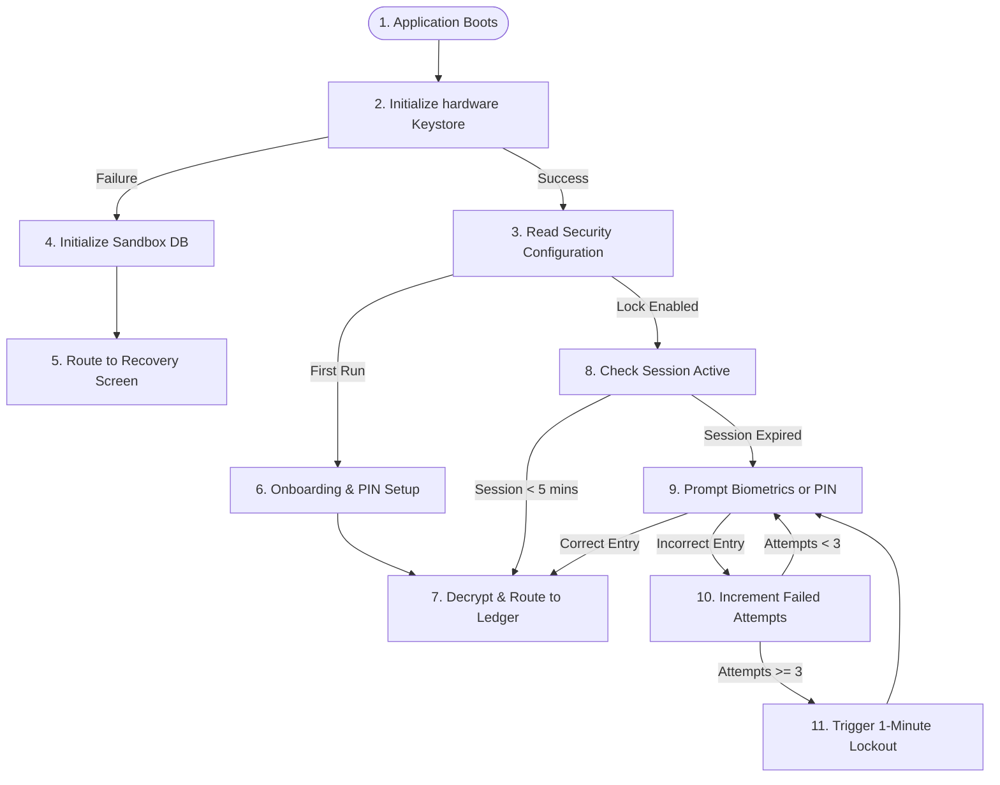
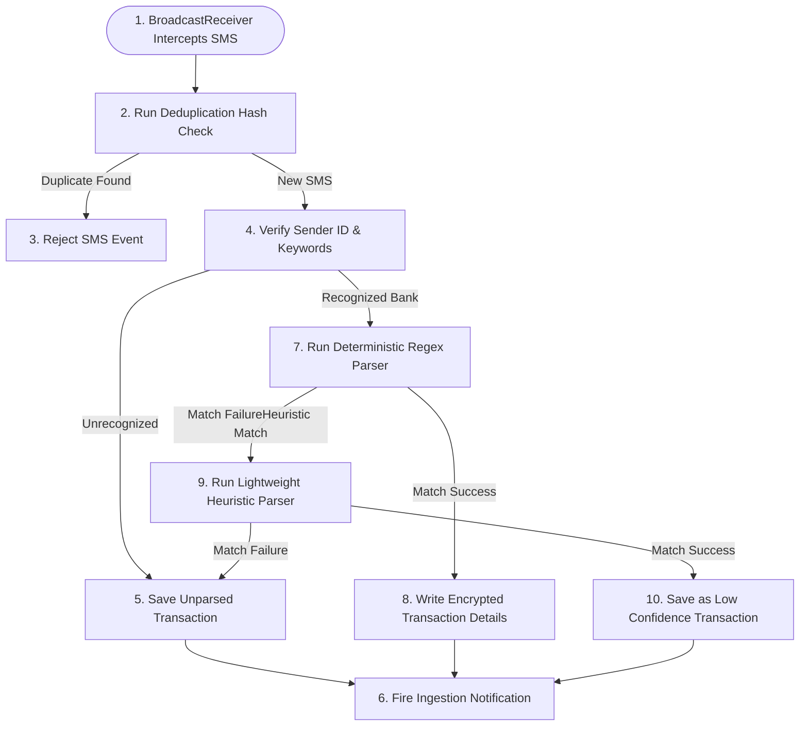

# BankYar User Journey & Interaction Flow Specification

**Project Name:** BankYar
**Classification:** Enterprise UX & Behavioral Architecture Specification
**Document Version:** 1.0.0
**Authors:** Principal UX Architect, Product Strategist, Customer Journey Specialist, Enterprise Interaction Designer, Human-Centered Design Expert, Service Designer, and Financial UX Consultant
**Status:** Approved / Authoritative Version 1 Baseline

---

## Executive Summary

BankYar is an offline-first, privacy-first personal finance platform designed primarily for Android (with future scalability to iOS, tablets, and desktop), utilizing Persian (RTL) as its native language. Because BankYar operates under a strict **zero-network constraint** (no internet permission declared in the OS manifest) and stores all data locally in an encrypted database (SQLCipher, AES-256), user trust and interaction clarity are our highest-priority concerns.

This document establishes the official **User Journey & Interaction Flow Specification** for BankYar Version 1. It acts as the definitive behavioral authority, bridging the gap between high-level product requirements and physical implementation without containing concrete UI designs, wireframes, or framework code.

By detailing every meaningful interaction, transition, recovery flow, and decision path, this specification ensures that human engineers and AI agents can develop, test, and audit the application with perfect behavioral consistency.

---

## Table of Contents
1. [UX Vision](#1-ux-vision)
2. [User Journey Philosophy](#2-user-journey-philosophy)
3. [Interaction Principles](#3-interaction-principles)
4. [User Mental Models](#4-user-mental-models)
5. [User Context Mapping](#5-user-context-mapping)
6. [Environment Assumptions](#6-environment-assumptions)
7. [Entry Points](#7-entry-points)
8. [Exit Points](#8-exit-points)
9. [Journey Taxonomy](#9-journey-taxonomy)
10. [Primary User Flows (The Core Ingestion & Ledger Journeys)](#10-primary-user-flows)
11. [Secondary User Flows (The Search, Filter & Analytics Journeys)](#11-secondary-user-flows)
12. [Administrative Flows (The In-App Diagnostics & Management Journeys)](#12-administrative-flows)
13. [Error Recovery Flows (The System Failure & Resilience Journeys)](#13-error-recovery-flows)
14. [Security Flows (The Authentication & Access Control Journeys)](#14-security-flows)
15. [Permission Flows (The OS Permission Acquisition Journeys)](#15-permission-flows)
16. [Notification Flows (The System Tray & Background Alert Journeys)](#16-notification-flows)
17. [Backup Flows (The Local Encrypted Export Journeys)](#17-backup-flows)
18. [Restore Flows (The Cryptographic Recovery Journeys)](#18-restore-flows)
19. [Search Flows](#19-search-flows)
20. [Filter Flows](#20-filter-flows)
21. [Statistics Flows](#21-statistics-flows)
22. [Settings Flows](#22-settings-flows)
23. [PIN Management Flows](#23-pin-management-flows)
24. [Database Recovery Flows](#24-database-recovery-flows)
25. [First Run Experience](#25-first-run-experience)
26. [Returning User Experience](#26-returning-user-experience)
27. [Empty State Journeys](#27-empty-state-journeys)
28. [Loading Journeys](#28-loading-journeys)
29. [Offline Journeys](#29-offline-journeys)
30. [Accessibility Journeys](#30-accessibility-journeys)
31. [Failure Scenarios](#31-failure-scenarios)
32. [Exceptional Scenarios](#32-exceptional-scenarios)
33. [Decision Trees](#33-decision-trees)
34. [State Transition Models](#34-state-transition-models)
35. [Success Paths](#35-success-paths)
36. [Alternative Paths](#36-alternative-paths)
37. [Cancellation Paths](#37-cancellation-paths)
38. [Retry Paths](#38-retry-paths)
39. [User Feedback Strategy](#39-user-feedback-strategy)
40. [Journey Validation Checklist](#40-journey-validation-checklist)
41. [Governance Rules](#41-governance-rules)
42. [Future Journey Expansion Strategy](#42-future-journey-expansion-strategy)

---

## 1. UX Vision

The UX Vision for BankYar is to create a secure personal finance experience that feels like a **high-precision, physical vault**. The application remains silent, focused, and objective, treating the user’s attention and data as sacred. We reject the sensory noise of modern fintech (such as gamified animations, marketing banners, and remote telemetry trackers) and focus on presenting clear financial truths, returning complete sovereignty and peace of mind back to the individual.

---

## 2. User Journey Philosophy

In an offline-first financial environment, user journeys are designed around **uncompromising trust and user control**. Because there are no remote servers to correct errors, reset passwords, or fetch data, every journey must be self-contained and transparent. We treat friction points (such as entering PINs or granting system permissions) as opportunities to build trust, clearly explaining the "Why" and "How" of every local cryptographic operation.

---

## 3. Interaction Principles

* **Minimal Cognitive Load:** Information is grouped cleanly into flat semantic cards. Suffixes, numbers, and dates are formatted in standard Persian, reducing visual processing time.
* **Progressive Disclosure:** Display the core transaction details (Amount, Date, Merchant) at a glance. Technical parameters, raw message strings, and custom matching rules are hidden behind single-tap detail sheets.
* **Error Prevention:** Interactive buttons are spaced comfortably to prevent accidental taps. Destructive actions (such as purging data) require explicit PIN confirmation.
* **Predictability & Consistency:** UI targets behave identically across different screens. Tabs maintain active scroll positions, and back chevrons always return the user to the immediate parent context.
* **Absolute Privacy by Default:** Financial totals and transaction details are masked on initial boot until the user completes local authentication.

---

## 4. User Mental Models

```
         USER EXPECTATION                      SYSTEM REALIZATION
┌──────────────────────────────┐        ┌──────────────────────────────┐
│ My data is safe and local.   │───────►│ 100% Offline, no network permission.│
└──────────────────────────────┘        └──────────────────────────────┘
┌──────────────────────────────┐        ┌──────────────────────────────┐
│ The app updates automatically│───────►│ Background SMS broadcast capture.│
└──────────────────────────────┘        └──────────────────────────────┘
┌──────────────────────────────┐        ┌──────────────────────────────┐
│ I can fix errors myself.     │───────►│ Self-service backups & restores.│
└──────────────────────────────┘        └──────────────────────────────┘
```

The user expects BankYar to act as an automated, offline clerk. The system translates raw, unorganized SMS alerts into a cohesive, structured ledger. This model emphasizes absolute privacy, instant data retrieval, and full user ownership of their financial records.

---

## 5. User Context Mapping

* **Physical State:** Often on-the-go, holding the mobile device with one hand, requesting clear visual readability and easily reachable action targets.
* **Emotional State:** Anxiety-prone when managing expenses or dealing with incorrect entries. Requires calming visual indicators and a supportive, non-blaming tone.
* **Connectivity State:** Operates in low-signal areas, airplane mode, or regions with poor network access, expecting full functionality with zero loading delays.

---

## 6. Environment Assumptions

* **Operating System:** Android 10+ providing a background SMS broadcast receiver API.
* **Hardware:** Secure, hardware-backed keystore available on the device to derive database keys.
* **Data Sources:** Incoming transactional SMS notifications sent by standard financial institutions.
* **User Input:** Physical touch, biometrics, and localized keyboard entries in Persian.

---

## 7. Entry Points

* **Direct Boot:** Launching the app icon from the system home screen.
* **System Notification Taps:** Tapping on a background SMS ingestion notification.
* **App Shortcuts:** Launching dedicated shortcut targets (e.g., "Search Transactions", "Manual Entry") directly from the home screen icon.
* **Local Share Intent:** Sharing copied SMS body text or files from external apps directly into BankYar.

---

## 8. Exit Points

* **Standard Closure:** Sending the app to the background via OS home gestures or task switchers.
* **Double-Tap Back Exit:** Pressing back twice on the root Ledger view to exit the app safely.
* **Secure Session Expire:** Automatic session termination and RAM key erasure after 5 minutes of background inactivity.
* **Self-Destruct Purge:** Triggering a full data purge, erasing local databases, and terminating the app process immediately.

---

## 9. Journey Taxonomy

To maintain organization, BankYar journeys are classified into six core functional scopes:

* **Primary Flows (PF):** Ledger display, detail viewing, and transaction annotations.
* **Secondary Flows (SF):** Searching, multi-parameter filtering, and analytical dashboards.
* **Administrative Flows (AF):** Local diagnostics, system configuration updates, and full database purges.
* **Error Recovery Flows (ER):** Database corruptions, low storage management, and validation failures.
* **Security Flows (SE):** Authentication gates, biometric bindings, and PIN resets.
* **Utility Flows (UT):** Background SMS capture, data migrations, backups, and restores.

---

## 10. Primary User Flows

This section contains detailed flow definitions for all core ledger and annotation journeys.

### Flow PF-01: View Transaction Detail
* **Goal:** Inspect all extracted metadata and raw carrier text of a single transaction record.
* **Preconditions:** User session is active and database is unlocked.
* **Trigger:** User taps on a transaction card in the chronological ledger.
* **User Actions:**
  1. Taps on a transaction card.
  2. Swipes horizontally to toggle between "Structured Data" and "Raw SMS" tabs.
  3. Taps the close icon or native back button to return.
* **System Actions:**
  1. Fetches the complete transaction payload from the encrypted database.
  2. Renders the detail sheet containing the merchant name, localized currency amount, timestamp, and account index.
  3. Displays the full raw SMS body text in a monospace typography token.
* **Decision Points:** If the transaction is unparsed, display an optional alert card suggesting manual category mapping.
* **Alternative Paths:** Tap on the assigned category chip to navigate back to the ledger with that category filter applied.
* **Failure Paths:** If the record ID is missing or deleted, display a localized error toast and pop the view back to the ledger.
* **Recovery Paths:** Trigger an automatic soft-reload of the ledger list, focusing on the nearest active record.
* **Completion Criteria:** User views the transaction metadata and returns to the parent ledger screen.
* **Success Indicators:** Transition animation completes in < 200ms with zero layout shifting.
* **Accessibility Considerations:** Ensure the entire text block supports screen reader semantic labeling, announcing the amount, type, and date.
* **Security Considerations:** Mask partial card digits (e.g., card ending in `****۴۰۵۳`), ensuring no full account details are exposed.
* **Performance Expectations:** UI thread remains responsive at 60fps+; details render in under 100ms.

---

### Flow PF-02: Add Custom Note
* **Goal:** Add a custom text annotation to a transaction record.
* **Preconditions:** User session is active and transaction details page is open.
* **Trigger:** User taps the "Add Note" trigger inside the transaction detail sheet.
* **User Actions:**
  1. Taps the "Add Note" button.
  2. Types custom text using the system keyboard.
  3. Taps the "Save" button to confirm.
* **System Actions:**
  1. Displays an interactive input sheet, setting the keyboard focus automatically.
  2. Validates character length in real-time (< 1000 characters).
  3. Commits the text annotation to the SQLite database.
  4. Renders a self-dismissing success notice and updates the detail view.
* **Decision Points:** If the text is empty, disable the "Save" action to prevent saving blank notes.
* **Alternative Paths:** Tap "Cancel" or drag the sheet down to dismiss, discarding edits safely.
* **Failure Paths:** Database write lock occurs. Display an inline alert banner: "مشکلی در ذخیره‌سازی رخ داده است. مجدداً تلاش کنید."
* **Recovery Paths:** Cache the user's input in temporary RAM draft variables so they do not lose their text when retrying.
* **Completion Criteria:** Note text is committed to the database and displayed on the details page.
* **Success Indicators:** Success confirmation toast is shown, and notes count updates in the ledger list.
* **Accessibility Considerations:** Provide high-contrast input borders and label the save action as "ثبت یادداشت" for screen readers.
* **Security Considerations:** Ensure input text is not cached in standard system keyboards or shared with cloud suggestion dictionaries.
* **Performance Expectations:** Database write completes in < 100ms; UI transition completes instantly.

---

### Flow PF-03: Edit Note
* **Goal:** Update an existing text annotation on a transaction.
* **Preconditions:** Transaction has a saved note, and detail sheet is open.
* **Trigger:** User taps the "Edit Note" edit pen icon next to the active note card.
* **User Actions:**
  1. Taps the "Edit Note" icon.
  2. Modifies the existing text inside the input field.
  3. Taps the "Save" button to confirm changes.
* **System Actions:**
  1. Populates the text input field with the current note text and places the cursor at the end of the text line.
  2. Runs character limit validations in real-time.
  3. Updates the database record with the new text string.
  4. Displays a success confirmation toast and returns the user to the detail view.
* **Decision Points:** If the text has not been modified, keep the "Save" button disabled.
* **Alternative Paths:** Clearing the text entirely and tapping "Save" transitions the note to a deleted state.
* **Failure Paths:** File system write failure. Display a warning toast: "ذخیره تغییرات با خطا مواجه شد."
* **Recovery Paths:** Keep the modal open, allowing the user to copy their updated note text before attempting a retry.
* **Completion Criteria:** The database is updated, and the new note content is displayed.
* **Success Indicators:** Note updates on screen in under 100ms; ledger preview shows the modified text.
* **Accessibility Considerations:** Provide clear semantic labeling for the editing pen icon, and ensure touch targets are large (`bankyar.space.xl`).
* **Security Considerations:** Securely erase any previous note version bytes cached in RAM.
* **Performance Expectations:** Real-time text validation runs with zero keystroke delay.

---

### Flow PF-04: Delete Note
* **Goal:** Permanently remove a note annotation from a transaction.
* **Preconditions:** Transaction contains an active note.
* **Trigger:** User taps the trash/delete icon next to the note.
* **User Actions:**
  1. Taps the delete icon on the note card.
  2. Taps "Confirm" in the destructive confirmation sheet.
* **System Actions:**
  1. Displays a bottom confirmation sheet explaining the note will be removed.
  2. Deletes the notes association from the database record.
  3. Shows a bottom success banner with an "Undo" trigger.
* **Decision Points:** If the user taps "Undo" within 5 seconds, restore the previous note text in the database.
* **Alternative Paths:** Tap "Cancel" or anywhere outside the confirmation sheet to close it safely.
* **Failure Paths:** Database connection is locked. Display a warning: "حذف یادداشت ناموفق بود."
* **Recovery Paths:** Cache the note text in RAM; if the delete fails, keep the note displayed to prevent accidental loss.
* **Completion Criteria:** The note is removed, and the detail view updates.
* **Success Indicators:** Note card slides out of view, and a success banner appears.
* **Accessibility Considerations:** Screen reader announces "یادداشت با موفقیت حذف شد. برای بازگردانی ضربه بزنید."
* **Security Considerations:** Securely erase deleted note bytes from active RAM buffers.
* **Performance Expectations:** Deletion and UI updates complete in < 100ms.

---

## 11. Secondary User Flows

### Flow SF-01: Search Ledger
* **Goal:** Instantly query the financial ledger using local full-text search.
* **Preconditions:** Ledger contains transaction records.
* **Trigger:** User taps the search bar at the top of the Ledger tab.
* **User Actions:**
  1. Taps the search bar.
  2. Types search terms (e.g., "اسنپ" or "#تفریح").
  3. Taps the "Clear" icon to reset.
* **System Actions:**
  1. Opens the full-screen search overlay, setting the keyboard focus.
  2. Applies a 300ms input debounce to prevent redundant queries.
  3. Queries the local FTS5 SQLite index.
  4. Renders the matching list in reverse-chronological order.
* **Decision Points:** If the query matches zero results, transition to the Search Empty State.
* **Alternative Paths:** Select suggested search chips below the search bar to run predefined queries.
* **Failure Paths:** Database FTS5 index is corrupted. Fallback to standard SQLite query matches.
* **Recovery Paths:** Run a silent background repair on the FTS5 tables and reload the view.
* **Completion Criteria:** User finds the target transaction and taps it to view details.
* **Success Indicators:** Results render in < 200ms with zero keyboard stutter.
* **Accessibility Considerations:** Input field includes a clear description: "جستجو در توضیحات، تراکنش‌ها و برچسب‌ها."
* **Security Considerations:** Ensure search queries are processed locally and never stored in system auto-complete history.
* **Performance Expectations:** Search queries resolve in under 100ms on standard mobile hardware.

---

### Flow SF-02: Advanced Filtering
* **Goal:** Refine long transaction lists by applying multiple criteria simultaneously.
* **Preconditions:** Ledger tab is open.
* **Trigger:** User taps the "Filter" utility icon on the Ledger app bar.
* **User Actions:**
  1. Taps the filter icon.
  2. Selects filters (e.g., date range, debit/credit type, category, specific bank account).
  3. Taps "Apply Filters."
* **System Actions:**
  1. Launches the filter bottom sheet displaying category chips and selectors.
  2. Updates selected chip styles instantly (`bankyar.semantic.color.text.accent`).
  3. Formulates the local query matching selected criteria.
  4. Refreshes the ledger feed to display matching transactions.
* **Decision Points:** If the applied filters yield zero matches, display a supportive empty state with a "Reset Filters" action.
* **Alternative Paths:** Tapping "Reset All" clears all active selections, returning the ledger to its default chronological state.
* **Failure Paths:** Filter query fails. Revert the ledger to its pre-filter state and display a warning banner.
* **Recovery Paths:** Clear active criteria and guide the user to select broader filters.
* **Completion Criteria:** Ledger display updates to show only transactions matching the selected criteria.
* **Success Indicators:** Ledger list updates in under 100ms, displaying active filter chips below the search bar.
* **Accessibility Considerations:** Filter chips are labeled clearly (e.g., "فیلتر هزینه فعال است") for screen readers.
* **Security Considerations:** Filter preferences are kept local and are never shared.
* **Performance Expectations:** Database query and UI refresh complete in under 150ms.

---

### Flow SF-03: View Statistics Dashboard
* **Goal:** Observe cash flow and spending distribution trends through offline visualizations.
* **Preconditions:** Transaction data is saved in the database.
* **Trigger:** User selects the "Analytics" tab from the bottom navigation bar.
* **User Actions:**
  1. Taps the "Analytics" tab.
  2. Taps date segment controllers to switch between Weekly, Monthly, and Yearly intervals.
  3. Taps a specific segment on the spend donut chart.
* **System Actions:**
  1. Computes totals for incomes, expenses, and net cash flow completely offline.
  2. Generates responsive visual charts (cash flow bars and category donut charts).
  3. Renders spending behavior alerts based on historical trends.
* **Decision Points:** If there are zero transactions, hide blank charts and display the Statistics Empty State.
* **Alternative Paths:** Tapping a segment on the donut chart applies that category filter and redirects the user to the ledger tab.
* **Failure Paths:** Calculation timeout on older hardware. Show an inline progress spinner and process calculations off the main thread.
* **Recovery Paths:** Fallback to displaying a clean, simplified text ledger of category totals if chart rendering fails.
* **Completion Criteria:** User observes their spending trends and closes the analytics tab.
* **Success Indicators:** Charts draw smoothly in under 200ms with zero layout shifting.
* **Accessibility Considerations:** Provide screen readers with descriptive text summaries of the charts (e.g., "بزرگترین هزینه مربوط به گروه خوراکی با سهم ۴۰ درصد است").
* **Security Considerations:** Ensure sensitive financial charts are masked or blurred when the app transitions to the background.
* **Performance Expectations:** Calculations are executed off the main thread, maintaining a steady 60fps+ rendering speed.

---

## 12. Administrative Flows

This section defines administrative tasks, including system management and configuration.

### Flow AF-01: Update Security PIN
* **Goal:** Update the 4-digit security PIN used to access BankYar.
* **Preconditions:** App lock is enabled, and settings screen is open.
* **Trigger:** User taps "Update Security PIN" inside security settings.
* **User Actions:**
  1. Taps "Update Security PIN."
  2. Enters current PIN.
  3. Enters new PIN.
  4. Re-enters the new PIN to confirm.
* **System Actions:**
  1. Prompts the current PIN validation view.
  2. Validates current PIN match; if correct, transitions to the new PIN input.
  3. Matches the new PIN entries; if they align, encrypts the new hash in `SecurePreferences`.
  4. Displays a success notification and returns the user to settings.
* **Decision Points:** If the new PIN entries do not match, display a validation warning and reset the confirm input.
* **Alternative Paths:** User taps "Cancel" to abort, keeping their current PIN active and secure.
* **Failure Paths:** Incorrect current PIN entry. Show a warning and track failed attempts.
* **Recovery Paths:** If the user exceeds 3 failed attempts, trigger a 1-minute lockout.
* **Completion Criteria:** The new PIN hash is saved, and the previous PIN is invalidated.
* **Success Indicators:** Success confirmation banner is shown, and the input view is closed.
* **Accessibility Considerations:** Text fields are optimized for numeric keyboards and labeled clearly for accessibility.
* **Security Considerations:** Never store PINs in plaintext; use strong cryptographic hashing (PBKDF2) locally.
* **Performance Expectations:** PIN verification completes instantly (< 50ms).

---

### Flow AF-02: Permanent Local Purge (Self-Destruct)
* **Goal:** Erase all local files, databases, and saved settings permanently.
* **Preconditions:** Settings screen is open.
* **Trigger:** User selects "Factory Reset Application" inside settings.
* **User Actions:**
  1. Selects the reset option.
  2. Reads the critical warning text.
  3. Enters their current security PIN to confirm.
  4. Taps the final "Confirm Permanent Erase" button.
* **System Actions:**
  1. Displays a prominent warning sheet explaining that this action is permanent and cannot be undone.
  2. Prompts a PIN challenge.
  3. Closes active database pools, deletes SQLCipher files, erases preferences, and clears cache directory.
  4. Instantly terminates the app process.
* **Decision Points:** If the entered PIN is incorrect, abort the reset immediately and increment failed attempts.
* **Alternative Paths:** Tap "Cancel" to safely close the warning sheet.
* **Failure Paths:** Database files are locked by background tasks. Force close connection pools before file deletion.
* **Recovery Paths:** If file deletion fails, flag directories for erasure on the next app boot.
* **Completion Criteria:** All local files are deleted, and the application closes.
* **Success Indicators:** App shuts down instantly post-deletion.
* **Accessibility Considerations:** Read the critical warning text with high priority for screen readers.
* **Security Considerations:** Securely overwrite database pages before file deletion to prevent potential data reconstruction.
* **Performance Expectations:** File erasure and app shutdown complete in under 1 second.

---

## 13. Error Recovery Flows

This section maps recovery paths for system failures and unparsed files.

### Flow ER-01: Database Corruption Recovery
* **Goal:** Recover app functionality and restore user records when the local database file is corrupted.
* **Preconditions:** App is launched, and SQLCipher file signature validation fails.
* **Trigger:** System detects SQLite database corruption on startup.
* **User Actions:**
  1. Selects "Restore Backup" on the Disaster Recovery Screen.
  2. Selects their latest encrypted `.bankyar` backup file.
  3. Enters their backup password.
  4. Taps "Confirm Restore."
* **System Actions:**
  1. Blocks standard screens, initializes an isolated sandbox database, and presents the Disaster Recovery Screen.
  2. Verifies the password, decrypts the backup file, and validates data schema integrity.
  3. Overwrites the corrupted database files with the restored tables.
  4. Displays a success confirmation toast and triggers an application reboot.
* **Decision Points:** If the user has no backup file, allow them to choose "Initialize New Database" as a last resort.
* **Alternative Paths:** User can export local diagnostic logs to share with developers before restoring.
* **Failure Paths:** Backup password verification fails. Show a warning: "رمز عبور فایل پشتیبان صحیح نیست."
* **Recovery Paths:** Keep the restore screen open, allowing the user to re-enter their password or select a different backup file.
* **Completion Criteria:** Database integrity is restored, and the user is redirected to the Lock Screen.
* **Success Indicators:** Recovery dashboard displays verified steps; database boots successfully.
* **Accessibility Considerations:** Provide step-by-step progress announcements for screen readers.
* **Security Considerations:** Zeroize any temporary decryption keys in RAM immediately after use.
* **Performance Expectations:** Data restoration and verification complete in < 2 seconds for average databases.

---

### Flow ER-02: Low Storage Management
* **Goal:** Protect local data and prevent file corruption when the device is out of storage space.
* **Preconditions:** Available device storage drops below 50MB.
* **Trigger:** Storage monitor detects a low disk space warning during app operations.
* **User Actions:**
  1. Reads the high-priority storage warning dialog.
  2. Taps "Clear Diagnostic Logs" to free up local space.
  3. Closes other device files manually if needed.
* **System Actions:**
  1. Displays a prominent, non-blocking warning modal.
  2. Pauses non-essential background processes (such as automated diagnostics).
  3. Temporarily caches new incoming transactions in volatile RAM.
  4. Erases old local diagnostic logs once the user confirms.
* **Decision Points:** If storage remains critically low, disable database export tools to prevent partial file writes.
* **Alternative Paths:** Tap "Postpone" to temporarily dismiss the warning for 15 minutes.
* **Failure Paths:** File write fails due to full storage. Abort the operation and display a critical error alert.
* **Recovery Paths:** Keep new transaction data cached in RAM until disk space is freed or the app is closed.
* **Completion Criteria:** Storage space increases above 50MB, and normal app operations resume.
* **Success Indicators:** Warning banner dismisses automatically once disk space is restored.
* **Accessibility Considerations:** Ensure the warning modal is prioritized first in the focus order.
* **Security Considerations:** Protect transaction data cached in volatile RAM from exposure to other apps.
* **Performance Expectations:** Storage check runs in < 50ms without affecting UI responsiveness.

---

## 14. Security Flows

### Flow SE-01: PIN Authentication
* **Goal:** Verify user identity before granting access to local financial records.
* **Preconditions:** App is launched or resumed, and app lock is enabled.
* **Trigger:** User launches or resumes BankYar.
* **User Actions:**
  1. Types their 4-digit security PIN.
  2. Taps "Fallback Biometrics" if biometric auth is preferred.
* **System Actions:**
  1. Displays the secure Lock Screen, hiding sensitive fields in the task switcher preview.
  2. Matches the entered PIN hash against the hash saved in `SecurePreferences` using PBKDF2.
  3. Upon successful match, derives the database key and decrypts the connection pool.
  4. Navigates the user to their last active dashboard view.
* **Decision Points:** If the entered PIN is incorrect, display an inline warning and decrement remaining attempts.
* **Alternative Paths:** Tapping "Biometrics" triggers the device's native fingerprint or face unlock dialog.
* **Failure Paths:** User exceeds 3 failed attempts. Lock the input and display a strict 1-minute countdown timer.
* **Recovery Paths:** Allow the user to re-try once the countdown timer expires.
* **Completion Criteria:** User identity is verified, and the ledger view is unlocked.
* **Success Indicators:** Screen transitions smoothly in under 100ms.
* **Accessibility Considerations:** Provide clear voice feedback for correct and incorrect PIN entries.
* **Security Considerations:** Evict master encryption keys from RAM after 5 minutes of background inactivity.
* **Performance Expectations:** Cryptographic hash matching resolves in under 50ms.

---

### Flow SE-02: PIN Recovery
* **Goal:** Reset app access when the user has forgotten their security PIN.
* **Preconditions:** App is locked, and user has a password-encrypted backup file.
* **Trigger:** User taps "Forgot PIN?" on the secure Lock Screen.
* **User Actions:**
  1. Taps "Forgot PIN?."
  2. Confirms they understand that local data must be reset.
  3. Selects their encrypted `.bankyar` backup file.
  4. Enters their backup password.
  5. Configures a new 4-digit security PIN.
* **System Actions:**
  1. Displays a clear warning explaining that forgetting the PIN requires a local data reset and backup restore.
  2. Runs a full local database purge to clear the locked environment.
  3. Prompts the backup file selector and password input.
  4. Decrypts and restores the database tables, then opens the PIN Setup view.
* **Decision Points:** If the user has no backup file, allow them to choose "Erase and Start Fresh," which permanently deletes local data.
* **Alternative Paths:** Tap "Cancel" to return to the Lock Screen and try entering the PIN again.
* **Failure Paths:** Backup file decryption fails. Show a warning and keep the restore screen active.
* **Recovery Paths:** Re-prompt for the backup password or guide the user to select a different backup file.
* **Completion Criteria:** A new security PIN is saved, and user data is restored successfully.
* **Success Indicators:** Redirects the user to the Ledger Dashboard with their restored transaction history.
* **Accessibility Considerations:** Read warnings with high priority, ensuring users understand the consequences of a reset.
* **Security Considerations:** Securely erase the old forgotten PIN hash from memory.
* **Performance Expectations:** Full system reset and restoration completes in under 3 seconds.

---

## 15. Permission Flows

### Flow PE-01: SMS Permission Onboarding
* **Goal:** Securely guide the user to grant SMS read permissions, explaining the privacy benefits.
* **Preconditions:** App is launched for the first time, and onboarding is active.
* **Trigger:** Onboarding process reaches the permission setup step.
* **User Actions:**
  1. Reads the contextual privacy explanation.
  2. Taps "Enable Automated Tracking."
  3. Taps "Allow" on the system permission dialog.
* **System Actions:**
  1. Displays a clean, localized dialog explaining that BankYar parses SMS purely on-device and never accesses the internet.
  2. Triggers the Android system permission request (`READ_SMS` / `RECEIVE_SMS`).
  3. Upon approval, saves the active permission state and runs the first inbox scan.
* **Decision Points:** If the user denies permission, transition to the SMS Permission Denied flow.
* **Alternative Paths:** Tap "Skip for Now" to proceed with manual entry features only.
* **Failure Paths:** Permission is denied twice or blocked by system policies. Disable automated configurations.
* **Recovery Paths:** Display an educational banner on the empty ledger screen, providing a step-by-step guide to enable permissions in system settings.
* **Completion Criteria:** SMS permission is granted, and background listeners are initialized.
* **Success Indicators:** Shows a success toast and redirects the user to the Ledger tab.
* **Accessibility Considerations:** Focus screen reader on the privacy explanation first, using large tap targets.
* **Security Considerations:** Explicitly confirm that BankYar does not declare or use the `INTERNET` permission.
* **Performance Expectations:** Permissions are registered instantly; first inbox scan completes in under 1 second.

---

### Flow PE-02: SMS Permission Denied
* **Goal:** Transition the application gracefully when the user denies SMS access, emphasizing manual features.
* **Preconditions:** User denies the SMS permission request.
* **Trigger:** Permission request returns a denied status.
* **User Actions:**
  1. Reads the educational permission-denied banner on the Ledger screen.
  2. Taps "Add Manual Transaction" to log a record manually, or taps "Paste Clipboard" to parse copied text.
* **System Actions:**
  1. Disables background SMS monitoring listeners.
  2. Refreshes the Ledger tab to show a supportive empty state with prominent manual entry options.
  3. Displays an optional, non-intrusive guide banner explaining how automated features can be enabled later.
* **Decision Points:** If the user taps "Enable Automated Tracking" on the banner, trigger the permission request again.
* **Alternative Paths:** Set up custom regex rules manually to prepare the app for future inbox imports.
* **Failure Paths:** Permission is permanently blocked by system settings. Replace permission triggers with direct shortcuts to system settings.
* **Recovery Paths:** Provide a step-by-step illustration guiding the user on how to adjust permissions in Android settings.
* **Completion Criteria:** Ledger dashboard displays fallback manual entry tools, keeping automated warnings non-intrusive.
* **Success Indicators:** Fallback options are displayed instantly with zero interface freezing.
* **Accessibility Considerations:** Read the fallback options clearly for screen readers, ensuring high contrast.
* **Security Considerations:** Do not request unrelated system permissions.
* **Performance Expectations:** Fallback UI transitions load in under 100ms.

---

## 16. Notification Flows

### Flow NO-01: Notification Ingestion
* **Goal:** Reassure the user of successful background transaction processing via a non-intrusive system alert.
* **Preconditions:** Background SMS listener is active, and a new transaction is parsed.
* **Trigger:** Background parsing engine saves a new transaction record.
* **User Actions:**
  1. Taps on the system tray notification card.
* **System Actions:**
  1. Captures the notification tap and fires a secure local deep link (`bankyar://transactions/:id`).
  2. Runs deep link routing through the `SecuritySessionGuard`.
  3. Prompts the secure Lock Screen if the session is locked.
  4. Upon successful authentication, routes the user directly to the Transaction Detail sheet.
* **Decision Points:** If the app session is already unlocked, bypass the lock screen and route directly to details.
* **Alternative Paths:** Swipe the notification away to dismiss it, preserving the background updates quietly.
* **Failure Paths:** The transaction record is deleted before the user taps. Show a localized toast and route to home.
* **Recovery Paths:** Redirect the user to the chronological ledger, highlighting the newest active transactions.
* **Completion Criteria:** User taps the notification, completes authentication, and views the transaction details.
* **Success Indicators:** Secure redirection completes in under 150ms after authentication.
* **Accessibility Considerations:** Formulate descriptive notification text (e.g., "تراکنش جدید ثبت شد: ۵۰,۰۰۰ تومان - بانک ملت").
* **Security Considerations:** Hide financial amounts inside notifications if system lock screen privacy settings are active.
* **Performance Expectations:** Background notification triggers in < 200ms after database write.

---

## 17. Backup Flows

### Flow BU-01: Export Encrypted Backup
* **Goal:** Generate a password-protected, encrypted backup file of all local data to safeguard against device loss.
* **Preconditions:** User has active data, and Settings screen is open.
* **Trigger:** User taps "Create Encrypted Backup" inside backup settings.
* **User Actions:**
  1. Taps "Create Encrypted Backup."
  2. Enters a strong, custom backup password.
  3. Confirms the password.
  4. Taps "Export File" and selects a local directory or share target.
* **System Actions:**
  1. Displays password configuration sheet with password strength feedback.
  2. Uses PBKDF2 with a random salt to derive a strong AES-256 key from the password.
  3. Exports all database tables into a structured JSON payload, encrypting it via AES-256-GCM.
  4. Launches the system share sheet, letting the user save their `.bankyar` backup file.
* **Decision Points:** If the entered passwords do not match, highlight the mismatch and disable export.
* **Alternative Paths:** Tap "Cancel" to abort, safely zeroizing password buffers in RAM.
* **Failure Paths:** File write fails due to full disk space. Show a warning: "فضای کافی برای ذخیره وجود ندارد."
* **Recovery Paths:** Pause non-essential logs and prompt the user to clear space or select an alternative directory.
* **Completion Criteria:** The password-encrypted `.bankyar` file is generated and saved successfully.
* **Success Indicators:** Displays a success checkmark modal and self-dismisses after 3 seconds.
* **Accessibility Considerations:** Announce progress percentages and validation states clearly to screen readers.
* **Security Considerations:** Never store backup passwords; zeroize key bytes in RAM immediately after file write.
* **Performance Expectations:** Backup file generation completes in under 1 second.

---

## 18. Restore Flows

### Flow RE-01: Import Encrypted Backup
* **Goal:** Restore previous transaction history and settings from an encrypted backup file.
* **Preconditions:** Backup settings screen or Disaster Recovery Screen is open.
* **Trigger:** User selects "Restore Backup" and chooses a `.bankyar` file.
* **User Actions:**
  1. Selects their `.bankyar` backup file from local storage.
  2. Types the decryption password.
  3. Taps "Verify and Restore."
* **System Actions:**
  1. Displays the backup verification sheet, prompting the password.
  2. Derives the AES-256 key using the password and the file's salt, then verifies GCM integrity.
  3. Validates the JSON schema version compatibility.
  4. Overwrites local database tables with the restored data and restarts the app.
* **Decision Points:** If the schema version is older, run database migration scripts locally before finalizing.
* **Alternative Paths:** User taps "Cancel" to abort the restore, leaving their current active database intact.
* **Failure Paths:** Decryption password is incorrect. Display a warning: "گذرواژه فایل پشتیبان اشتباه است."
* **Recovery Paths:** Keep the password modal open, allowing the user to re-try or choose a different file.
* **Completion Criteria:** User data is restored successfully, and the app is restarted.
* **Success Indicators:** LED indicators show successful restoration, and the ledger updates.
* **Accessibility Considerations:** Highlight input fields clearly, providing voice feedback.
* **Security Considerations:** Protect the restored database file with the system's hardware key instantly.
* **Performance Expectations:** Verification and import process completes in under 1.5 seconds.

---

## 19. Search Flows

Detailed search interactions are defined in **SF-01: Search Ledger** (Section 11). The search engine uses a dedicated, full-screen overlay with text debouncing and FTS5 SQLite queries. If a search query yields zero matches, the system transitions to the **Search Empty Results** journey (Section 27).

---

## 20. Filter Flows

Detailed multi-parameter filtering is defined in **SF-02: Advanced Filtering** (Section 11). Filters are applied dynamically using horizontal scrollable chips for categories, banks, date ranges, and transaction types. If filters return zero results, the system displays a supportive empty state with a "Clear Filters" action.

---

## 21. Statistics Flows

Analytical visualization interactions are defined in **SF-03: View Statistics Dashboard** (Section 11). It displays monthly cash flows, category allocations, and spending behavior alerts. Interactive donut segments allow users to drill down into specific categories, updating the Ledger view automatically.

---

## 22. Settings Flows

Settings are organized inside a clean, linear preference list in the Settings tab, as mapped in the Application Sitemap (Section 4). Tapping settings rows (Security, Parser, Backup, Diagnostics) slides sub-pages horizontally, keeping navigation simple and predictable.

---

## 23. PIN Management Flows

Security credentials management is detailed in **AF-01: Update Security PIN** (Section 12) and **SE-02: PIN Recovery** (Section 14). It requires double-entry validations, uses secure PBKDF2 local hashing, and incorporates strict lockout timers to prevent brute-force attempts.

---

## 24. Database Recovery Flows

Database integrity and repair processes are defined in **ER-01: Database Corruption Recovery** (Section 13). It isolates corrupted files, runs localized repairs, and guides the user to restore their data from their latest password-encrypted `.bankyar` backup file.

---

## 25. First Run Experience

* **Goal:** Securely guide new users through initial configurations (PIN setup and permissions) and introduce BankYar's value.
* **Preconditions:** App is installed and launched for the first time.
* **Trigger:** Splash screen detects that no security configurations exist.
* **User Actions:**
  1. Launches BankYar.
  2. Reads the introductory value cards.
  3. Configures a new 4-digit security PIN.
  4. Grants SMS permission (or skips to manual setup).
* **System Actions:**
  1. Displays the onboarding slides, reassuring the user of 100% offline privacy.
  2. Prompts the PIN setup sheet, requiring confirmation entry.
  3. Displays the contextual SMS permission explanation.
  4. Initializes the SQLite SQLCipher database using hardware-backed keys.
* **Decision Points:** If the user denies SMS permission, navigate them to the onboarding complete screen, highlighting manual fallback features.
* **Alternative Paths:** Allow users to import an existing backup file immediately on the splash screen to bypass onboarding.
* **Failure Paths:** Hardware keystore fails to initialize. Show the disaster recovery screen.
* **Recovery Paths:** Fallback to standard local password-derived encryption if hardware-bound keys are blocked.
* **Completion Criteria:** Security PIN is set, database is encrypted, and user is routed to the Ledger tab.
* **Success Indicators:** Shows a warm success toast and launches the main Ledger dashboard.
* **Accessibility Considerations:** Ensure all slides and onboarding actions support clear screen reader announcements.
* **Security Considerations:** Do not allow bypassing PIN setup; secure access control is mandatory.
* **Performance Expectations:** Onboarding screens transition instantly; database setup completes in < 500ms.

---

## 26. Returning User Experience

* **Goal:** Restore the user's active session quickly and securely.
* **Preconditions:** User has completed onboarding, and app lock is active.
* **Trigger:** User launches or resumes BankYar.
* **User Actions:**
  1. Launches or resumes the application.
  2. Authenticates using biometrics (fingerprint/face) or enters their 4-digit PIN.
* **System Actions:**
  1. Presents the secure Lock Screen, concealing sensitive totals in the background preview.
  2. Decrypts the SQLite connection pool upon successful authentication.
  3. Restores the user's last active tab, scroll position, and filters from `SecurePreferences`.
* **Decision Points:** If the user has been inactive for less than 5 minutes, bypass the lock screen to keep navigation fluent.
* **Alternative Paths:** Tap "Forgot PIN?" if the credentials are forgotten, triggering the PIN Recovery flow.
* **Failure Paths:** Biometric authentication fails. Fallback to PIN entry automatically.
* **Recovery Paths:** Track incorrect PIN attempts, triggering a 1-minute lockout after 3 consecutive failures.
* **Completion Criteria:** User is authenticated successfully and routed to their active dashboard.
* **Success Indicators:** Unlocks and loads the dashboard in under 100ms.
* **Accessibility Considerations:** Provide clear voice feedback for successful unlocks.
* **Security Considerations:** Clear temporary decryption keys from active RAM after 5 minutes of background inactivity.
* **Performance Expectations:** Authentication verification resolves in under 50ms.

---

## 27. Empty State Journeys

Empty state interactions are designed to guide users comfortably when no data is available, as detailed in the **Empty State Strategy** (Section 3 of `EMPTY_LOADING_ERROR_RECOVERY_SYSTEM.md`).

Every empty screen (First Launch, No SMS Imported, No Transactions, No Search Results, No Notes, No Statistics, No Backup) features a supportive, non-jargon explanation, a comforting message, and a prominent primary action button to get started.

---

## 28. Loading Journeys

Loading interactions prevent perceived delays by utilizing appropriate progress indicators based on task durations, as defined in the **Loading Experience** (Section 4 of `EMPTY_LOADING_ERROR_RECOVERY_SYSTEM.md`).

The system utilizes:
* **Skeleton Content Masks (Shimmers):** For standard content loads under 1000ms.
* **Circular Progress Rings:** For short-running tasks of unknown duration.
* **Linear Progress Bars:** For determinate tasks with clear progress percentages.
* **Full-Screen Stepped Layouts:** For long-running blocking tasks (restorations, imports).

---

## 29. Offline Journeys

Because BankYar is offline-first, all interactions are designed to function completely disconnected from the internet. The app does not display warning banners or "no internet connection" alerts; it simply operates at 100% capacity at all times.

State mutations (annotations, categories, custom rules) are committed instantly to the local SQLCipher database and rendered on screen in under 100ms.

---

## 30. Accessibility Journeys

Accessibility is built natively into every journey, adhering to high inclusive design standards. Layouts support:
* **Screen Reader Semantics:** Read aloud active totals, transaction details, and input validation messages.
* **Text Scaling:** Support up to 200% system magnification without layout shifting or text clipping.
* **High Contrast:** Text, borders, and icons maintain WCAG AAA contrast ratios.
* **Reduced Motion:** Replace sliding transitions and shimmers with simple fade-ins if reduced motion is enabled in system settings.

---

## 31. Failure Scenarios

* **Cryptographic Key Loss:** If the system keystore is modified or erased, database connection fails. The system boots into Disaster Recovery Mode, prompting the user to initialize a fresh database and restore from backup.
* **Aggressive ROM Power Killers:** Device battery managers kill the background listener. The app includes a diagnostics health monitor, guiding the user step-by-step on how to whitelist BankYar from aggressive optimizations.
* **File Write Blocks:** Lack of storage space prevents backups. The system displays a high-priority warning modal and pauses non-essential diagnostic logging.

---

## 32. Exceptional Scenarios

* **Dual SIM / Carrier SMS Retransmission:** Multiple incoming SMS packets are triggered for a single transaction. The background capture pipeline runs a deduplication hash check based on `Hash(raw_body + timestamp + sender)`, rejecting duplicate events.
* **Format Drift in Bank Alerts:** A bank changes its transaction text layout. The parser catches the mismatch, records it as an "Unparsed Transaction" without crashing, and prompts the user to verify the transaction details manually.

---

## 33. Decision Trees

This section defines system-level logical decision trees for core app behaviors.

### Decision Tree 1: Application Startup Sequence


### Decision Tree 2: Background SMS Ingestion


---

## 34. State Transition Models

To ensure predictable behavior, BankYar transitions through 16 distinct operational states.

### Operational States Matrix:

| Source State | Target State | Trigger Event | Guard / Verification Condition | Action Taken |
| :--- | :--- | :--- | :--- | :--- |
| **First Install** | **Unlocked** | Onboarding complete | PIN setup and db encryption succeed | Route to ledger feed. |
| **Locked** | **Unlocked** | User authenticates | Entered credentials match PBKDF2 hash | Decrypt SQLite pool. |
| **Unlocked** | **Locked** | Session timeout | Inactive in background > 5 minutes | Purge keys from RAM. |
| **Unlocked** | **Searching** | Tap search bar | Search overlay launches | Focus search input. |
| **Unlocked** | **Backup Running** | Tap backup export | Master PIN is verified | Run JSON GCM export. |
| **Unlocked** | **Processing** | New SMS arriving | Broadcast receiver triggers | Parse message off-thread. |
| **Processing** | **Idle** | Parsing completes | Record is committed to SQLCipher | Refresh active views. |
| **Unlocked** | **Recovery Mode** | DB integrity fails | SQLCipher decryption returns failure | Launch recovery screen. |

---

## 35. Success Paths

The success path represents the optimal, friction-free journey for a user. In BankYar, success paths are designed to compile in under 100ms, using clear haptic confirmation. The standard success path maps as follows:

```
[User triggers action] -> [Local off-thread validation passes] -> [SQLite commit completes] -> [View updates instantly] -> [Calm success notification dismisses]
```

---

## 36. Alternative Paths

Alternative paths handle valid user choices that deviate from the primary flow. For example, if background SMS monitoring is disabled, the system transitions to the manual statement import path, allowing the user to import local CSV statements or paste copied text from the clipboard.

---

## 37. Cancellation Paths

Cancellation paths ensure that if a user aborts an active operation, the system cleans up temporary files and returns the user safely to their previous screen, as mapped in **BU-01: Export Encrypted Backup** (Section 17).

---

## 38. Retry Paths

Retry paths manage transient errors safely. For non-sensitive database operations, BankYar implements a standardized Retry Strategy utilizing exponential backoff with randomized jitter, capping retries at a maximum of 3 attempts.

---

## 39. User Feedback Strategy

BankYar implements a clear, supportive feedback system to keep users informed without causing anxiety.

* **High-Priority Modals:** Reserved strictly for critical decisions (such as data purges, permission blocks, or backup restores).
* **Self-Dismissing Toasts (Snackbars):** Used for minor successes (e.g., "یادداشت ذخیره شد") or temporary warnings, dismissing automatically after 3 seconds.
* **Haptic Feedback:** Native device vibration patterns confirm important actions, providing a physical sense of security.

---

## 40. Journey Validation Checklist

All user journey updates and newly introduced features must pass this checklist before implementation:

- [ ] Does the journey provide a clear, successful completion path?
- [ ] Is every failure scenario accompanied by constructive self-service recovery guidance?
- [ ] Are technical stack traces, error codes, and cryptic jargon excluded from user-facing views?
- [ ] Do all interactive elements reside within comfortable thumb-reach?
- [ ] Has the layout been verified against WCAG AAA contrast ratios under all lighting modes?
- [ ] Does the screen support up to 200% text magnification without layout shifting or text clipping?
- [ ] Are temporary cryptographic keys in RAM zeroized immediately upon cancellation or rollback?
- [ ] Are there zero instances of hardcoded HEX colors or physical measurements (`px`, `dp`, `sp`)?

---

## 41. Governance Rules

* **No Dead Ends:** Every error screen, loading view, and empty state must feature a prominent, primary recovery action button.
* **Preserve Data First:** Under no circumstances should a recovery flow risk deleting or overwriting user data without explicit verification.
* **Explainable Interactions:** Automated classifications (such as automatic category assignments) must be transparent, allowing users to inspect or override decisions.
* **Offline Purity:** No design component or layout may rely on external network assets, typography packages, or remote analytics endpoints.

---

## 42. Future Journey Expansion Strategy

As BankYar evolves to support future platforms and advanced capabilities, new interactions must adapt to our established behavioral standards:

```
+-----------------------------------+-----------------------------------+-----------------------------------+
|              PHASE 1              |              PHASE 2              |              PHASE 3              |
|          (Current State)          |           (12-24 Months)          |           (24+ Months)            |
+-----------------------------------+-----------------------------------+-----------------------------------+
| - Native Android Focus            | - iOS Platform Parity             | - Large-Screen Optimization       |
| - 100% Offline Core Ledger        | - Clipboard Auto-Import UX        | - Split-Screen Tablet Layouts     |
| - Deterministic SMS Parsing       | - Peer-to-Peer Wi-Fi Backups      | - On-Device AI Classifiers        |
+-----------------------------------+-----------------------------------+-----------------------------------+
```

* **Phase 1: Foundations (Current):** Perfecting native Android offline operations, background capture reliability, and secure local encryption.
* **Phase 2: Multi-Platform (12-24 Months):** Introducing iOS-specific manual imports (clipboard auto-detection modals and CSV uploads), alongside secure peer-to-peer Wi-Fi backup exchanges.
* **Phase 3: Intelligence (24+ Months):** Integrating lightweight, on-device AI classifiers (e.g., Naive Bayes tokenizers) within the isolated database sandbox, alongside responsive landscape tablet configurations.

---
**End of User Journey & Interaction Flow Specification**
